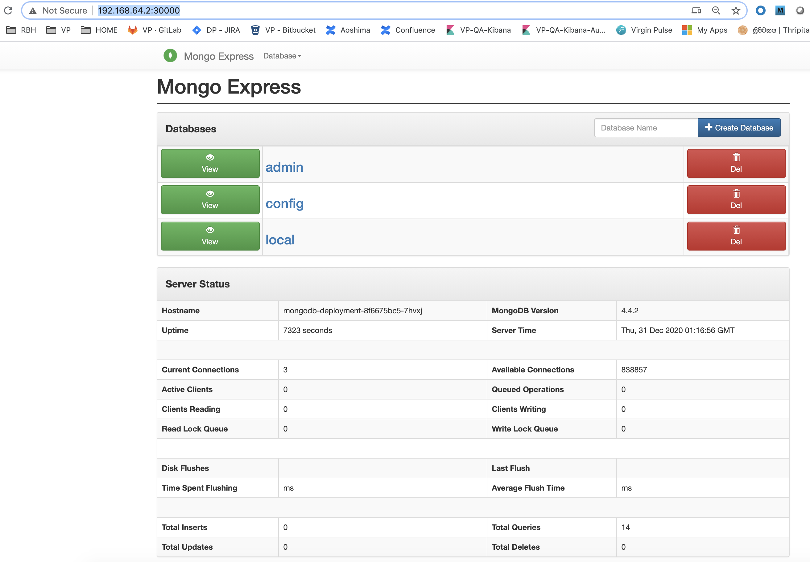
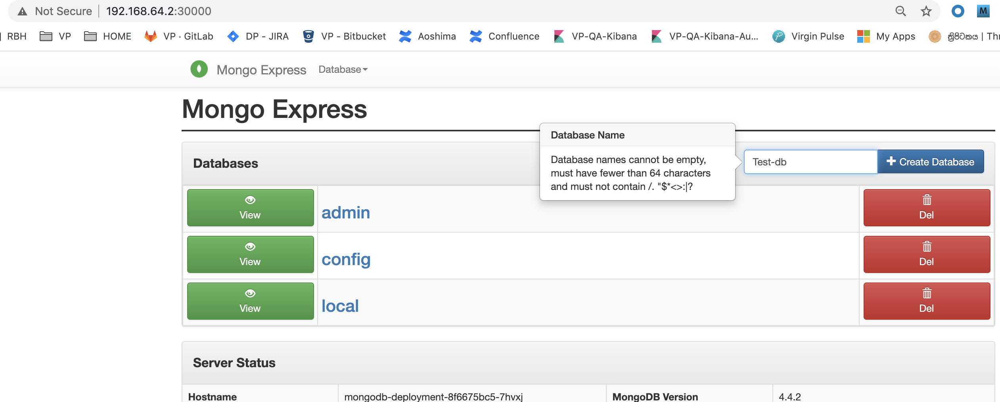
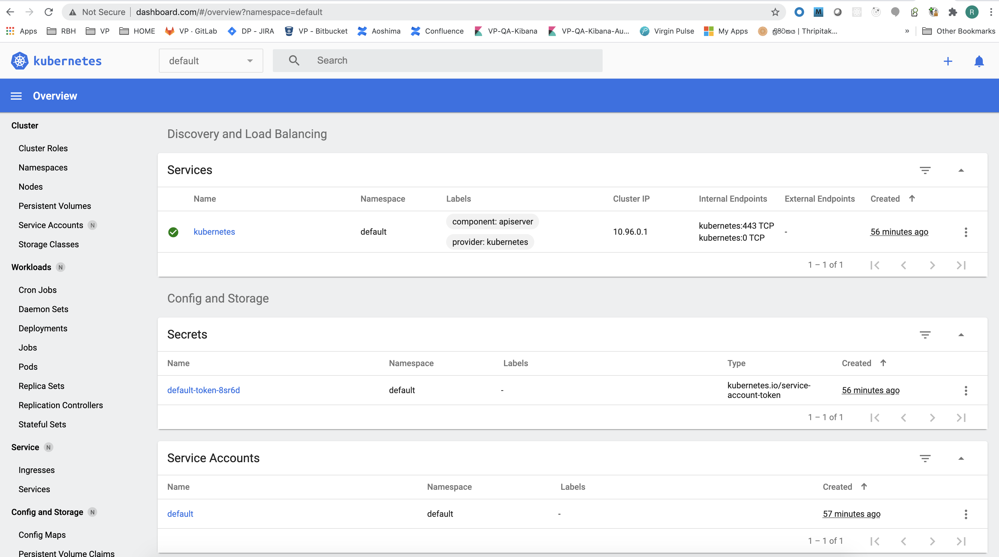

## Introduction

This tutorial will:
- install minikube locally
- show how to run: [Spring Bath on Kebernetes](spring-batch)
- 

**References**:

- [Free - Learn Devops Kubernetes deployment by kops and terraform](https://www.udemy.com/course/learn-devops-kubernetes-deployment-by-kops-and-terraform/learn/lecture/18287718#overview)
-[Really good Kubernetes Tutorial for Beginners [FULL COURSE in 4 Hours]](https://www.youtube.com/watch?v=X48VuDVv0do)
- [Spring Cloud on Kubernetes](https://www.youtube.com/watch?v=pYpruogcb6w)

## Local Setup

### install hyperkit virtual env and minikube
Minikube will run master and worker node porcesses in one node and come with docker and kubectl installed.

**Minikube** :
- for start up/deleting cluster     

**kubectl**:
- for configuring the minikube cluster  

```sh
brew update

brew install hyperkit

brew install minikube 

```

### start minikube in virtual env

```sh
minikube start --vm-driver=hyperkit
```

### delete all resources created and start over

`minikube delete`


### Basic kubectl commands

**get nodes**: `kubectl get nodes`

```sh
kubectl get nodes

(base)  rdissanayakam@rbh12855  ~/home/bitbucket/microservices   master ●✚  kubectl get nodes
NAME       STATUS   ROLES    AGE     VERSION
minikube   Ready    master   6m47s   v1.19.4
```

**get minikube status:** `minikube status`

```sh
(base)  rdissanayakam@rbh12855  ~/home/bitbucket/microservices   master ●✚  minikube status

minikube

type: Control Plane

host: Running

kubelet: Running

apiserver: Running

kubeconfig: Configured

```

**get kubectl version**: `kubectl version`

```sh
(base)  rdissanayakam@rbh12855  ~/home/bitbucket/microservices   master ●✚  kubectl version

Client Version: version.Info{Major:"1", Minor:"16+", GitVersion:"v1.16.6-beta.0", 

GitCommit:"e7f962ba86f4ce7033828210ca3556393c377bcc", GitTreeState:"clean", BuildDate:"2020-01-15T08:26:26Z", 

GoVersion:"go1.13.5", Compiler:"gc", Platform:"darwin/amd64"}

Server Version: version.Info{Major:"1", Minor:"19", GitVersion:"v1.19.4", 

GitCommit:"d360454c9bcd1634cf4cc52d1867af5491dc9c5f", GitTreeState:"clean", BuildDate:"2020-11-11T13:09:17Z", 

GoVersion:"go1.15.2", Compiler:"gc", Platform:"linux/amd64"}
```

**get pod** : `kubectl get pod`

```sh
(base)  rdissanayakam@rbh12855  ~/home/bitbucket/microservices   master ●✚  kubectl get pod

No resources found in default namespace.
```

**get services** `kubectl get services`

```sh
(base)  rdissanayakam@rbh12855  ~/home/bitbucket/microservices   master ●✚  kubectl get services

NAME         TYPE        CLUSTER-IP   EXTERNAL-IP   PORT(S)   AGE

kubernetes   ClusterIP   10.96.0.1    <none>        443/TCP   16m
```

**get help on a command** `kubectl -h`


```sh
(base)  rdissanayakam@rbh12855  ~/home/bitbucket/microservices   master ●✚  kubectl create -h

Create a resource from a file or from stdin.

JSON and YAML formats are accepted.

Examples:
# Create a pod using the data in pod.json.
kubectl create -f ./pod.json

# Create a pod based on the JSON passed into stdin.
cat pod.json | kubectl create -f -

# Edit the data in docker-registry.yaml in JSON then create the resource using the edited data.
kubectl create -f docker-registry.yaml --edit -o json

Available Commands:
clusterrole         Create a ClusterRole.

clusterrolebinding  Create a ClusterRoleBinding for a particular ClusterRole

configmap           Create a configmap from a local file, directory or literal value

cronjob             Create a cronjob with the specified name.

deployment          Create a deployment with the specified name.

job                 Create a job with the specified name.

namespace           Create a namespace with the specified name

poddisruptionbudget Create a pod disruption budget with the specified name.

priorityclass       Create a priorityclass with the specified name.

quota               Create a quota with the specified name.

role                Create a role with single rule.

rolebinding         Create a RoleBinding for a particular Role or ClusterRole

secret              Create a secret using specified subcommand

service             Create a service using specified subcommand.

serviceaccount      Create a service account with the specified name

Options:

    --allow-missing-template-keys=true: If true, ignore any errors in templates when a field or map key is missing in

Usage:

kubectl create -f FILENAME [options]

Use "kubectl <command> --help" for more information about a given command.

Use "kubectl options" for a list of global command-line options (applies to all commands).

```

**create pod/deployment**: `kubectl create deployment my-dep --image=nginx`

```sh
(base)  ✘ rdissanayakam@rbh12855  ~/home/bitbucket/microservices   master  kubectl create deployment nginx-depl --image=nginx

deployment.apps/nginx-depl created
```

**get deployment**: `kubectl get deployment`

```sh
(base)  rdissanayakam@rbh12855  ~/home/bitbucket/microservices   master  kubectl get deployment

NAME         READY   UP-TO-DATE   AVAILABLE   AGE

nginx-depl   1/1     1            1           70s
```

READY(0/1) : service is not ready yet

READY(1/1) : service is ready

```sh
(base)  rdissanayakam@rbh12855  ~/home/bitbucket/microservices   master  kubectl get pod

NAME                          READY   STATUS    RESTARTS   AGE

nginx-depl-5c8bf76b5b-dvwh9   1/1     Running   0          2m50s
```

pod name format= <deployment-name>-<replicaset-hash>-<hash>

STATUS(Container Creating) : not ready

STATUS (Runnig) : container ready   


**get replicaset** `kubectl get replicaset`

A replicaset is automatically created with deployment. Nothing you should manage.

```sh
(base)  rdissanayakam@rbh12855  ~/home/bitbucket/microservices   master  kubectl get replicaset

NAME                    DESIRED   CURRENT   READY   AGE

nginx-depl-5c8bf76b5b   1         1         1       8m12s
```

**edit configuration of deployment**: `kubectl edit deployment nginx-depl`

kubectl automatically generates a configuration file with default values for the depllyment we did. Let's edit it:

`kubectl edit deployment nginx-depl`

```yml
# Please edit the object below. Lines beginning with a '#' will be ignored,
# and an empty file will abort the edit. If an error occurs while saving this file will be
# reopened with the relevant failures.
#
apiVersion: apps/v1
kind: Deployment
metadata:
annotations:
    deployment.kubernetes.io/revision: "1"
creationTimestamp: "2020-12-30T17:55:08Z"
generation: 1
labels:
    app: nginx-depl
managedFields:
- apiVersion: apps/v1
    fieldsType: FieldsV1
    fieldsV1:
    f:metadata:
        f:labels:
        .: {}
        f:app: {}
    f:spec:
        f:progressDeadlineSeconds: {}
        f:replicas: {}
        f:revisionHistoryLimit: {}
        f:selector:
        f:matchLabels:
            .: {}
            f:app: {}
        f:strategy:
        f:rollingUpdate:
            .: {}
            f:maxSurge: {}
            f:maxUnavailable: {}
        f:type: {}
        f:template:
        f:metadata:
            f:labels:
            .: {}
            f:app: {}
        f:spec:
            f:containers:
            k:{"name":"nginx"}:
                .: {}
                f:image: {}
                f:imagePullPolicy: {}
                f:name: {}
                f:resources: {}
                f:terminationMessagePath: {}
                f:terminationMessagePolicy: {}
            f:dnsPolicy: {}
            f:restartPolicy: {}
            f:dnsPolicy: {}
            f:restartPolicy: {}
            f:schedulerName: {}
            f:securityContext: {}
            f:terminationGracePeriodSeconds: {}
    manager: kubectl
    operation: Update
    time: "2020-12-30T17:55:08Z"
- apiVersion: apps/v1
    fieldsType: FieldsV1
    fieldsV1:
    f:metadata:
        f:annotations:
        .: {}
        f:deployment.kubernetes.io/revision: {}
    f:status:
        f:availableReplicas: {}
        f:conditions:
        .: {}
        k:{"type":"Available"}:
            .: {}
            f:lastTransitionTime: {}
            f:lastUpdateTime: {}
            f:message: {}
            f:reason: {}
            f:status: {}
            f:type: {}
        k:{"type":"Progressing"}:
            .: {}
            f:lastTransitionTime: {}
            f:lastUpdateTime: {}
            f:message: {}
            f:reason: {}
            f:status: {}
            f:type: {}
        f:observedGeneration: {}
        f:readyReplicas: {}
        f:replicas: {}
        f:updatedReplicas: {}
    manager: kube-controller-manager
    operation: Update
    time: "2020-12-30T17:55:18Z"
name: nginx-depl
namespace: default
resourceVersion: "4630"
selfLink: /apis/apps/v1/namespaces/default/deployments/nginx-depl
uid: 0beb87fb-5d73-4124-863b-8d2d7cc3ccb0
spec:   
progressDeadlineSeconds: 600
replicas: 1
revisionHistoryLimit: 10
selector:
    matchLabels:
    app: nginx-depl
strategy:
    rollingUpdate:
    maxSurge: 25%
    maxUnavailable: 25%
    type: RollingUpdate
template:
    metadata:
    creationTimestamp: null
    labels:
        app: nginx-depl
    spec:
    containers:
    - image: nginx
        imagePullPolicy: Always
        name: nginx
        resources: {}
        terminationMessagePath: /dev/termination-log
        terminationMessagePolicy: File
    dnsPolicy: ClusterFirst
    restartPolicy: Always
    schedulerName: default-scheduler
    securityContext: {}
    terminationGracePeriodSeconds: 30
status:
availableReplicas: 1
conditions:
- lastTransitionTime: "2020-12-30T17:55:18Z"
    lastUpdateTime: "2020-12-30T17:55:18Z"
    message: Deployment has minimum availability.
    reason: MinimumReplicasAvailable
    status: "True"
    type: Available
- lastTransitionTime: "2020-12-30T17:55:08Z"
    lastUpdateTime: "2020-12-30T17:55:18Z"
    message: ReplicaSet "nginx-depl-5c8bf76b5b" has successfully progressed.
    reason: NewReplicaSetAvailable
    status: "True"
    type: Progressing
observedGeneration: 1
readyReplicas: 1
replicas: 1
updatedReplicas: 1    
```

Let's update image to 1.16 and save.

```yml
...
spec:
    containers:
    - image: nginx:1.16

...
```

```sh
(base)  rdissanayakam@rbh12855  ~/home/bitbucket/microservices   master  kubectl edit deployment nginx-depl

deployment.apps/nginx-depl edited

(base)  rdissanayakam@rbh12855  ~/home/bitbucket/microservices   master  kubectl get pod
#old container terminated and       new container brought up
NAME                          READY   STATUS    RESTARTS   AGE

nginx-depl-7fc44fc5d4-2k2ph   1/1     Running   0          58s

#new replicaset is automatically created, old one has no pods in it anymore  
(base)  rdissanayakam@rbh12855  ~/home/bitbucket/microservices   master  kubectl get replicaset
NAME                    DESIRED   CURRENT   READY   AGE
nginx-depl-5c8bf76b5b   0         0         0       21m
nginx-depl-7fc44fc5d4   1         1         1       2m12s

```

### Debugging pods

**debugging pods** : `kubectl logs CONTAINER_NAME`


```sh
(base)  ✘ rdissanayakam@rbh12855  ~/home/bitbucket/microservices   master  kubectl logs nginx-depl-7fc44fc5d4-2k2ph

#nothing is logged
(base)  rdissanayakam@rbh12855  ~/home/bitbucket/microservices   master 
```

Let's create mongo deployment:

```sh
(base)  rdissanayakam@rbh12855  ~/home/bitbucket/microservices   master     kubectl create deployment
mongo-depl --image=mongo

deployment.apps/mongo-depl created

(base)  ✘ rdissanayakam@rbh12855  ~/home/bitbucket/microservices   master  kubectl get pod

NAME                          READY   STATUS              RESTARTS   AGE    
mongo-depl-5fd6b7d4b4-mbvnn   0/1     ContainerCreating   0          16s
nginx-depl-7fc44fc5d4-2k2ph   1/1     Running             0          175m

(base)  rdissanayakam@rbh12855  ~/home/bitbucket/microservices   master  kubectl get pod
NAME                          READY   STATUS    RESTARTS   AGE
mongo-depl-5fd6b7d4b4-mbvnn   1/1     Running   0          27s
nginx-depl-7fc44fc5d4-2k2ph   1/1     Running   0          175m


(base)  rdissanayakam@rbh12855  ~/home/bitbucket/microservices   master  kubectl logs mongo-depl-5fd6b7d4b4-mbvnn

{"t":{"$date":"2020-12-30T21:10:03.014+00:00"},"s":"I",  "c":"CONTROL",  "id":23285,   "ctx":"main","msg":"Automatically disabling TLS 1.0, to force-enable TLS 1.0 specify --sslDisabledProtocols 'none'"}
{"t":{"$date":"2020-12-30T21:10:03.015+00:00"},"s":"W",  "c":"ASIO",     "id":22601,   "ctx":"main","msg":"No TransportLayer configured during NetworkInterface startup"}
{"t":{"$date":"2020-12-30T21:10:03.016+00:00"},"s":"I",  "c":"NETWORK",  "id":4648601, "ctx":"main","msg":"Implicit TCP FastOpen unavailable. If TCP FastOpen is required, set tcpFastOpenServer, tcpFastOpenClient, and tcpFastOpenQueueSize."}
{"t":{"$date":"2020-12-30T21:10:03.016+00:00"},"s":"I",  "c":"STORAGE",  "id":4615611, "ctx":"initandlisten","msg":"MongoDB starting","attr":{"pid":1,"port":27017,"dbPath":"/data/db","architecture":"64-bit","host":"mongo-depl-5fd6b7d4b4-mbvnn"}}
{"t":{"$date":"2020-12-30T21:10:03.016+00:00"},"s":"I",  "c":"CONTROL",  "id":23403,   "ctx":"initandlisten","msg":"Build Info","attr":{"buildInfo":{"version":"4.4.2","gitVersion":"15e73dc5738d2278b688f8929aee605fe4279b0e","openSSLVersion":"OpenSSL 1.1.1  11 Sep 2018","modules":[],"allocator":"tcmalloc","environment":{"distmod":"ubuntu1804","distarch":"x86_64","target_arch":"x86_64"}}}}
{"t":{"$date":"2020-12-30T21:10:03.016+00:00"},"s":"I",  "c":"CONTROL",  "id":51765,   "ctx":"initandlisten","msg":"Operating System","attr":{"os":{"name":"Ubuntu","version":"18.04"}}}
{"t":{"$date":"2020-12-30T21:10:03.016+00:00"},"s":"I",  "c":"CONTROL",  "id":21951,   "ctx":"initandlisten","msg":"Options set by command line","attr":{"options":{"net":{"bindIp":"*"}}}}
{"t":{"$date":"2020-12-30T21:10:03.017+00:00"},"s":"I",  "c":"STORAGE",  "id":22297,   "ctx":"initandlisten","msg":"Using the XFS filesystem is strongly recommended with the WiredTiger storage engine. See http://dochub.mongodb.org/core/prodnotes-filesystem","tags":["startupWarnings"]}
{"t":{"$date":"2020-12-30T21:10:03.017+00:00"},"s":"I",  "c":"STORAGE",  "id":22315,   "ctx":"initandlisten","msg":"Opening WiredTiger","attr":{"config":"create,cache_size=1409M,session_max=33000,eviction=(threads_min=4,threads_max=4),config_base=false,statistics=(fast),log=(enabled=true,archive=true,path=journal,compressor=snappy),file_manager=(close_idle_time=100000,close_scan_interval=10,close_handle_minimum=250),statistics_log=(wait=0),verbose=[recovery_progress,checkpoint_progress,compact_progress],"}}
{"t":{"$date":"2020-12-30T21:10:03.536+00:00"},"s":"I",  "c":"STORAGE",  "id":22430,   "ctx":"initandlisten","msg":"WiredTiger message","attr":{"message":"[1609362603:536789][1:0x7fd0d5606ac0], txn-recover: [WT_VERB_RECOVERY | WT_VERB_RECOVERY_PROGRESS] Set global recovery timestamp: (0, 0)"}}
{"t":{"$date":"2020-12-30T21:10:03.536+00:00"},"s":"I",  "c":"STORAGE",  "id":22430,   "ctx":"initandlisten","msg":"WiredTiger message","attr":{"message":"[1609362603:536859][1:0x7fd0d5606ac0], txn-recover: [WT_VERB_RECOVERY | WT_VERB_RECOVERY_PROGRESS] Set global oldest timestamp: (0, 0)"}}
{"t":{"$date":"2020-12-30T21:10:03.542+00:00"},"s":"I",  "c":"STORAGE",  "id":4795906, "ctx":"initandlisten","msg":"WiredTiger opened","attr":{"durationMillis":525}}
{"t":{"$date":"2020-12-30T21:10:03.542+00:00"},"s":"I",  "c":"RECOVERY", "id":23987,   "ctx":"initandlisten","msg":"WiredTiger recoveryTimestamp","attr":{"recoveryTimestamp":{"$timestamp":{"t":0,"i":0}}}}
{"t":{"$date":"2020-12-30T21:10:03.553+00:00"},"s":"I",  "c":"STORAGE",  "id":4366408, "ctx":"initandlisten","msg":"No table logging settings modifications are required for existing WiredTiger tables","attr":{"loggingEnabled":true}}
{"t":{"$date":"2020-12-30T21:10:03.554+00:00"},"s":"I",  "c":"STORAGE",  "id":22262,   "ctx":"initandlisten","msg":"Timestamp monitor starting"}
{"t":{"$date":"2020-12-30T21:10:03.559+00:00"},"s":"W",  "c":"CONTROL",  "id":22120,   "ctx":"initandlisten","msg":"Access control is not enabled for the database. Read and write access to data and configuration is unrestricted","tags":["startupWarnings"]}
{"t":{"$date":"2020-12-30T21:10:03.560+00:00"},"s":"I",  "c":"STORAGE",  "id":20320,   "ctx":"initandlisten","msg":"createCollection","attr":{"namespace":"admin.system.version","uuidDisposition":"provided","uuid":{"uuid":{"$uuid":"35b07ba7-2a6e-496a-82a8-146b137f77a9"}},"options":{"uuid":{"$uuid":"35b07ba7-2a6e-496a-82a8-146b137f77a9"}}}}
{"t":{"$date":"2020-12-30T21:10:03.568+00:00"},"s":"I",  "c":"INDEX",    "id":20345,   "ctx":"initandlisten","msg":"Index build: done building","attr":{"buildUUID":null,"namespace":"admin.system.version","index":"_id_","commitTimestamp":{"$timestamp":{"t":0,"i":0}}}}
{"t":{"$date":"2020-12-30T21:10:03.568+00:00"},"s":"I",  "c":"COMMAND",  "id":20459,   "ctx":"initandlisten","msg":"Setting featureCompatibilityVersion","attr":{"newVersion":"4.4"}}
{"t":{"$date":"2020-12-30T21:10:03.569+00:00"},"s":"I",  "c":"STORAGE",  "id":20536,   "ctx":"initandlisten","msg":"Flow Control is enabled on this deployment"}
{"t":{"$date":"2020-12-30T21:10:03.570+00:00"},"s":"I",  "c":"STORAGE",  "id":20320,   "ctx":"initandlisten","msg":"createCollection","attr":{"namespace":"local.startup_log","uuidDisposition":"generated","uuid":{"uuid":{"$uuid":"5b25e517-5ef2-45ca-b315-3a209baf33a5"}},"options":{"capped":true,"size":10485760}}}
{"t":{"$date":"2020-12-30T21:10:03.579+00:00"},"s":"I",  "c":"INDEX",    "id":20345,   "ctx":"initandlisten","msg":"Index build: done building","attr":{"buildUUID":null,"namespace":"local.startup_log","index":"_id_","commitTimestamp":{"$timestamp":{"t":0,"i":0}}}}
{"t":{"$date":"2020-12-30T21:10:03.580+00:00"},"s":"I",  "c":"FTDC",     "id":20625,   "ctx":"initandlisten","msg":"Initializing full-time diagnostic data capture","attr":{"dataDirectory":"/data/db/diagnostic.data"}}
{"t":{"$date":"2020-12-30T21:10:03.583+00:00"},"s":"I",  "c":"STORAGE",  "id":20320,   "ctx":"LogicalSessionCacheRefresh","msg":"createCollection","attr":{"namespace":"config.system.sessions","uuidDisposition":"generated","uuid":{"uuid":{"$uuid":"7008eaaa-98ac-46af-a376-b4afcafd32c9"}},"options":{}}}
{"t":{"$date":"2020-12-30T21:10:03.584+00:00"},"s":"I",  "c":"CONTROL",  "id":20712,   "ctx":"LogicalSessionCacheReap","msg":"Sessions collection is not set up; waiting until next sessions reap interval","attr":{"error":"NamespaceNotFound: config.system.sessions does not exist"}}
{"t":{"$date":"2020-12-30T21:10:03.584+00:00"},"s":"I",  "c":"NETWORK",  "id":23015,   "ctx":"listener","msg":"Listening on","attr":{"address":"/tmp/mongodb-27017.sock"}}
{"t":{"$date":"2020-12-30T21:10:03.584+00:00"},"s":"I",  "c":"NETWORK",  "id":23015,   "ctx":"listener","msg":"Listening on","attr":{"address":"0.0.0.0"}}
{"t":{"$date":"2020-12-30T21:10:03.584+00:00"},"s":"I",  "c":"NETWORK",  "id":23016,   "ctx":"listener","msg":"Waiting for connections","attr":{"port":27017,"ssl":"off"}}
{"t":{"$date":"2020-12-30T21:10:03.599+00:00"},"s":"I",  "c":"INDEX",    "id":20345,   "ctx":"LogicalSessionCacheRefresh","msg":"Index build: done building","attr":{"buildUUID":null,"namespace":"config.system.sessions","index":"_id_","commitTimestamp":{"$timestamp":{"t":0,"i":0}}}}
{"t":{"$date":"2020-12-30T21:10:03.599+00:00"},"s":"I",  "c":"INDEX",    "id":20345,   "ctx":"LogicalSessionCacheRefresh","msg":"Index build: done building","attr":{"buildUUID":null,"namespace":"config.system.sessions","index":"lsidTTLIndex","commitTimestamp":{"$timestamp":{"t":0,"i":0}}}}
(base)  rdissanayakam@rbh12855  ~/home/bitbucket/microservices   master 
```

**describing pods** : `kubectl describe pod POD_NAME    `

```sh
(base)  rdissanayakam@rbh12855  ~/home/bitbucket/microservices   master  kubectl describe pod mongo-depl-5fd6b7d4b4-mbvnn

Name:         mongo-depl-5fd6b7d4b4-mbvnn
Namespace:    default
Priority:     0
Node:         minikube/192.168.64.2
Start Time:   Wed, 30 Dec 2020 15:09:37 -0600
Labels:       app=mongo-depl
            pod-template-hash=5fd6b7d4b4
Annotations:  <none>
Status:       Running
IP:           172.17.0.3
IPs:
IP:           172.17.0.3
Controlled By:  ReplicaSet/mongo-depl-5fd6b7d4b4
Containers:
mongo:
    Container ID:   docker://1336494faae6f2d0bfbecb17dd3974f3a443c29188ccd6c7a9b854926e5b786d
    Image:          mongo
    Image ID:       docker-pullable://mongo@sha256:02e9941ddcb949424fa4eb01f9d235da91a5b7b64feb5887eab77e1ef84a3bad
    Port:           <none>
    Host Port:      <none>
    State:          Running
    Started:      Wed, 30 Dec 2020 15:10:02 -0600
    Ready:          True
    Restart Count:  0
    Environment:    <none>
    Mounts:
    /var/run/secrets/kubernetes.io/serviceaccount from default-token-7hsl2 (ro)
Conditions:
Type              Status
Initialized       True
Ready             True
ContainersReady   True
PodScheduled      True
Volumes:
default-token-7hsl2:
    Type:        Secret (a volume populated by a Secret)
    SecretName:  default-token-7hsl2
    Optional:    false
QoS Class:       BestEffort
Node-Selectors:  <none>
Tolerations:     node.kubernetes.io/not-ready:NoExecute for 300s
                node.kubernetes.io/unreachable:NoExecute for 300s
Events:
Type    Reason     Age    From               Message
----    ------     ----   ----               -------
Normal  Scheduled  4m56s  default-scheduler  Successfully assigned default/mongo-depl-5fd6b7d4b4-mbvnn to minikube
Normal  Pulling    4m56s  kubelet, minikube  Pulling image "mongo"
Normal  Pulled     4m31s  kubelet, minikube  Successfully pulled image "mongo" in 24.62914344s
Normal  Created    4m31s  kubelet, minikube  Created container mongo
Normal  Started    4m31s  kubelet, minikube  Started container mongo
```

**get an interactive terminal for debugging** : `kubectl exec -it POD_NAME -- bin/bash`

```sh
(base)  rdissanayakam@rbh12855  ~/home/bitbucket/microservices   master  kubectl exec -it mongo-depl-5fd6b7d4b4-mbvnn -- bin/bash

root@mongo-depl-5fd6b7d4b4-mbvnn:/# ls
bin   data  docker-entrypoint-initdb.d  home        lib    media  opt   root  sbin  sys  usr
boot  dev   etc                         js-yaml.js  lib64  mnt    proc  run   srv   tmp  var

root@mongo-depl-5fd6b7d4b4-mbvnn:/# ls data/
configdb  db

root@mongo-depl-5fd6b7d4b4-mbvnn:/# exit
exit
```

**delete deployment (and replicaset)**: `kubectl delete deployment DEPLOYMENT_NAME`

```sh
(base)  rdissanayakam@rbh12855  ~/home/bitbucket/microservices   master  kubectl get deployment
NAME         READY   UP-TO-DATE   AVAILABLE   AGE
mongo-depl   1/1     1            1           19m
nginx-depl   1/1     1            1           3h34m

(base)  rdissanayakam@rbh12855  ~/home/bitbucket/microservices   master  kubectl get pod
NAME                          READY   STATUS    RESTARTS   AGE
mongo-depl-5fd6b7d4b4-mbvnn   1/1     Running   0          19m
nginx-depl-7fc44fc5d4-2k2ph   1/1     Running   0          3h15m

(base)  rdissanayakam@rbh12855  ~/home/bitbucket/microservices   master  kubectl delete deployment mongo-depl
deployment.apps "mongo-depl" deleted

(base)  rdissanayakam@rbh12855  ~/home/bitbucket/microservices   master  kubectl get pod
NAME                          READY   STATUS        RESTARTS   AGE
mongo-depl-5fd6b7d4b4-mbvnn   0/1     Terminating   0          21m
nginx-depl-7fc44fc5d4-2k2ph   1/1     Running       0          3h16m

(base)  rdissanayakam@rbh12855  ~/home/bitbucket/microservices   master  kubectl get replicaset
NAME                    DESIRED   CURRENT   READY   AGE
nginx-depl-5c8bf76b5b   0         0         0       3h36m
nginx-depl-7fc44fc5d4   1         1         1       3h16m

(base)  rdissanayakam@rbh12855  ~/home/bitbucket/microservices   master  kubectl get pod
NAME                          READY   STATUS    RESTARTS   AGE
nginx-depl-7fc44fc5d4-2k2ph   1/1     Running   0          3h16m

(base)  rdissanayakam@rbh12855  ~/home/bitbucket/microservices   master  kubectl delete deployment nginx-depl
deployment.apps "nginx-depl" deleted

(base)  rdissanayakam@rbh12855  ~/home/bitbucket/microservices   master  kubectl get pod
NAME                          READY   STATUS        RESTARTS   AGE
nginx-depl-7fc44fc5d4-2k2ph   0/1     Terminating   0          3h17m

(base)  rdissanayakam@rbh12855  ~/home/bitbucket/microservices   master  kubectl get replicaset
No resources found in default namespace.

(base)  rdissanayakam@rbh12855  ~/home/bitbucket/microservices   master  kubectl get pod
No resources found in default namespace.

```
### using kubernetese configuration file  (instead of kubectl create deployment name image options) : 

`kubectl apply  -f FILE_NAME`

e.g. `kubectl apply  -f config-file.yaml    `

First let's create config file for deploying nginx:

```sh
touch nginx-deployment.yaml

vi nginx-deployment.yaml
```
save following:

```yml
apiVersion: apps/v1
kind: Deployment #deployment config 
metadata:
name: nginx-deployment
labels:
    app: nginx

spec: ##specification for the deployment
replicas: 1 ##number of pods 
selector:
    matchLabels:
    app: nginx
template:
    metadata:
    labels:
        app: nginx
    spec: ##specification for the pod   
    containers:
    - name: nginx
        image: nginx:1.16
        ports:
        - containerPort: 80
```

Apply configuration to deploy pod(s): `kubectl apply -f nginx-deployment.yaml`

```sh
(base)  rdissanayakam@rbh12855  ~/home/bitbucket/microservices   master  kubectl apply -f nginx-deployment.yaml
deployment.apps/nginx-deployment created

(base)  rdissanayakam@rbh12855  ~/home/bitbucket/microservices   master  kubectl get pod
NAME                                READY   STATUS    RESTARTS   AGE
nginx-deployment-644599b9c9-gqlh7   1/1     Running   0          6s

(base)  rdissanayakam@rbh12855  ~/home/bitbucket/microservices   master  kubectl get deployment
NAME               READY   UP-TO-DATE   AVAILABLE   AGE
nginx-deployment   1/1     1            1           15s

(base)  rdissanayakam@rbh12855  ~/home/bitbucket/microservices   master  kubectl get replicaset
NAME                          DESIRED   CURRENT   READY   AGE
nginx-deployment-644599b9c9   1         1         1       20s
```

Let's update configuration (to have ttwo pods) and reapply:


```yml
apiVersion: apps/v1
kind: Deployment #deployment config 
metadata:
name: nginx-deployment
labels:
    app: nginx

spec: ##specification for the deployment
replicas: 2 ##number of pods 
selector:
    matchLabels:
    app: nginx
template: #pod template
    metadata:
    labels:
        app: nginx
    spec: ##specification/blueprint for the pod   
    containers:
    - name: nginx
        image: nginx:1.16
        ports:
        - containerPort: 80
```

After applying two pods created.

```sh
(base)  rdissanayakam@rbh12855  ~/home/bitbucket/microservices   master  kubectl apply -f nginx-deployment.yaml
deployment.apps/nginx-deployment configured

(base)  rdissanayakam@rbh12855  ~/home/bitbucket/microservices   master  kubectl get pod
NAME                                READY   STATUS    RESTARTS   AGE
nginx-deployment-644599b9c9-gqlh7   1/1     Running   0          3m34s #old one still there
nginx-deployment-644599b9c9-hlrqc   1/1     Running   0          12s #new pod go created

(base)  rdissanayakam@rbh12855  ~/home/bitbucket/microservices   master  kubectl get deployment
NAME               READY   UP-TO-DATE   AVAILABLE   AGE
nginx-deployment   2/2     2            2           3m54s

(base)  rdissanayakam@rbh12855  ~/home/bitbucket/microservices   master  kubectl get replicaset
NAME                          DESIRED   CURRENT   READY   AGE
nginx-deployment-644599b9c9   2         2         2       4m1s

```

### Kubernetes configuration file structure

Each configuration  has 3 parts:
1. metadta
2. specification (attributes of `spec`  vary based on whther it is a deployment or ser ice)
3. status (Auto generated and maintained by kubernetes (Current state vs Desired state: like in docker compose apply which let you apply incremental changes))
        - status data come from `etcd` which hold current state of components   
**Deployment:  nginx-deployment.yml**
```yml
apiVersion: apps/v1
kind: Deployment  
metadata: #PART1: METADATA
name: nginx-deployment
labels: ...

spec: #PART2: SPECIFICATION 
replicas: 2  
selector: ...
template: ...
```

**Service:  nginx-service.yml**
```yml
apiVersion: v1
kind: Service 
metadata: #PART1: METADATA
name: nginx-service
spec: #PART2: SPECIFICATION
selector: ...
ports: 
    - protocol: TCP
    port: 80
    targetPort: 8080  #matches containerPort of nginx-deployment.yml
```

**where to store config files?** : 
- usual practice is to store them with code.

### Connecting components (Labrls + Selectors + Port)**

Connect services and deployments (services should know which deploymnets  registered to it.)

In service and deployment configuration ymls: 
- **metadata**: contain `labels` (any <key,value> pair (<app,  nginx>))
    - pods get the label through the tempate blueprint
- **spec**: contain `selecters`
    - the label is matched by the selecter (`matchLabels: app:nginx`)


- nginx-service.yml `spec: selector` will match the ngonx-deployment.yml `metadata: labels` to create a connection between service and deployment           

- nginx Service (created from nginx-service.yml) when get a requst (from say DB Service) on its listening port 80  will send request to Pod for nginx-depyment in Pod for target port 8080

Let's apply both configs:

```sh
(base)  rdissanayakam@rbh12855  ~/home/bitbucket/kubernetes   master ●  kubectl apply -f nginx-deployment.yaml
deployment.apps/nginx-deployment created

(base)  rdissanayakam@rbh12855  ~/home/bitbucket/kubernetes   master ●  kubectl apply -f nginx-service.yaml
service/nginx-service created

(base)  rdissanayakam@rbh12855  ~/home/bitbucket/kubernetes   master ●  kubectl get pod
NAME                               READY   STATUS    RESTARTS   AGE
nginx-deployment-f4b7bbcbc-rswsv   1/1     Running   0          16s
nginx-deployment-f4b7bbcbc-w9h9p   1/1     Running   0          16s

(base)  rdissanayakam@rbh12855  ~/home/bitbucket/kubernetes   master ●  kubectl get service
NAME            TYPE        CLUSTER-IP      EXTERNAL-IP   PORT(S)   AGE
kubernetes      ClusterIP   10.96.0.1       <none>        443/TCP   6h8m #default service, always there
nginx-service   ClusterIP   10.104.131.73   <none>        80/TCP    34s #one we created

(base)  rdissanayakam@rbh12855  ~/home/bitbucket/kubernetes   master ●  kubectl describe service nginx-service
Name:              nginx-service
Namespace:         default
Labels:            <none>
Annotations:       kubectl.kubernetes.io/last-applied-configuration:
                    {"apiVersion":"v1","kind":"Service","metadata":{"annotations":{},"name":"nginx-service","namespace":"default"},"spec":{"ports":[{"port":80...
Selector:          app=nginx
Type:              ClusterIP
IP:                10.104.131.73
Port:              <unset>  80/TCP
TargetPort:        8080/TCP
Endpoints:         172.17.0.3:8080,172.17.0.4:8080 #IP addresses:ports of nginx-deployment target pods service must forward requests to
Session Affinity:  None
Events:            <none>       

(base)  rdissanayakam@rbh12855  ~/home/bitbucket/kubernetes   master ●  kubectl get deployment
NAME               READY   UP-TO-DATE   AVAILABLE   AGE
nginx-deployment   2/2     2            2           53s

#get IP address of deplyment pods
(base)  rdissanayakam@rbh12855  ~/home/bitbucket/kubernetes   master ●  kubectl get pod -o wide
NAME                               READY   STATUS    RESTARTS   AGE     IP           NODE       NOMINATED NODE   READINESS GATES
nginx-deployment-f4b7bbcbc-rswsv   1/1     Running   0          6m48s   172.17.0.3   minikube   <none>           <none>
nginx-deployment-f4b7bbcbc-w9h9p   1/1     Running   0          6m48s   172.17.0.4   minikube   <none>           <none>     

```
### Get autogenerated status status
Get config in yml format

```sh
    #get update config stored in etcd
```
```yaml
apiVersion: apps/v1
kind: Deployment
...
status:
availableReplicas: 2
conditions:
- lastTransitionTime: "2020-12-30T22:23:19Z"
    lastUpdateTime: "2020-12-30T22:23:19Z"
    message: Deployment has minimum availability.
    reason: MinimumReplicasAvailable
    status: "True"
    type: Available
- lastTransitionTime: "2020-12-30T22:23:17Z"
    lastUpdateTime: "2020-12-30T22:23:19Z"
    message: ReplicaSet "nginx-deployment-f4b7bbcbc" has successfully progressed.
    reason: NewReplicaSetAvailable
    status: "True"
    type: Progressing
observedGeneration: 1
readyReplicas: 2
replicas: 2
updatedReplicas: 2
```

### delete deployments and service 

`kubectl delete -f config.yaml`

```sh
(base)  rdissanayakam@rbh12855  ~/home/bitbucket/kubernetes   master ●  kubectl delete -f nginx-service.yaml
service "nginx-service" deleted

(base)  rdissanayakam@rbh12855  ~/home/bitbucket/kubernetes   master ●  kubectl delete -f nginx-deployment.yaml
deployment.apps "nginx-deployment" deleted

```

### Demo : MongoDB and MongoExpress(Web) 

Code in demo-mongo folder

### STEP1: create mongodb deployment

**demo-mongo/mongodb.yaml**

```yml
apiVersion: apps/v1
kind: Deployment
metadata:
name: mongodb-deployment
labels:
    app: mongodb
spec:
replicas: 1
selector:
    matchLabels:
    app: mongodb
template:
    metadata:
    labels:
        app: mongodb
    spec:
    containers:
    - name: mongodb
        image: mongodb  
        ports:
        - containerPort: 27017 #lookup mongo in dockerhub if you do not know  (https://hub.docker.com/_/mongo)
        env: #lookup mongo in dockerhub if you do not know (https://hub.docker.com/_/mongo Environment Variables    )
        - name: MONGO_INITDB_ROOT_USERNAME
        value: #TODO: create kubernetes secret and reference here
        - name: MONGO_INITDB_ROOT_PASSWORD
        value: #TODO: create kubernetes secret and reference here
```

**Create secret for MONGO_INITDB_ROOT_USERNAME and MONGO_INITDB_ROOT_PASSWOR**           

get base64 endcode username and passwords:

```sh
echo -n "username" | base64
dXNlcm5hbWU=

echo -n "mypassword" | base64
bXlwYXNzd29yZA==
```

Now create mongo-secret.yml:
```yml
apiVersion: v1
kind: Secret
metadata:
name: mongodb-secret #anyname
type: Opaque #default, common but can use TLS certificates also
data:
mongo-root-username: dXNlcm5hbWU= #base64 encoded username (echo -n "username" | base64)/value (any apropriate name for key)
mongo-root-password: bXlwYXNzd29yZA== #base64 encoded password/value (any apropriate name for key)
```

Now let's create the secret:

```sh
(base)  rdissanayakam@rbh12855  ~/home/bitbucket/kubernetes/demo-mongo   master ●  kubectl apply -f mongo-secret.yaml
secret/mongodb-secret created

(base)  rdissanayakam@rbh12855  ~/home/bitbucket/kubernetes/demo-mongo   master ●  kubectl get secret
NAME                  TYPE                                  DATA   AGE
default-token-7hsl2   kubernetes.io/service-account-token   3      6h47m
mongodb-secret        Opaque                                2      20s #secret created  
```

Now let's go and update our `mongodb.yaml` to reference the k8s secret we created.

```yml
apiVersion: apps/v1
kind: Deployment
metadata:
name: mongodb-deployment
labels:
    app: mongodb
spec:
replicas: 1
selector:
    matchLabels:
    app: mongodb
template:
    metadata:
    labels:
        app: mongodb
    spec:
    containers:
    - name: mongodb
        image: mongo 
        ports:
        - containerPort: 27017 #lookup mongo in dockerhub if you do not know  (https://hub.docker.com/_/mongo)
        env: #lookup mongo in dockerhub if you do not know (https://hub.docker.com/_/mongo Environment Variables    )
        - name: MONGO_INITDB_ROOT_USERNAME
        valueFrom:
            secretKeyRef: 
            name: mongodb-secret #metadata:name in mongo-secret.yml 
            key: mongo-root-username #data:mongo-root-username key in mongo-secret.yml
        - name: MONGO_INITDB_ROOT_PASSWORD
        valueFrom:
            secretKeyRef: 
            name: mongodb-secret #metadata:name in mongo-secret.yml 
            key: mongo-root-password #data:mongo-root-password key in mongo-secret.yml
```

Now let's apply the mongodb-deployment.yml configuration:

```sh
(base)  rdissanayakam@rbh12855  ~/home/bitbucket/kubernetes/demo-mongo   master ●  kubectl apply -f mongodb.yaml
deployment.apps/mongodb-deployment configured


(base)  rdissanayakam@rbh12855  ~/home/bitbucket/kubernetes/demo-mongo   master ●   kubectl get all
NAME                                      READY   STATUS        RESTARTS   AGE
pod/mongodb-deployment-5cf4c8fdbf-vqfxv   0/1     Terminating   0          113s
pod/mongodb-deployment-8f6675bc5-7hvxj    1/1     Running       0          3s

NAME                 TYPE        CLUSTER-IP   EXTERNAL-IP   PORT(S)   AGE
service/kubernetes   ClusterIP   10.96.0.1    <none>        443/TCP   6h59m

NAME                                 READY   UP-TO-DATE   AVAILABLE   AGE
deployment.apps/mongodb-deployment   1/1     1            1           114s

NAME                                            DESIRED   CURRENT   READY   AGE
replicaset.apps/mongodb-deployment-5cf4c8fdbf   0         0         0       114s
replicaset.apps/mongodb-deployment-8f6675bc5    1         1         1       4s


(base)  rdissanayakam@rbh12855  ~/home/bitbucket/kubernetes/demo-mongo   master ●   kubectl get pod
NAME                                 READY   STATUS    RESTARTS   AGE
mongodb-deployment-8f6675bc5-7hvxj   1/1     Running   0          8s
```

### STEP2: create internal service so other pods can talk to mongodb pods

Let's modify `mongodb.yml` to inclide service config as well. append foloowing to file:

```yml
#omitted: deployment doc
#note 3 dashes to seperate service document from deployment document above:
---
apiVersion: v1
kind: Service 
metadata:
name: mongodb-service
spec:
selector:
    app: mongodb  #should match template:metadata:label in mongodb deployment configuration to connect to pod
ports:
    - protocol: TCP
    port: 27017
    targetPort: 27017 #should match containerPort in mongodb deployment configuration 
```

Now let's apply service config:

```sh
(base)  rdissanayakam@rbh12855  ~/home/bitbucket/kubernetes/demo-mongo   master ●  kubectl apply -f mongodb.yaml
deployment.apps/mongodb-deployment unchanged
service/mongodb-service created
```

verify ports:

```sh
(base)  rdissanayakam@rbh12855  ~/home/bitbucket/kubernetes/demo-mongo   master ●  kubectl get service
NAME              TYPE        CLUSTER-IP      EXTERNAL-IP   PORT(S)     AGE
kubernetes        ClusterIP   10.96.0.1       <none>        443/TCP     7h12m
mongodb-service   ClusterIP   10.97.250.196   <none>        27017/TCP   64s #service created listening @port 27017

#verify target Container ports:
(base)  rdissanayakam@rbh12855  ~/home/bitbucket/kubernetes/demo-mongo   master ●  kubectl describe service mongodb-service
Name:              mongodb-service
Namespace:         default
Labels:            <none>
Annotations:       kubectl.kubernetes.io/last-applied-configuration:
                    {"apiVersion":"v1","kind":"Service","metadata":{"annotations":{},"name":"mongodb-service","namespace":"default"},"spec":{"ports":[{"port":...
Selector:          app=mongodb
Type:              ClusterIP
IP:                10.97.250.196
Port:              <unset>  27017/TCP
TargetPort:        27017/TCP
Endpoints:         172.17.0.4:27017 #target port veirfied to be 27017   
Session Affinity:  None
Events:            <none>

(base)  rdissanayakam@rbh12855  ~/home/bitbucket/kubernetes/demo-mongo   master ●  kubectl get pod -o wide
NAME                                 READY   STATUS    RESTARTS   AGE   IP           NODE       NOMINATED NODE   READINESS GATES
mongodb-deployment-8f6675bc5-7hvxj   1/1     Running   0          15m   172.17.0.4   minikube    <none>           <none> #pod ip matches target ip of service

# see all components

(base)  rdissanayakam@rbh12855  ~/home/bitbucket/kubernetes/demo-mongo   master ●  kubectl get all | grep mongo
pod/mongodb-deployment-8f6675bc5-7hvxj   1/1     Running   0          17m
service/mongodb-service   ClusterIP   10.97.250.196   <none>        27017/TCP   5m47s
deployment.apps/mongodb-deployment   1/1     1            1           19m
replicaset.apps/mongodb-deployment-5cf4c8fdbf   0         0         0       19m
replicaset.apps/mongodb-deployment-8f6675bc5    1         1         1       17m
```

### STEP3: create mongoexpress deployment+service+confgmap 

Let's ccreate mongo-express.yml:
```yml
apiVersion: apps/v1
kind: Deployment
metadata:
name: mongo-express
labels:
    app: mongo-express
spec:
replicas: 1
selector:
    matchLabels:
    app: mongo-express
template:
    metadata:
    labels:
        app: mongo-express
    spec:
    containers:
    - name: mongo-express
        image: mongo-express 
        ports:
        - containerPort: 8081  #lookup mongo-express in dockerhub for port/env vars etc(https://hub.docker.com/_/mongo-express)
        env: 
        - name: ME_CONFIG_MONGODB_SERVER
        value: #TODO: instead of harcoding value, we put it in a configmap and reference (so other components can also use it )
        - name: ME_CONFIG_MONGODB_ADMINUSERNAME #same ones we setup for mogodb earlier
        valueFrom:
            secretKeyRef: 
            name: mongodb-secret #metadata:name in mongo-secret.yml 
            key: mongo-root-username #data:mongo-root-username key in mongo-secret.yml
        - name: ME_CONFIG_MONGODB_ADMINPASSWORD #same ones we setup for mogodb earlier
        valueFrom:
            secretKeyRef: 
            name: mongodb-secret #metadata:name in mongo-secret.yml 
            key: mongo-root-password #data:mongo-root-password key in mongo-secret.yml   
```

To fill in `ME_CONFIG_MONGODB_SERVER` value we will create a config map `mongo-configmap.yaml`:

```yml
apiVersion: v1
kind: configMap
metadata:
name: mongodb-configmap
data: #key-value pairs
database_url: mongodb-service #service name in mongo.yml
```

Now lets create config map:

```sh
(base)  ✘ rdissanayakam@rbh12855  ~/home/bitbucket/kubernetes/demo-mongo   master ●  kubectl apply -f mongo-configmap.yaml
configmap/mongodb-configmap created
```

Now that config map is created, lets update mongo-express.yaml to reference it:

```yml
apiVersion: apps/v1
kind: Deployment
metadata:
name: mongo-express
labels:
    app: mongo-express
spec:
replicas: 1
selector:
    matchLabels:
    app: mongo-express
template:
    metadata:
    labels:
        app: mongo-express
    spec:
    containers:
    - name: mongo-express
        image: mongo-express 
        ports:
        - containerPort: 8081  #lookup mongo-express in dockerhub for port/env vars etc(https://hub.docker.com/_/mongo-express)
        env: 
        - name: ME_CONFIG_MONGODB_SERVER
        valueFrom: #instead of harcoding value, we put it in a configmap and reference (so other components can also use it )
            configMapKeyRef: 
            name: mongodb-configmap #metadata:name in mongo-configmap.yml 
            key: database_url #data:database_url key in mongo-cpnfigmap.yml
        - name: ME_CONFIG_MONGODB_ADMINUSERNAME #same ones we setup for mogodb earlier
        valueFrom:
            secretKeyRef: 
            name: mongodb-secret #metadata:name in mongo-secret.yml 
            key: mongo-root-username #data:mongo-root-username key in mongo-secret.yml
        - name: ME_CONFIG_MONGODB_ADMINPASSWORD #same ones we setup for mogodb earlier
        valueFrom:
            secretKeyRef: 
            name: mongodb-secret #metadata:name in mongo-secret.yml 
            key: mongo-root-password #data:mongo-root-password key in mongo-secret.yml   
```

Lets create mongo express deployment:

```sh
(base)  rdissanayakam@rbh12855  ~/home/bitbucket/kubernetes/demo-mongo   master ●  kubectl apply -f mongo-express.yaml
deployment.apps/mongo-express created
```

verify:

```sh
(base)  rdissanayakam@rbh12855  ~/home/bitbucket/kubernetes/demo-mongo   master ●  kubectl get pod
NAME                                 READY   STATUS    RESTARTS   AGE
mongo-express-5b895fdb56-58wcd       1/1     Running   0          55s
mongodb-deployment-8f6675bc5-7hvxj   1/1     Running   0          46m

(base)  ✘ rdissanayakam@rbh12855  ~/home/bitbucket/kubernetes/demo-mongo   master ●  kubectl logs mongo-express-5b895fdb56-58wcd
Waiting for mongodb-service:27017...
Welcome to mongo-express
------------------------


Mongo Express server listening at http://0.0.0.0:8081
Server is open to allow connections from anyone (0.0.0.0)
basicAuth credentials are "admin:pass", it is recommended you change this in your config.js!
Database connected
Admin Database connected
```
mongo-express is runnig at : `http://0.0.0.0:8081`

### STEP4: acess mongo-express using extenal service/browser 

To access mongo-express deployment through a browser, we need a mongo-express service. Let's modifty mongo-express.yaml to include the service.

append following to `mongo-express.yaml`:

```yaml
#note 3 dashes to seperate service document from deployment document:
---
apiVersion: v1
kind: Service 
metadata:
name: mongo-express-service
spec:
selector:
    app: mongo-express  #should match template:metadata:label in  deployment configuration to connect to pod
type: LoadBalancer #Mark as an external service (confusing because internal service also loadbalancess)
ports:
    - protocol: TCP
    port: 8081
    targetPort: 8081 #should match containerPort in  deployment configuration 
    nodePort: 30000 #Mark as external service (>=30000). External web will acess using this port

```

Now let's apply the mongo-express service:

```sh
(base)  rdissanayakam@rbh12855  ~/home/bitbucket/kubernetes/demo-mongo   master ●   kubectl apply -f mongo-express.yaml
deployment.apps/mongo-express unchanged
service/mongo-express-service created

(base)  rdissanayakam@rbh12855  ~/home/bitbucket/kubernetes/demo-mongo   master ●   kubectl get service
NAME                    TYPE           CLUSTER-IP       EXTERNAL-IP   PORT(S)          AGE
kubernetes              ClusterIP      10.96.0.1        <none>        443/TCP          7h55m 
#note External ip PENDING. will show a public ip for a real k8s cluster
mongo-express-service   LoadBalancer   10.104.168.113   <pending>     8081:30000/TCP   41s #Note LoadBalancer type denoting it as an external service  #Cluster-ip is default: internal ip of service       
mongodb-service         ClusterIP      10.97.250.196    <none>        27017/TCP        44m
```

Note that External-IP shows as pending. This is only an issue in minikube. In a real cluster you will see a public ip.

To set a public ip (only for) minikube execute: `minikube service mongo-express-service`


```sh
(base)  rdissanayakam@rbh12855  ~/home/bitbucket/kubernetes/demo-mongo   master ●  minikube service mongo-express-service
|-----------|-----------------------|-------------|---------------------------|
| NAMESPACE |         NAME          | TARGET PORT |            URL            |
|-----------|-----------------------|-------------|---------------------------|
| default   | mongo-express-service |        8081 | http://192.168.64.2:30000 |
|-----------|-----------------------|-------------|---------------------------|
🎉  Opening service default/mongo-express-service in default browser...
```

assigns public ip: 192.168.64.2

Now browser automatically opens : http://192.168.64.2:30000/



Now in the web page create a `Test-db` database:



When we made a request to create a db it in the background forwards request in following order:

    - external web request --> 
    - mongo-express external service --> 
    - mongo-express pod --> 
    - mongodb (internal) service --> 
    - mogodb pod which created db for you and reflect back in rever path

### Namespace

- you can organize resources into namespaces
- a cluster can have multiple namespaces
- think of a namespace as a virtual cluster inside k8s cluster  
- when you create a cluster, kubernetes give you 4 namespaces out of the box

**get namespace** : `kubectl get namespaces`

```sh
(base)  rdissanayakam@rbh12855  ~/home/bitbucket/kubernetes/demo-mongo   master ●  kubectl get namespaces
NAME              STATUS   AGE
default           Active   9h #what we use to create resources unleass we create a new namespace
kube-node-lease   Active   9h #node hearbeats   
kube-public       Active   9h #publicly accessible data(configmap eith cluster info in it) access using kubectl cluster-info dump
kube-system       Active   9h #not meant for your use.  
``` 

```sh
(base)  rdissanayakam@rbh12855  ~/home/bitbucket/kubernetes/demo-mongo   master ●   kubectl cluster-info
Kubernetes master is running at https://192.168.64.2:8443
KubeDNS is running at https://192.168.64.2:8443/api/v1/namespaces/kube-system/services/kube-dns:dns/proxy

To further debug and diagnose cluster problems, use 'kubectl cluster-info dump'.
```

**get namespace of a resource**:

```sh
(base)  rdissanayakam@rbh12855  ~/home/bitbucket/kubernetes/demo-mongo   master ●   kubectl get configmap -o yaml
apiVersion: v1
items:
- apiVersion: v1
data:
    database_url: mongodb-service
kind: ConfigMap
metadata:
    annotations:
    kubectl.kubernetes.io/last-applied-configuration: |
        {"apiVersion":"v1","data":{"database_url":"mongodb-service"},"kind":"ConfigMap","metadata":{"annotations":{},"name":"mongodb-configmap","namespace":"default"}}
    creationTimestamp: "2020-12-30T23:58:07Z"
    managedFields:
    - apiVersion: v1
    fieldsType: FieldsV1
    fieldsV1:
        f:data:
        .: {}
        f:database_url: {}
        f:metadata:
        f:annotations:
            .: {}
            f:kubectl.kubernetes.io/last-applied-configuration: {}
    manager: kubectl
    operation: Update
    time: "2020-12-30T23:58:07Z"
    name: mongodb-configmap
    namespace: default #note namespace is default
    resourceVersion: "20211"
    selfLink: /api/v1/namespaces/default/configmaps/mongodb-configmap
    uid: 16f57828-54c3-49f7-b621-9dd44e87abe3
kind: List
metadata:
resourceVersion: ""
selfLink: ""
```

**create a namespace**

OPTION 1: `kubectl create namespace NAMESPACE_NAME`

```sh
(base)  rdissanayakam@rbh12855  ~/home/bitbucket/kubernetes/demo-mongo   master ●   kubectl create namespace my-namespace

namespace/my-namespace created
(base)  rdissanayakam@rbh12855  ~/home/bitbucket/kubernetes/demo-mongo   master ●  kubectl get namespaces
NAME              STATUS   AGE
default           Active   9h
kube-node-lease   Active   9h
kube-public       Active   9h
kube-system       Active   9h
my-namespace      Active   4s #new namespace created    
```

OPTION2: create a namespace with a config file (better  )

**when to use new namespace**

1. when you have a lot of resources (namespaces: database, monitoring, elastic-stack, nginx-ingress)
2. conflict: may teams, same application  
3. resource shaing: staging and development envs in same cluster  
4. blue/green deployments (Production-blue-active, production-green-new)
5. access and resource limits in namespaces (namespace per team and team has access to only resources in its namespace only)

Note:

1. you cannot  access most resources  in a namespace from another (e.g. configmap, secrets). They need to be created in each namespace that need to use them.
2. service resources however can be shared across namespaces
3. some components are not created in a namespace (rather live globally in the cluster) e.g. persistent volumes , node      

**To add a resource to a specific namespace** :

`kubectl apply -f my-configmap.yaml --namespace=my-namespace`


let's create a configmap in `my-namespace` in my-configmap.yaml:

```yml
apiVersion: v1
kind: ConfigMap
metadata:
name: my-configmap
namespace:  my-namespace
data: #key-value pairs
database_url: mongodb-service #service name in mongo.yml
```

apply:

```sh
(base)  rdissanayakam@rbh12855  ~/home/bitbucket/kubernetes   master ●  kubectl apply -f my-configmap.yaml
configmap/my-configmap created
```

check namespace:

```sh
(base)  rdissanayakam@rbh12855  ~/home/bitbucket/kubernetes   master ●  kubectl get configmap -n my-namespace #note -n my-namespace optionn, otherwise only lists default namespace maps
NAME           DATA   AGE
my-configmap   1      2m5s


(base)  rdissanayakam@rbh12855  ~/home/bitbucket/kubernetes   master ●  kubectl get configmap -n my-namespace -o yaml
apiVersion: v1
items:
- apiVersion: v1
data:
    database_url: mongodb-service
kind: ConfigMap
metadata:
    annotations:
    kubectl.kubernetes.io/last-applied-configuration: |
        {"apiVersion":"v1","data":{"database_url":"mongodb-service"},"kind":"ConfigMap","metadata":{"annotations":{},"name":"my-configmap","namespace":"my-namespace"}}
    creationTimestamp: "2020-12-31T17:03:44Z"
    managedFields:
    - apiVersion: v1
    fieldsType: FieldsV1
    fieldsV1:
        f:data:
        .: {}
        f:database_url: {}
        f:metadata:
        f:annotations:
            .: {}
            f:kubectl.kubernetes.io/last-applied-configuration: {}
    manager: kubectl
    operation: Update
    time: "2020-12-31T17:03:44Z"
    name: my-configmap
    namespace: my-namespace #note new namespace configmap resource belongs to
    resourceVersion: "34318"
    selfLink: /api/v1/namespaces/my-namespace/configmaps/my-configmap
    uid: 1a8e4dd8-8a4d-4a87-bd1c-20d394f27f67
kind: List
metadata:
resourceVersion: ""
selfLink: ""
```

###  change active namespace

**only namespace my-namespace allowed!**

Install `kubens`:

`brew install kubectx`

get a list of namespaces: `kubens`

```sh
🍺  /usr/local/Cellar/kubectx/0.9.1: 12 files, 36.8KB, built in 3 seconds
(base)  rdissanayakam@rbh12855  ~/home/bitbucket/kubernetes   master ●  kubens
default #active one is highlighted with green
kube-node-lease
kube-public
kube-system
my-namespace
```

change active-namespace:

```sh
(base)  ✘ rdissanayakam@rbh12855  ~/home/bitbucket/kubernetes   master ●  kubens my-namespace
Context "minikube" modified.
Active namespace is "my-namespace".
```

`kubens` command will highlight my-namespace green now.

### Kubernetes ingress

To access a service/pod through web instead of external service, make it internal service and ingress into a user-friendly domain name. so you won't have to open your app through an ip like when you used external service.

So the web request flows as follows:

`http:my-app.com` ==> `ingress-controller-pod`==> `my-app-ingress` ==> `my=app-service` ==> `my-app-pod`

You also need implementation for ingress called `ingress-controller`.

ingress controller:
- evaluate all the rules
- manage redirection
- entrypoint to cluster 
- many third-party implementations
- k8s nginx ingress controller  

the ingress.yaml:

```yml
apiVersion: networking.k8s.io/v1beta1
kind: Ingress #note service Ingress
metadata:
name: myapp-ingress
spec:
rules:
- host: myapp.com #can't put anything here. should be a valid domain addreess. and you should map the domain name to ip address of the node
    http:
    paths:
    - backend:
        serviceName: myapp-internal-service #shoul correspond to the name of internal service
        servicePort: 8080 #should correspond to the service port
```

**installing ingress controller in minikube**: `minikube addons enable ingress`
Let's start by installing ingress controller in minikube

```sh
base)  rdissanayakam@rbh12855  ~/home/bitbucket/kubernetes   master ●  minikube addons enable ingress
🔎  Verifying ingress addon...
🌟  The 'ingress' addon is enabled
```
This automatically starts k8s nginx implementation of ingress controller

```sh
(base)  rdissanayakam@rbh12855  ~/home/bitbucket/kubernetes   master ●  kubectl get pod -n kube-system
NAME                                        READY   STATUS      RESTARTS   AGE
coredns-f9fd979d6-55j65                     1/1     Running     0          25h
etcd-minikube                               1/1     Running     0          25h
ingress-nginx-admission-create-jt2gv        0/1     Completed   0          2m12s
ingress-nginx-admission-patch-cnfq2         0/1     Completed   0          2m12s
ingress-nginx-controller-558664778f-7gr7m   1/1     Running     0          2m12s #note the new ingress-nginx-controller runnig in cluster   
kube-apiserver-minikube                     1/1     Running     0          25h
kube-controller-manager-minikube            1/1     Running     0          25h
kube-proxy-7d522                            1/1     Running     0          25h
kube-scheduler-minikube                     1/1     Running     0          25h
storage-provisioner                         1/1     Running     1          25h
```

Now let's check kubernetes-dashboard in namespaces (note it is not visible):

```sh
(base)  rdissanayakam@rbh12855  ~/home/bitbucket/kubernetes   master ●      kubectl get ns
NAME              STATUS   AGE
default           Active   25h
kube-node-lease   Active   25h
kube-public       Active   25h
kube-system       Active   25h
my-namespace      Active   15h
```

if kubernetes-dashboard is not there run `minikube dashboard` to install it. This will automatically install kubernetes-dashboard and open proxy url. terminate (CTRL+C)

```sh
(base)  rdissanayakam@rbh12855  ~  minikube dashboard
🔌  Enabling dashboard ...
🤔  Verifying dashboard health ...
🚀  Launching proxy ...
🤔  Verifying proxy health ...
🎉  Opening http://127.0.0.1:56444/api/v1/namespaces/kubernetes-dashboard/services/http:kubernetes-dashboard:/proxy/ in your default browser...
^C
```

now try again:

```sh
(base)  rdissanayakam@rbh12855  ~/home/bitbucket/kubernetes   master ●      kubectl get ns
NAME                   STATUS   AGE
default                Active   25h
kube-node-lease        Active   25h
kube-public            Active   25h
kube-system            Active   25h
kubernetes-dashboard   Active   17s #note dashbiard 
my-namespace           Active   15h
```

get all resources under kubernetes-dashboard: `kubectl get all -n kubernetes-dashboard`

```sh
(base)  rdissanayakam@rbh12855  ~/home/bitbucket/kubernetes   master ●      kubectl get all -n kubernetes-dashboard
#pods
NAME                                             READY   STATUS              RESTARTS   AGE
pod/dashboard-metrics-scraper-7445d59dfd-h8cs7   0/1     ContainerCreating   0          3s
pod/kubernetes-dashboard-7d8466d688-bzw22        0/1     ContainerCreating   0          4s  # i have kubernetes-dashboard

#service
NAME                                TYPE        CLUSTER-IP      EXTERNAL-IP   PORT(S)    AGE
service/dashboard-metrics-scraper   ClusterIP   10.102.13.175   <none>        8000/TCP   3s 
service/kubernetes-dashboard        ClusterIP   10.97.146.25    <none>        443/TCP    4s #I have internal service kubernetes-dashboard

#deployments
NAME                                        READY   UP-TO-DATE   AVAILABLE   AGE
deployment.apps/dashboard-metrics-scraper   0/1     1            0           3s #
deployment.apps/kubernetes-dashboard        0/1     1            0           4s

#replicasets
NAME                                                   DESIRED   CURRENT   READY   AGE
replicaset.apps/dashboard-metrics-scraper-7445d59dfd   1         1         0       3s
replicaset.apps/kubernetes-dashboard-7d8466d688        1         1         0       4s
```

Now let's create dashborad-ingress.yaml and apply:

```yaml
apiVersion: networking.k8s.io/v1beta1
kind: Ingress
metadata:
name: dashboard-ingress
namespace: kubernetes-dashboard
spec:
rules:
- host: dashboard.com # i still need to configure ip for this host
    http: #http forwarding to internal service
    paths:
    - backend: #service backend 
        serviceName: kubernetes-dashboard
        servicePort: 80 #sbhould match service/kubernetes-dashboard PROT when execute kubectl get all -n kubernetes-dashboard
```

apply:

```sh
(base)  rdissanayakam@rbh12855  ~/home/bitbucket/kubernetes   master ●  kubectl apply -f dashboard-ingess.yaml
ingress.networking.k8s.io/dashboard-ingress created

(base)  rdissanayakam@rbh12855  ~/home/bitbucket/kubernetes   master ●  kubectl get ingress -n kubernetes-dashboard
NAME                CLASS    HOSTS           ADDRESS        PORTS   AGE
dashboard-ingress   <none>   dashboard.com   192.168.64.2   80      44s #note the ip address because we need to map to dashboard.com
```

now` sudo vi /etc/hosts` and add mapping

```sh
192.168.64.2    dashboard.com
```

open dashboard.com:



**ingress default backend**: `kubectl describe ingress dashboard-ingress -n kubernetes-dashboard`

```sh
(base)  ✘ rdissanayakam@rbh12855  ~  kubectl describe ingress dashboard-ingress -n kubernetes-dashboard
Name:             dashboard-ingress
Namespace:        kubernetes-dashboard
Address:          192.168.64.3
Default backend:  default-http-backend:80 (<none>) #note the default backend
Rules:
Host           Path  Backends
----           ----  --------
dashboard.com
                    kubernetes-dashboard:80 (172.17.0.4:9090)
Annotations:
kubectl.kubernetes.io/last-applied-configuration:  {"apiVersion":"networking.k8s.io/v1beta1","kind":"Ingress","metadata":{"annotations":{},"name":"dashboard-ingress","namespace":"kubernetes-dashboard"},"spec":{"rules":[{"host":"dashboard.com","http":{"paths":[{"backend":{"serviceName":"kubernetes-dashboard","servicePort":80}}]}}]}}

Events:
Type    Reason  Age   From                      Message
----    ------  ----  ----                      -------
Normal  CREATE  56m   nginx-ingress-controller  Ingress kubernetes-dashboard/dashboard-ingress
Normal  UPDATE  55m   nginx-ingress-controller  Ingress kubernetes-dashboard/dashboard-ingress
```

**how to configure paths**:

myapp-ingress.yaml:

```yaml
apiVersion: networking.k8s.io/v1beta1
kind: Ingress
metadata:
name: simple-fanout-example
annotations: 
    nginx.ingresskubernetes.io/rewrite-target: /
spec:
rules:
- host: myapp.com
    http: #http forwarding to internal service
    paths:
    - path: /analytics #http://myapp.com/analytics
        backend: #service backend 
        serviceName: analytics-service
        servicePort: 3000
    - path: /shopping #http://myapp.com/shopping  
        backend: #service backend 
        serviceName: shopping-service
        servicePort: 8080
    
```

or you could choose to have subdomains for each service:

myapp-ingress.yaml:

```yaml
apiVersion: networking.k8s.io/v1beta1
kind: Ingress
metadata:
name: simple-fanout-example
annotations: 
    nginx.ingresskubernetes.io/rewrite-target: /
spec:
rules:
- host: analytics.myapp.com
    http: 
    paths:
        backend: #service backend 
        serviceName: analytics-service
        servicePort: 3000
- host: shopping.myapp.com
    http: 
    paths:  
        backend: #service backend 
        serviceName: shopping-service
        servicePort: 8080   
```

**configuring TLS certificates (https) for ingress**:

myapp-tls-ingress.yml

```yaml
apiVersion: networking.k8s.io/v1beta1
kind: Ingress
metadata:
name: tls-example-ingress
spec:
tls: #note tls keyword
- hosts:
    - myapp.com
    secretName: myapp-secret-tls #should be created using secret and referenced here
rules:
- host: myapp.com
    http: 
    paths:
    - path: /analytics 
        backend: 
        serviceName: analytics-service
        servicePort: 3000
    - path: /shopping  
        backend:
        serviceName: shopping-service
        servicePort: 8080
    
```

myapp-tls-secret.yaml:

```yml
apiVersion: v1
kind: Secret
metadata:
name: myapp-secret-tls #matched above myapp-tls-ingress. tls secretName
namespace: default #should be same namespace as the ingress component above
data:
tls.crt: dXNlcm5hbWU= # key must be named tls.crt. base64 encoded cert
tls.key: bXlwYXNzd29yZA== #key must be named tls.key. base64 encoded pkey
```

### Helm

- Helm changes a lot between versions

**What is Helm?**:
- package manager for kubernets
    - A bundle of yaml files (say to deploy elk, database apps, monitoring apps)
    - create your own Helm Charts with Helm
    - Push them to Helm Repository  
    - Download and use existing helm charts other people pushed

- templating engine
    - allow creating template file for microservices that have a common yaml template but only few values changes
    - without helm you will need to create yml for each microservice even though they are pretty similsr.
    - in template files you will have placeholders for the values that could change
    - e.g. template file

    ```yml
    apiVersion: v1
    kind: Pod
    metadata:
        name: {{.Values.name}}
    spec:
        containers:
        - name: {{.Values.container.name}}
        image: {{.Values.container.image}}
        port: {{.Values.container.port        }}
    ```

    These values in template comes from an additional external xconfig called  values.yml (or --set constrcruct):

    ```yml
    name: my-app
    container:
        name: my-app-container
        image: my-app-image
        port: 9001
    ```

    - templates are especially helpful in CI/CD because in your microservice build you can replace template values on the fly 

- deploy same application across different environments-clusters
    - instead of deploying each microservice yml file individually in each cluster, you can package them up using helm chart and use  ti to deploy to deply in each env using one command

**Helm chart structure**

```sh
mychart/ #name of the chart
    - Chart.yaml #meta info about the chart
    - values.yaml #values for the template files
    - charts/ #chart dependencies
    - templates/ #template files stored
```

Deploy above yaml files  execute: 

`helm install CHART_NAME`

Values will be injected template files and deployed.

values.yaml has **default** values that can be overriden:

values.yaml:

```yml
imageName: myapp
port: 8080
version: 1.0.0
```

This can be overriden by providing an additional yaml which overrides them:

`helm install --values=my-values.yaml CHART_NAME`

my-values.yaml (you can add additional values as well):

```yml
version: 2.0.0
```

or less preferably you can do it command line:

`helm install --set version=2.0.0`

### Helm does release management

**Helm version 2**: 
    - Helm Client (Helm CLI)
    - Server  (Tiller) - should run in a kubernetes cluster

    - When we execute `helm install CHART_NAME` client send request to Tiller which install components in kubernetes environment
    - This is called release manangement
    - Tiller keeps track of history of chart executions (revision1: helm install chartname, revision2: helm upgrade chartname)
    - Therefore if your upgrade goes wrong you can rollback: `helm rollback charname` (Revision3: helm rollback charname)
    - **PROBLEM WITH THIS SETUP**: Tiller has too much power inside k8s cluster.- Security issue
    - so in helm3 they removed Tiller.


**Helm version 3**
    - no Tiller. Solves securty concern


### K8s Volumes

**How to persist dta in k8s using volumes?**
3 components:

1. PV: persistent volume
2. PVC: persistent volume claim
3. SC: storage class

**the need for volumes**

say you have two pods: `my-app-pod` ==uses ==> `mysql-pod` 

if your  mysql pod restarted all your data is lost as k8s provides no data persistence out of the box

so we need a storage that:
- doesn't depend on the pod lifecycle
- avaiable on all nodes
- survive even if cluster crashe    s

In addtion to dbs, we may also need a storage directory t

SOlution: **persisteny volumes**

**Persistent Volumes**
- a cluster resource
- created via yaml file
- kind: PersistentVolume

**nfs as stoage backend**:

```yml
apiVersion: v1
kind: PersistentVolume
metadata:
  name: pv-name
spec:
  capacity:
    storage: 5Gi #you should configure and maintain localdisk/nfs servier/ clod-storage
  volumeMode: Filesystem
  accessModes:
    - ReadWriteOnce
  persistentVolumeReclaimPolicy: Recycle
  storageClassName: slow
  mountOptions:
    - hard
    - nfsvers=4.0
  nfs: #nfs storage backend 
    path: /dir/path/on/nfs/server
    server: nfs-server-ip-address
```

**google cloud as stoage backend**:

```yml
apiVersion: v1
kind: PersistentVolume
metadata:
  name: test-volume
  labels:
    failure-domain.beta.kubernetes.io/zone: us-central1-a__us-centtral1-b
spec:
  capacity:
    storage: 400Gi 
  volumeMode: Filesystem
  accessModes:
  - ReadWriteOnce
  gcePersistentDisk: #google cloud parameters
    pdNamr: my-data-disk
    fsType: ext4
```

**node local stoage as stoage backend**:

```yml
apiVersion: v1
kind: PersistentVolume
metadata:
  name: example-pv
spec:
  capacity:
    storage: 100Gi 
  volumeMode: Filesystem
  accessModes:
  - ReadWriteOnce
  persistentVolumeReclaimPolicy: Delete
  storageClassName: local-storage
  local:
    path: /mnt/disks/ssd1
  nodeAffinity:
    required:
      nodeSelectorTerms:
      - matchExpressions:
        - key: kubernetes.io/hostname
          operator: In
          values:
          - example-node    
```
- persistent volumes are not namespaced.

**Persistent Volume Claim**

- Application has to **claim** the persistent volume (application-pod ==> pvc ==> pv)
- created with yaml configs
- while Admin role create persistent volume, user role creates a persistent volume claim (claim PV using PVC    )
  
```yml
kind: PersistentVolumeClaim
apiVersion: v1
metadata:
    name: pvc-name
spec: #any volume matches the claim spec is used
    storageClassName: manual
    volumeMode: FileSystem
    accessModes:
        - ReadWriteOnce
    resources:
        requests:
            storage: 10Gi
```

Now in your pod config the volume `claimName` should match above claim name:

```yml
apiVersion: v1
kind: Pod
metadata:
    name: mypod
spec:
    containers:
        - name: myfrontend
          image: nginx
          volumeMounts: #volume in volumes section mounted to pod
          - mountPath: "/var/www/html" #apps can access volume data from /var/www/html
            name: mypd
    volumes:
      - name: mypd
        persitentVolumeClaim:
          claimName: pvc-name #should match PersistentVolumeClaim name
```

**Pod having different volume typrd**

```yml
kind: deployment
metadata:
  name: elastic
spec:
  selector:
    matchLabels:
      app: elastic
  template:
    metadata:
      labels:
        app: elastic
    spec:
      containers:
      - image: elastic:latest
        name: elastic-container
        ports:
        - containerPort: 9200
        volumeMounts:
        - name: es-persistent-storage
        mountPath: /var/lib.data
        - name: es-secret-dor
        mountPath: /var/lib/secret
        - name: es-config-dir
        mountPath: /var/lib/config
    volumes:
    - name: es-persistent-storage
      persistentVolumeClaim: 
        claimName: es-secret-dir
    - name: es-secret-dir
      secret: 
        secretName: es-secret
    - name: es-config-dir
      configMap:
        name: es-config-map
```

### Storage class (SC)

SC creates persistent volumes dynamically. (otherwise developers should request admins to create PVs before they configure PVCS)

**storage class config:**
```yaml
apiVersion: storage.k8s.io/v1
kind: StorageClass
metadata:
  name: storage-class-name
provisioner: kubernetes.io/aws-ebs
parameters:
  type: io1
  iopsPerGB: "10"
  fsType: ext4  
```

To cliam above persistent volume create pvc:

**pvc config:**
```yml
apiVersion: v1
kind: PersistentVolumeClaim
metadata:
  name: mypvc
spec:
  accessModes:
  - ReadWriteOnce
  resources:
    requests:
      storage: 100Gi
  storageClassName: storage-class-name #must match metadata:name of storage class config yml
```

### Deploying Stateful apps with StatefukSet
- examples of stateful apps:
    - an app tthat keeps state of app using storagr/db
    - compared to steless app each new request is handles as a brand new app

- **stateless applications** are deployed using **Deployment** (and replicated to pods as needed)
- **stateless applications** are deployed using **StatefulSet** 
- both manage pods and configure storage the same way.  
- however, **replicating statful applications are more difficult**:
    - need to maintain stivky identity for each of its pod
    - will need pv attached for state

### Kubernetes services

types:
1. ClusterIP Services
2. NodePort Services
3. Headless SErvices
4. LoadBalancer Services

**Why we need services?**:

- Each pod has its own ip. but pods are ephemeral (destroyed frequently) so ip changes
- Services: 
    - stable IP
    - loadbalancing


