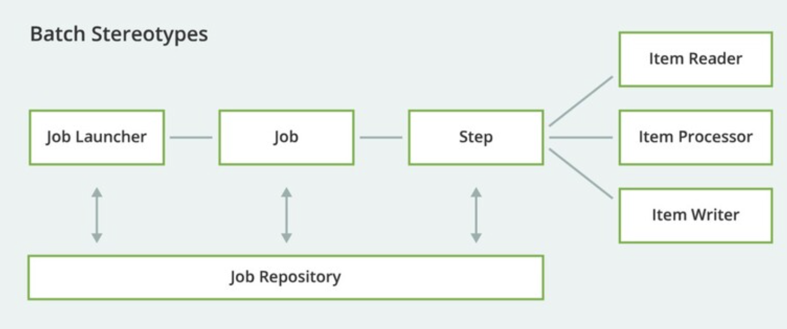
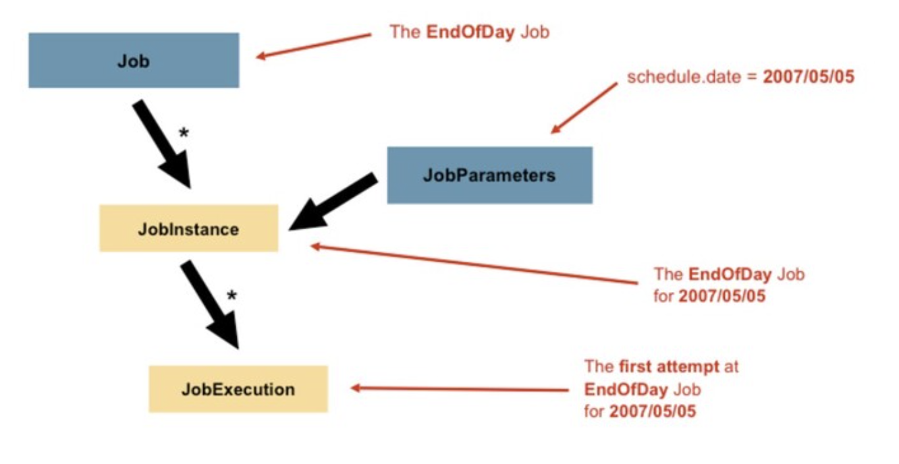
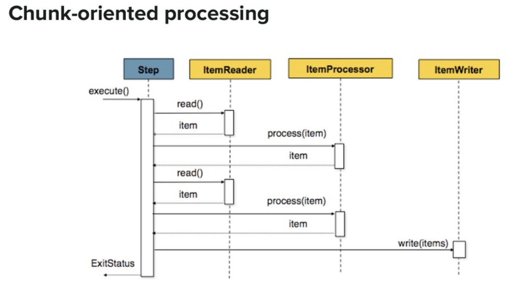
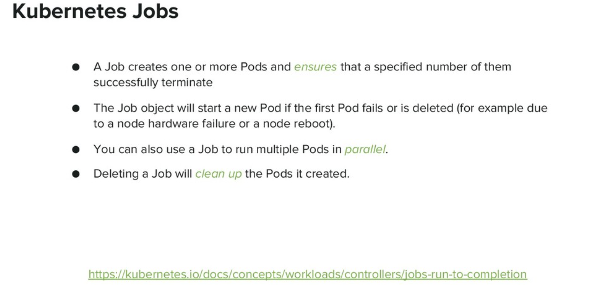
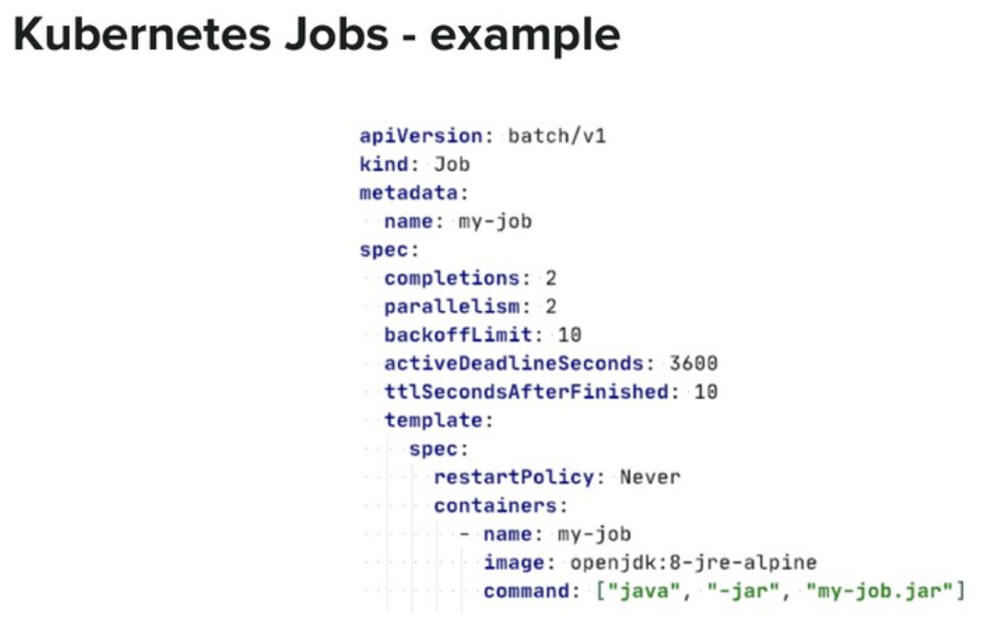
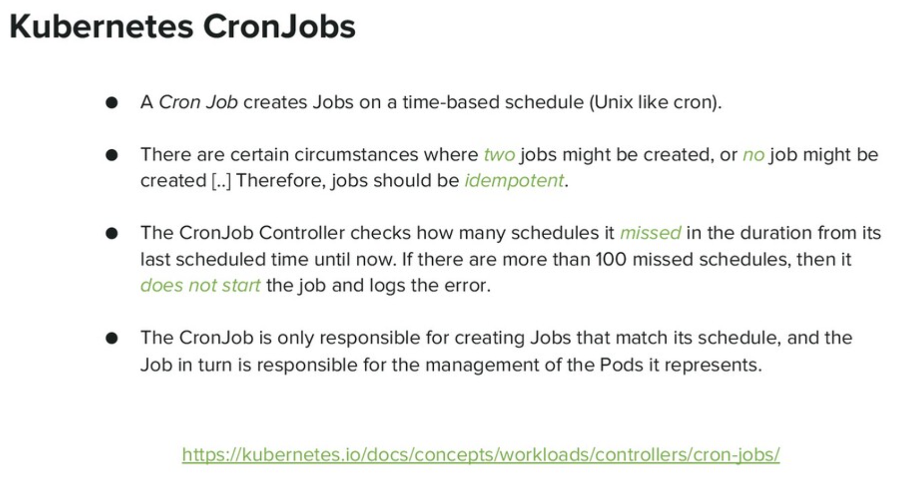
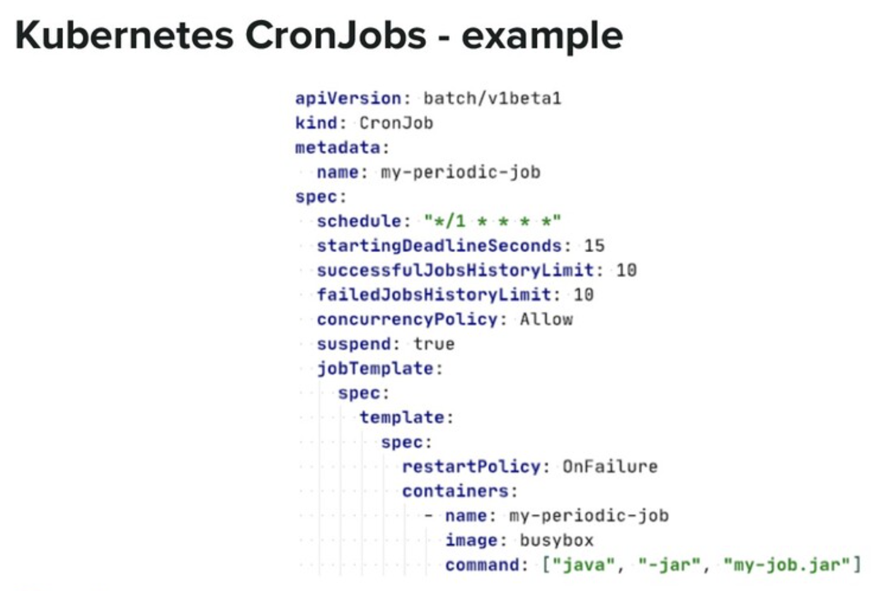

# Spring batch

## Spring batch jobs

**Book**: The definitive guide to Spring Batch







## Kubernetes jobs

- A Job **creates one or more Pods** and **ensures that a specified number of them successfully terminate**
- The Job object will start a new Pod if the first Pod fails or is deleted (for example due
to a node hardware failure or a node reboot).
- You can also use a Job to **run multiple Pods in parallel**.
- Deleting a Job will clean up the Pods it created.

https://kubernetes.io/docs/concepts/workloads/controllers/job/






## Kubernetes Cronjobs

- A Cron Job **creates Jobs on a time-based schedule** (Unix like cron).
- There are certain circumstances where two jobs might be created, or no job might be created [..] Therefore, **jobs should be idempotent**.
- The CronJob Controller checks how many schedules it missed in the duration from its last scheduled time until now. I**f there are more than 100 missed schedules, then it does not start the job and logs the error**.
- The CronJob is only responsible for creating Jobs that match its schedule, and the
- Job in turn is responsible for the management of the Pods it represents.

https://kubernetes.io/docs/concepts/workloads/controllers/cron-jobs/





### Why would you need Kubernetes (for your batch jobs) ?

● **Ability to run batch jobs** on any node in the cluster with a single command
● Ability to **query the entire cluster for running jobs** with a single command
● Ability to **automatically run jobs to completion** (in case of node/pod failure)
● Efficient resources management (k8s plays Tetris with your cluster)
● Scalability

## Spring Batch on Kubernetes A perfect match!

### Cloud friendly batch jobs, how?
● **Spring Batch jobs maintain their state in an external database**, and as such, they are
already 12 factors processes [1] (and could be easily 12 factorized: log to standard
output, configured from the environment, etc)
● **Skip** successfully executed steps in previous run in case of failure (cost efficient)
● **Retry** failed items in case of transient errors (like a call to a web service that might be
temporarily down or being re-scheduled in a cloud environment)
● **Restart** from the last save point within the same step thanks to the chunk-oriented
processing model (cost efficient)
● **Safe** against duplicate job executions (due to a human error or k8s pod rescheduling
or CronJob limitation when it might run the same job twice)

### Containerised batch jobs, why?
● **Separate** logs
● **Independent** life cycle (bugs/features, deployment, etc)
● **Separate** parameters / exit codes !
● Restartability (in case of failure, only restart the failed job)
● Testability
● Scalability
● Resource usage **efficiency** (optimized resource limits => better pod scheduling)

### BigBang-less migration plan
● Keep the database outside Kubernetes [1], migrate only stateless batch jobs: gradual, hybrid migration path
● Traditional job => bootify it => 12 factorize it => dockerize it => kubernetize it
● Use kubernetes namespaces for testing/deploying jobs in staging/production [2]
● CI/CD CronJobs live with “kubectl set image” or its REST API equivalent [3]\

[1]: https://cloud.google.com/blog/products/gcp/kubernetes-best-practices-mapping-external-services
[2]: https://kubernetes.io/blog/2015/08/using-kubernetes-namespaces-to-manage/
[3]: https://kubernetes.io/docs/reference/generated/kubernetes-api/v1.17/#patch-cronjob-v1beta1-batch

What you should know before the migration
● Job/Container exit code is very important!
● Understand graceful/abrupt shutdown implications
● Choose the right job pattern [1] (Job instances volume)
● Choose the right restart/concurrency policies
● Understand CronJobs limitations [2]

[1]: https://kubernetes.io/docs/concepts/workloads/controllers/jobs-run-to-completion/#job-patterns
[2]: https://kubernetes.io/docs/concepts/workloads/controllers/cron-jobs/#cron-job-limitations

# Spring Cloud Kubernetes

https://spring.io/blog/2021/01/27/spring-batch-on-kubernetes-efficient-batch-processing-at-scale


https://docs.spring.io/spring-cloud-kubernetes/docs/current/reference/html/index.html

## Why do you need Spring Cloud Kubernetes?

Spring Cloud Kubernetes provides implementations of well known Spring Cloud interfaces **allowing developers to build and run Spring Cloud applications on Kubernetes**. While this project may be useful to you when building a cloud native application, it is also not a requirement in order to deploy a Spring Boot app on Kubernetes. If you are just getting started in your journey to running your Spring Boot app on Kubernetes you can accomplish a lot with nothing more than a basic Spring Boot app and Kubernetes itself. To learn more, you can get started by reading the Spring Boot reference documentation for deploying to Kubernetes and also working through the workshop material Spring and Kubernetes.


## Spring Batch on Kubernetes: Efficient batch processing at scale

spring batch good video : https://www.youtube.com/watch?v=1XEX-u12i0A


https://spring.io/blog/2021/01/27/spring-batch-on-kubernetes-efficient-batch-processing-at-scale

Batch processing has been a challenging area of computer science since its inception in the early days of punch cards and magnetic tapes. Nowadays, the modern cloud computing era comes with a whole new set of challenges for how to develop and operate batch workload efficiently in a cloud environment. In this blog post, **I introduce some of the challenges a batch developer or architect may face when designing and running batch applications at scale and show how Spring Batch, Spring Boot and Kubernetes can tremendously simplify this task.**

### Challenges of Designing and Running Batch Workloads in the Cloud

Designing cloud-native batch applications might seem easy compared to web applications, but this is not true. Batch developers face many challenges.

**1. Fault Tolerance**
Batch processes typically interact with other services (such as databases, messages brokers, web services, and others) which are, by nature, flaky in cloud environments. Moreover, even the nodes on which those processes are run can die at any time and be replaced with healthy nodes. Cloud native batch applications should be designed in a fault-tolerant way.

**2. Robustness**
It is not uncommon that the **human error of running a batch job twice** has some big financial consequences (such as what happened to Walgreens, ANZ Bank, and NatWest, to name a few). Moreover, **some platforms, such as Kubernetes, have some known limitations about the eventuality of running the same job twice**. A cloud native batch application should be ready to **deal with this kind of issues by design**.

**3. Cost Efficiency**
Cloud infrastructures are billed by cpu/memory/bandwidth usage. In case of failure, It would be inefficient to not be able to restart a job from where it left off and “lose” the cpu/memory/bandwidth usage of the previous run (and hence be billed twice or more!).

**4. Observability**
Any modern batch architecture should be able to know at any point in time some key metrics, including:

What jobs are currently running?
Which jobs have failed, if any?
Other questions about how things are going.
Being able to have these KPIs at a glance on a dashboard is vital for efficient operations.

**5. Scalability**
We are dealing with an unprecedented amounts of data, which is impossible to handle on a single machine any more. Correctly processing large volumes of distributed data is probably the most challenging point. Cloud-native batch applications should be scalable by design.

All these aspects should be taken into consideration when designing and developing cloud-native batch applications. This is a considerable amount of work on the developer’s side. Spring Batch takes care of most of these issues. I explain the details in the next section.

### How does Spring Batch Make a Batch Developer’s Life easier?
Spring Batch is the **de facto batch processing framework on the JVM**. Entire books have been written on the rich feature set provided by Spring Batch, but I would like to highlight the most relevant features that address the previously mentioned challenges in the context of cloud-native development:

**1. Fault Tolerance**
Spring Batch provides fault-tolerance feature, such as **transaction management** and **skip and retry** mechanisms, which are useful when batch jobs interact with flaky services in a cloud environment.

**2. Robustness**
Spring Batch uses a **centralized transactional job repository, which prevents duplicate job executions**. By design, human errors and platform limitations that may lead to running the same job twice are impossible.

**3. Cost Efficiency**
Spring Batch jobs **maintain their state in an external database**, which makes it **possible to restart failed jobs where they left off**. This is cost effective, compared to other solutions that would redo the work from the beginning and, hence, would be billed twice or more!

**4. Observability**
Spring Batch provides **integration with Micrometer**, which is key in terms of observability. A Spring Batch-based batch infrastructure provides key metrics, such as the currently active jobs, read/write rates, failed jobs, and others. It can even be extended with custom metrics.

**5. Scalability**
As already mentioned, **Spring Batch jobs maintain their state in an external database**. **As a result, they are stateless** processes from the 12 factors methodology point of view. T**his stateless nature makes them suitable to be containerized** and executed in cloud environments in a scalable way. Moreover, Spring Batch provides several vertical and **horizontal scaling techniques**, such as **multi-threaded steps** and **remote partitioning/chunking of data**, to scale batch jobs in an efficient way.

Spring Batch provides other features, but the ones mentioned above are very helpful when designing and developing cloud-native batch processes.

### How Does Kubernetes Make the Batch Operator’s Life Easier?

Kubernetes is the de facto container orchestration platform for the cloud. Operating a batch infrastructure at scale is far from being a trivial task, and Kubernetes really is a game changer in this space. Before the cloud era, in one of my previous jobs, I played the role of a batch operator and I had to manage a cluster of 4 machines dedicated to batch jobs. Here are some of the tasks I had to either do manually or find a way to automate with (bash!) scripts:

ssh into each machine to check which jobs are currently running
ssh into each machine to collect the logs of failed jobs
ssh into each machine to upgrade job versions or update their configuration
ssh into each machine to kill hanging jobs and restart them
ssh into each machine to edit/update the crontab file for job scheduling
Many other similar tasks..


All these tasks are obviously inefficient and error prone, leaving four dedicated machines under-utilized due to poor resource management. If you are still doing such tasks in 2021 (either manually or via scripts), I believe it’s a good time to think about migrating your batch infrastructure to Kubernetes. The reason is that Kubernetes lets you do all these tasks with a single command against the entire cluster, and this is a huge difference from an operational point of view. 

####  Moving to Kubernetes lets you
- **Ask the entire cluster about currently running jobs** with a single command
- **Submit/schedule jobs without having to know on which node they will run**
- **Update job definitions transparently**
- **Automatically run jobs to completion** (a Kubernetes job creates one or more pods and ensures that a specified number of them terminate successfully)
- Optimize the usage of cluster’s resources (Kubernetes plays Tetris with the cluster’s machines) and hence optimize the bills!
- Use many other interesting features

### Spring Batch on Kubernetes: a perfect match, in action

I refer: https://spring.io/blog/2021/01/27/spring-batch-on-kubernetes-efficient-batch-processing-at-scale

In this section, **I take the same job developed in Spring Batch’s getting started guide (which is a data ingestion job that loads some person data from a CSV file into a relational database table), containerize it, and deploy it on Kubernetes**. If you want to go a step further by wrapping this job in a Spring Cloud Task and deploying it in a Spring Cloud Data Flow server,

#### Choosing the Right Kubernetes Job Deployment Pattern
The Kubernetes’ documentation provides a whole section called [Job patterns](https://kubernetes.io/docs/concepts/workloads/controllers/job/#job-patterns), which describes how to **choose the right job deployment pattern**. In this post, **I followed the [Parallel processing using expansions](https://kubernetes.io/docs/tasks/job/parallel-processing-expansion/) approach to create a job per file from a template**. While this approach **allows for processing multiple files in parallel**, it can put a pressure on Kubernetes when there are many files to ingest, as this would result in many Kubernetes job objects being created. If all your files have a similar structure and you want to create a single job to ingest them in one shot, you can use the **MultiResourceItemReader** provided by Spring Batch and create a single Kubernetes job. Another option is to use a **single job with a partitioned step where each worker step handles a file** (this can be achieved by using the built-in **MultiResourcePartitioner**).

#### 1. Set up a Database Server
I use a MySQL database to store Spring Batch metadata. The database lives outside the Kubernetes cluster, and this is on purpose. The reason is to mimic a realistic migration path, where only stateless workloads are migrated to Kubernetes in a first step. For many companies, migrating databases to Kubernetes is not an option yet (and this is a reasonable decision). To start the database server, run the following commands:

```sh
$ git clone git@github.com:benas/spring-batch-lab.git
$ cd blog/spring-batch-kubernetes
$ docker-compose -f src/docker/docker-compose.yml upCOPY
```

**This will create a MySQL container pre-populated with Spring Batch’s technical tables** as well as the b**usiness table, PEOPLE**. We can check this, as follows: