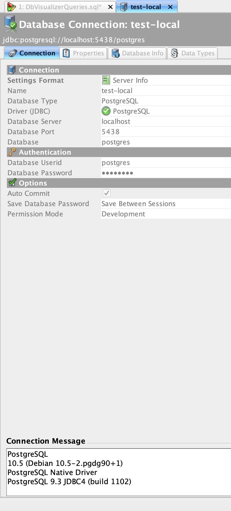
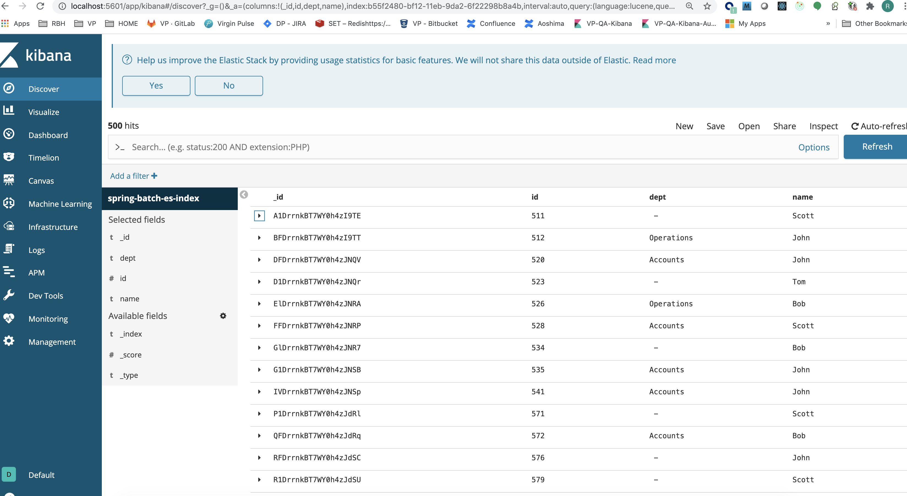
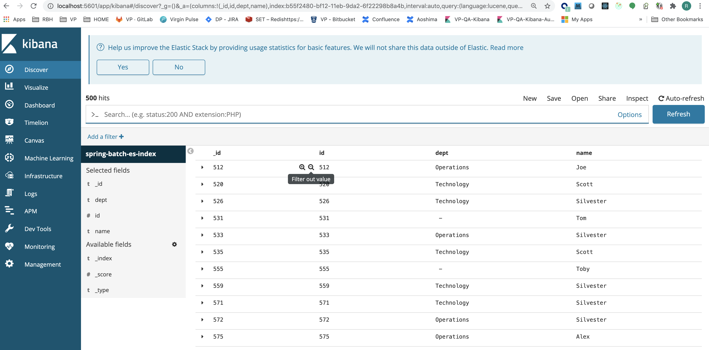
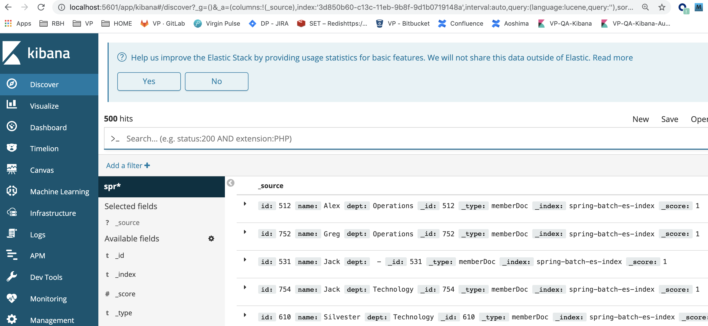

# Simple example

We will read from a Postgres DB and write to ElasticSearch

https://www.youtube.com/watch?v=1XEX-u12i0A

Create a springboot project with dependencies for H2(external db to store spring batch job state), Web, JPA, Batch dependencies.

Note the work done to allow no-arg constructors for jpa @Entity like User (`<!--add jpa to allow no arg constructors as in User entity class-->`)
Also see how kotlin is configured.

**pom.xml**
```xml
<?xml version="1.0" encoding="UTF-8"?>
<project xmlns="http://maven.apache.org/POM/4.0.0" xmlns:xsi="http://www.w3.org/2001/XMLSchema-instance"
         xsi:schemaLocation="http://maven.apache.org/POM/4.0.0 https://maven.apache.org/xsd/maven-4.0.0.xsd">
    <modelVersion>4.0.0</modelVersion>
    <parent>
        <groupId>org.springframework.boot</groupId>
        <artifactId>spring-boot-starter-parent</artifactId>
        <version>2.2.5.RELEASE</version>
        <relativePath/> <!-- lookup parent from repository -->
    </parent>

    <groupId>com.example</groupId>
    <artifactId>spring-batch-demo</artifactId>
    <version>0.0.1-SNAPSHOT</version>
    <name>spring-batch-demo</name>
    <description>Demo project for Spring Boot</description>

    <properties>
        <java.version>1.8</java.version>
        <kotlin.version>1.3.72</kotlin.version>
        <kotlin.compiler.jvmTarget>1.8</kotlin.compiler.jvmTarget>
    </properties>
    <dependencies>
        <!--postgres connect for docker connect to read data from table-->
        <dependency>
            <groupId>org.postgresql</groupId>
            <artifactId>postgresql</artifactId>
            <version>42.2.20</version>
        </dependency>
        <!---needed for insert to ES-->
<!--        <dependency>-->
<!--            <groupId>org.springframework.boot</groupId>-->
<!--            <artifactId>spring-boot-starter-data-elasticsearch</artifactId>-->
<!--        </dependency>-->
        <dependency>
            <groupId>org.elasticsearch</groupId>
            <artifactId>elasticsearch</artifactId>
            <version>6.8.5</version>
        </dependency>

        <dependency>
            <groupId> org.elasticsearch.client</groupId>
            <artifactId>elasticsearch-rest-high-level-client</artifactId>
            <version>6.8.5</version>
        </dependency>

        <!--spring batch-->
        <dependency>
            <groupId>org.springframework.boot</groupId>
            <artifactId>spring-boot-starter-batch</artifactId>
        </dependency>
        <dependency>
            <groupId>org.springframework.boot</groupId>
            <artifactId>spring-boot-starter-web</artifactId>
        </dependency>
        <dependency>
            <groupId>com.fasterxml.jackson.module</groupId>
            <artifactId>jackson-module-kotlin</artifactId>
        </dependency>
        <dependency>
            <groupId>org.jetbrains.kotlin</groupId>
            <artifactId>kotlin-reflect</artifactId>
        </dependency>
        <dependency>
            <groupId>org.jetbrains.kotlin</groupId>
            <artifactId>kotlin-stdlib-jdk8</artifactId>
        </dependency>
        <dependency>
            <groupId>org.springframework.boot</groupId>
            <artifactId>spring-boot-starter-data-jpa</artifactId>
        </dependency>
        <dependency>
            <groupId>org.springframework.boot</groupId>
            <artifactId>spring-boot-devtools</artifactId>
            <scope>runtime</scope>
            <optional>true</optional>
        </dependency>
        <!--h2: to hold job status-->
        <dependency>
            <groupId>com.h2database</groupId>
            <artifactId>h2</artifactId>
        </dependency>
        <dependency>
            <groupId>org.springframework.boot</groupId>
            <artifactId>spring-boot-starter-test</artifactId>
            <scope>test</scope>
        </dependency>
        <dependency>
            <groupId>org.springframework.batch</groupId>
            <artifactId>spring-batch-test</artifactId>
            <scope>test</scope>
        </dependency>
    </dependencies>

    <build>
        <sourceDirectory>${project.basedir}/src/main/kotlin</sourceDirectory>
        <testSourceDirectory>${project.basedir}/src/test/kotlin</testSourceDirectory>
        <plugins>
            <plugin>
                <groupId>org.springframework.boot</groupId>
                <artifactId>spring-boot-maven-plugin</artifactId>
                <version>2.2.5.RELEASE</version>
            </plugin>
            <plugin>
                <groupId>org.jetbrains.kotlin</groupId>
                <artifactId>kotlin-maven-plugin</artifactId>
                <version>${kotlin.version}</version>
                <configuration>
                    <args>
                        <arg>-Xjsr305=strict</arg>
                    </args>
                    <compilerPlugins>
                        <plugin>spring</plugin>
                        <!--add jpa to allow no arg constructors as in User entity class-->
                        <plugin>jpa</plugin>
                    </compilerPlugins>
                </configuration>
                <dependencies>
                    <dependency>
                        <groupId>org.jetbrains.kotlin</groupId>
                        <artifactId>kotlin-maven-allopen</artifactId>
                        <version>${kotlin.version}</version>
                    </dependency>
                    <!--add jpa no-arg to allow no arg constructors as in User entity class-->
                    <dependency>
                        <groupId>org.jetbrains.kotlin</groupId>
                        <artifactId>kotlin-maven-noarg</artifactId>
                        <version>${kotlin.version}</version>
                    </dependency>
                </dependencies>
            </plugin>
        </plugins>
    </build>
    <repositories>
        <repository>
            <id>spring-milestones</id>
            <name>Spring Milestones</name>
            <url>https://repo.spring.io/milestone</url>
            <snapshots>
                <enabled>false</enabled>
            </snapshots>
        </repository>
        <repository>
            <id>spring-snapshots</id>
            <name>Spring Snapshots</name>
            <url>https://repo.spring.io/snapshot</url>
            <releases>
                <enabled>false</enabled>
            </releases>
        </repository>
    </repositories>
    <pluginRepositories>
        <pluginRepository>
            <id>spring-milestones</id>
            <name>Spring Milestones</name>
            <url>https://repo.spring.io/milestone</url>
            <snapshots>
                <enabled>false</enabled>
            </snapshots>
        </pluginRepository>
        <pluginRepository>
            <id>spring-snapshots</id>
            <name>Spring Snapshots</name>
            <url>https://repo.spring.io/snapshot</url>
            <releases>
                <enabled>false</enabled>
            </releases>
        </pluginRepository>
    </pluginRepositories>

</project>
```

### docker postgres
we will read from a table in postgres in itemreader:

to remove all + hanging networks etc: ``docker-compose down --remove-orphans`

**docker-compose.yml**

```yml
version: '3.7'
services:
  postgres:
    image: postgres:10.5
    restart: always
    environment:
      - POSTGRES_USER=postgres
      - POSTGRES_PASSWORD=postgres #will be in default db postgres
    logging:
      options:
        max-size: 10m
        max-file: "3"
    ports:
      - '5438:5432' #expose 5438 port
    expose:
      - '5432'
    volumes:
      # NOTE::::: docker-compose down -v >delete postgres-data directory >docker-compose up --build -d to see sql changes
      - ./postgres-data:/var/lib/postgresql/data
      # copy the sql script to create tables
      - ./sql/create_tables.sql:/docker-entrypoint-initdb.d/create_tables.sql
      # copy the sql script to fill tables
      - ./sql/fill_tables.sql:/docker-entrypoint-initdb.d/fill_tables.sql

#    elasticsearch:
#    container_name: elasticsearch
#    image: docker.elastic.co/elasticsearch/elasticsearch:6.5.1
#    environment:
#      discovery.type: single-node
#    restart: "no"
#    ports:
#      - '9200:9200'
#      - '9300:9300'
#    expose:
#      - '9200'
#      - '9300'
#  kibana:
#    container_name: kibana
#    image: docker.elastic.co/kibana/kibana:6.5.1
#    ports:
#      - "5601:5601"
#    expose:
#      - "5601"
```

**create-tables.sql**
```sql
CREATE TABLE IF NOT EXISTS member (
    id INT NOT NULL,
    name VARCHAR(100) NOT NULL,
    dept VARCHAR(100) NOT NULL,
    PRIMARY KEY (id)
);
```

**fill-tables.sql**
```sql
-- https://github.com/jdaarevalo/docker_postgres_with_data/blob/main/sql/fill_tables.sql
set session my.number_of_members = '1000';
set session my.number_of_departments = '3';
INSERT INTO public."member"
SELECT
       id,
       (array['Jill', 'Joe', 'Jack', 'Greg', 'Silvester', 'Tom', 'Toby', 'Scott', 'Alex'])[floor(random() * 9 + 1)],
       concat('00', id%current_setting('my.number_of_departments')::int)
FROM GENERATE_SERIES(1, current_setting('my.number_of_members')::int) as id;
```

**bring up docker**

`docker-compose up postgres --build -d`

output
```sh
(base)  rdissanayakam@RBH12855  ~/home/bitbucket/kubernetes/spring-batch/spring-batch-demo/docker-postgres   master ●✚  docker-compose up
Docker Compose is now in the Docker CLI, try `docker compose up`

Creating network "docker-postgres_default" with the default driver
Pulling postgres (postgres:10.5)...
10.5: Pulling from library/postgres
f17d81b4b692: Pull complete
c1f213be5edb: Pull complete
9c79723dc510: Pull complete
603a66804109: Pull complete
b4f1b901e523: Pull complete
99d9650419de: Pull complete
02d87bb25bad: Pull complete
333a24caa91e: Pull complete
9cab7935ece2: Pull complete
5977bf28967d: Pull complete
74ddd26cf783: Pull complete
07b76fcb42dd: Pull complete
7da7962ee038: Pull complete
0ddc5f8e0873: Pull complete
Digest: sha256:e19acdab213d6318565a6da5fb824ca5161e99fe63dbc37036557aacb35fae51
Status: Downloaded newer image for postgres:10.5
Creating docker-postgres_postgres_1 ... done
Attaching to docker-postgres_postgres_1
postgres_1  | The files belonging to this database system will be owned by user "postgres".
postgres_1  | This user must also own the server process.
postgres_1  | 
postgres_1  | The database cluster will be initialized with locale "en_US.utf8".
postgres_1  | The default database encoding has accordingly been set to "UTF8".
postgres_1  | The default text search configuration will be set to "english".
postgres_1  | 
postgres_1  | Data page checksums are disabled.
postgres_1  | 
postgres_1  | fixing permissions on existing directory /var/lib/postgresql/data ... ok
postgres_1  | creating subdirectories ... ok
postgres_1  | selecting default max_connections ... 100
postgres_1  | selecting default shared_buffers ... 128MB
postgres_1  | selecting dynamic shared memory implementation ... posix
postgres_1  | creating configuration files ... ok
postgres_1  | running bootstrap script ... ok
postgres_1  | performing post-bootstrap initialization ... ok
postgres_1  | syncing data to disk ... 
postgres_1  | WARNING: enabling "trust" authentication for local connections
postgres_1  | You can change this by editing pg_hba.conf or using the option -A, or
postgres_1  | --auth-local and --auth-host, the next time you run initdb.
postgres_1  | ok
postgres_1  | 
postgres_1  | Success. You can now start the database server using:
postgres_1  | 
postgres_1  |     pg_ctl -D /var/lib/postgresql/data -l logfile start
postgres_1  | 
postgres_1  | waiting for server to start....2021-05-27 13:48:26.327 UTC [44] LOG:  listening on Unix socket "/var/run/postgresql/.s.PGSQL.5432"
postgres_1  | 2021-05-27 13:48:26.365 UTC [45] LOG:  database system was shut down at 2021-05-27 13:48:24 UTC
postgres_1  | 2021-05-27 13:48:26.381 UTC [44] LOG:  database system is ready to accept connections
postgres_1  |  done
postgres_1  | server started
postgres_1  | 
postgres_1  | /usr/local/bin/docker-entrypoint.sh: running /docker-entrypoint-initdb.d/create_tables.sql
postgres_1  | CREATE TABLE
postgres_1  | 
postgres_1  | 
postgres_1  | /usr/local/bin/docker-entrypoint.sh: running /docker-entrypoint-initdb.d/fill_tables.sql
postgres_1  | INSERT 0 1000
postgres_1  | 
postgres_1  | 
postgres_1  | waiting for server to shut down...2021-05-27 13:48:26.710 UTC [44] LOG:  received fast shutdown request
postgres_1  | .2021-05-27 13:48:26.711 UTC [44] LOG:  aborting any active transactions
postgres_1  | 2021-05-27 13:48:26.715 UTC [44] LOG:  worker process: logical replication launcher (PID 51) exited with exit code 1
postgres_1  | 2021-05-27 13:48:26.715 UTC [46] LOG:  shutting down
postgres_1  | 2021-05-27 13:48:26.817 UTC [44] LOG:  database system is shut down
postgres_1  |  done
postgres_1  | server stopped
postgres_1  | 
postgres_1  | PostgreSQL init process complete; ready for start up.
postgres_1  | 
postgres_1  | 2021-05-27 13:48:26.937 UTC [1] LOG:  listening on IPv4 address "0.0.0.0", port 5432
postgres_1  | 2021-05-27 13:48:26.937 UTC [1] LOG:  listening on IPv6 address "::", port 5432
postgres_1  | 2021-05-27 13:48:26.944 UTC [1] LOG:  listening on Unix socket "/var/run/postgresql/.s.PGSQL.5432"
postgres_1  | 2021-05-27 13:48:26.996 UTC [71] LOG:  database system was shut down at 2021-05-27 13:48:26 UTC
postgres_1  | 2021-05-27 13:48:27.018 UTC [1] LOG:  database system is ready to accept connections
```

**connect**:
https://levelup.gitconnected.com/creating-and-filling-a-postgres-db-with-docker-compose-e1607f6f882f



with member table created and 1000 ids populated.

```sh
| id | name | dept |
|----|------|------|
| 1  | Greg | 001  |
| 2  | Greg | 002  |
| 3  | å    | 000  |
| 4  | Tom  | 001  |
| 5  | Jack | 002  |
| 6  | Alex | 000  |
| 7  | Tom  | 001  |  
```

`docker-compose up elasticsearch --build -d`

`docker-compose up kibana --build -d`

### build code

**application.yml**
```yml
server:
  port: 8081


spring:
  batch:
    job:
      enabled: false #disable auto/default job launcher
  h2:
    console:
      enabled: true
      path: /h2-console
  datasource:
    url: jdbc:postgresql://localhost:5438/postgres
    username: postgres
    password: postgres

  elasticsearch:
    rest:
      uris: localhost:9200
      username:
      password:
```

**SpringBatchDemoApplication**
```kotlin
package com.example.springbatchdemo

import org.springframework.boot.autoconfigure.SpringBootApplication
import org.springframework.boot.runApplication

@SpringBootApplication
class SpringBatchDemoApplication

fun main(args: Array<String>) {
    runApplication<SpringBatchDemoApplication>(*args)
}
```

**User.kt**
```kotlin
package com.example.springbatchdemo.model

import javax.persistence.Entity
import javax.persistence.Id
import javax.validation.constraints.NotNull

@Entity
data class User(
        @Id
        val id: Long,
        @NotNull
        val name: String,
        var dept: String?
)
```

**ElasticsearchConfiguration.kt**
```kotlin
package com.example.springbatchdemo.config

import org.elasticsearch.client.RestHighLevelClient
import org.elasticsearch.client.RestClient
import org.apache.http.HttpHost
import org.springframework.context.annotation.Bean
import org.springframework.context.annotation.Configuration
import org.springframework.context.annotation.Primary

object ElasticsearchConfiguration {
    fun client(): RestHighLevelClient {
        return RestHighLevelClient(
                RestClient.builder(HttpHost("localhost", 9200, "http")))
    }
}
```

**SpringBatchConfig.kt**
```kotlin
package com.example.springbatchdemo.config

import com.example.springbatchdemo.batch.DBReader
import com.example.springbatchdemo.batch.ElasticSearchWriter
import com.example.springbatchdemo.batch.Processor
import com.example.springbatchdemo.model.User
import com.example.springbatchdemo.repository.UserRepository
import org.springframework.batch.core.Job
import org.springframework.batch.core.Step
import org.springframework.batch.core.configuration.annotation.DefaultBatchConfigurer
import org.springframework.batch.core.configuration.annotation.EnableBatchProcessing
import org.springframework.batch.core.configuration.annotation.JobBuilderFactory
import org.springframework.batch.core.configuration.annotation.StepBuilderFactory
import org.springframework.batch.core.launch.support.RunIdIncrementer
import org.springframework.context.annotation.Bean
import org.springframework.context.annotation.Configuration
import org.springframework.jdbc.datasource.SimpleDriverDataSource
import javax.sql.DataSource


@Configuration
@EnableBatchProcessing
class SpringBatchConfig (
        private val jobBuilderFactory: JobBuilderFactory,
        private val stepBuilderFactory: StepBuilderFactory,
        private val userRepository: UserRepository,
        private val dataSource : DataSource
) : DefaultBatchConfigurer() {

    //Had to implement DefaultBatchConfigurer and override set DataSource to point to h2 because it look for
    // batch tables (sys created) in postgres runnig in docker (postgres overrode h2 datasource).
    override fun setDataSource(dataSource: DataSource) {
        val inMemoryDataSource = SimpleDriverDataSource().apply {
            driver = org.h2.Driver()
            url = "jdbc:h2:file:~/test"
            username = "sa"
            password = ""
        }
        super.setDataSource(inMemoryDataSource)
    }


    @Bean
    fun getJob() : Job {
        val step: Step = stepBuilderFactory.get("ETL-file-load")
                .chunk<Long, User>(100)
                .reader(itemReader())
                .processor(itemProcessor())
                .writer(itemWriter())
                .build()


        return jobBuilderFactory.get("ETL-LOAD")
                .incrementer(RunIdIncrementer())
                .start(step)
                .build()
    }

    @Bean
    open fun itemReader() = DBReader.itemReader(dataSource)

    @Bean
    open fun itemProcessor() = Processor()

    @Bean
    open fun itemWriter() = ElasticSearchWriter(ElasticsearchConfiguration.client())
}
```

**DBReader**
```kotlin
package com.example.springbatchdemo.batch

import org.springframework.batch.item.database.support.SqlPagingQueryProviderFactoryBean

import org.springframework.batch.item.database.builder.JdbcPagingItemReaderBuilder

import java.util.HashMap

import org.springframework.batch.item.database.JdbcPagingItemReader
import org.springframework.batch.item.database.Order
import org.springframework.batch.item.database.PagingQueryProvider
import org.springframework.batch.item.database.support.PostgresPagingQueryProvider
import javax.sql.DataSource

//https://docs.spring.io/spring-batch/docs/4.0.x/reference/html/readersAndWriters.html#pagingItemReaders
object DBReader {

    fun itemReader(dataSource: DataSource): JdbcPagingItemReader<Long> {
        val parameterValues: MutableMap<String, Any> = HashMap()
        parameterValues["id"] = 500
        return JdbcPagingItemReaderBuilder<Long>()
                .name("memberIdReader")
                .dataSource(dataSource)
                .queryProvider(queryProvider())
                .parameterValues(parameterValues)
                .rowMapper { resultSet, _ -> resultSet.getLong(1) }
                .pageSize(100)
                .build()
    }

    fun queryProvider(): PostgresPagingQueryProvider {
        val provider = PostgresPagingQueryProvider()
        provider.setSelectClause("select id")
        provider.setFromClause("from member")
        provider.setWhereClause("where id>:id")
        provider.sortKeys = mapOf("id" to Order.ASCENDING)
        return provider
    }
}
```

**Processor.kt**
```kotlin
package com.example.springbatchdemo.batch

import com.example.springbatchdemo.model.User
import org.springframework.batch.item.ItemProcessor
import org.springframework.stereotype.Component
import java.lang.Exception
import java.util.*
import kotlin.collections.HashMap


class Processor : ItemProcessor<Long, User> { //input user, output:user
    @Throws(Exception::class)
    override fun process(memberId: Long): User {
        println("Member Id = $memberId")
        val user = User(memberId, listOf<String>("Tom", "Bob", "John", "Scott").random(), listOf<String>("001", "002", "003", "004").random() )
        val deptCode: String? = user.dept
        val dept = DEPT_NAMES[deptCode]
        user.dept = dept

        println(String.format("Converted from [%s] to [%s]", deptCode, dept))
        return user
    }

    companion object {
        private val DEPT_NAMES: MutableMap<String, String> = HashMap()
    }

    init {
        DEPT_NAMES["001"] = "Technology"
        DEPT_NAMES["002"] = "Operations"
        DEPT_NAMES["003"] = "Accounts"
    }
}
```

**ElasticSearchWriter**
```kotlin
package com.example.springbatchdemo.batch

import com.example.springbatchdemo.model.User
import org.elasticsearch.client.RestHighLevelClient
import org.springframework.batch.item.ItemWriter
import java.util.*
import org.elasticsearch.action.index.IndexRequest
import org.elasticsearch.client.RequestOptions


//https://blog.mimacom.com/import-rdb-data-elasticsearch-spring-batch/
class ElasticSearchWriter (
        private val esClient: RestHighLevelClient
) : ItemWriter<User> {


    @Throws(Exception::class)
    override fun write(users: List<User>) {
        //userRepository.saveAll(users)

        for(user in users) {
            val jsonMap = mutableMapOf<String, Any?>()
            jsonMap.put("id", user.id)
            jsonMap.put("name", user.name)
            jsonMap.put("dept", user.dept)

            val indexRequest = IndexRequest("spring-batch-es-index")
                    .id(user.id as String)
                    .type("memberDoc")
                    .source(jsonMap)

            esClient.index(indexRequest, RequestOptions.DEFAULT)
        }
        println("Data Saved for Users $users")
    }
}
```

Remmeber We disabled auto/default job launcher as we want batch job runnig when /load endpoint is called instead:

*application.yml**
```yaml
spring:
  batch:
    job:
      enabled: false #disable auto/default job launcher, we want batch job runnig when /load endpoint is called instead.
```

Lets define /load endpoint that triggers a batch job   

**LoadController.kt**

```kotin
package com.example.springbatchdemo.controller

import org.springframework.batch.core.*
import org.springframework.batch.core.launch.JobLauncher
import org.springframework.batch.core.repository.JobExecutionAlreadyRunningException
import org.springframework.batch.core.repository.JobInstanceAlreadyCompleteException
import org.springframework.batch.core.repository.JobRestartException
import org.springframework.beans.factory.annotation.Autowired
import org.springframework.web.bind.annotation.GetMapping
import org.springframework.web.bind.annotation.RequestMapping
import org.springframework.web.bind.annotation.RestController


@RestController
@RequestMapping("/load")
class LoadController {
    @Autowired
    var jobLauncher: JobLauncher? = null

    @Autowired
    var job: Job? = null

    @GetMapping
    @Throws(JobParametersInvalidException::class, JobExecutionAlreadyRunningException::class, JobRestartException::class, JobInstanceAlreadyCompleteException::class)
    fun load(): BatchStatus {
        val maps: MutableMap<String, JobParameter> = HashMap()
        maps["time"] = JobParameter(System.currentTimeMillis())
        val parameters = JobParameters(maps)
        val jobExecution = jobLauncher!!.run(job!!, parameters)

        println("JobExecution: " + jobExecution.status)
        println("Batch is Running...")

        while (jobExecution.isRunning) {
            println("...")
        }
        return jobExecution.status
    }
}
```

Now if you run appplication and hit `GET http://localhost:8081/load` endpoint, it returns **COMPLETED**

your es cluster has data: yay!




Runnig app will create **spring batch tables**

```sql
+------------------------------+
| Tables_in_test               |
+------------------------------+
| BATCH_JOB_EXECUTION          |
| BATCH_JOB_EXECUTION_CONTEXT  |
| BATCH_JOB_EXECUTION_PARAMS   |
| BATCH_JOB_EXECUTION_SEQ      |
| BATCH_JOB_INSTANCE           |
| BATCH_JOB_SEQ                |
| BATCH_STEP_EXECUTION         |
| BATCH_STEP_EXECUTION_CONTEXT |
| BATCH_STEP_EXECUTION_SEQ     |
| PEOPLE                       |
+------------------------------+
```

If you need to create them yourselves, here is sql:

https://github.com/spring-projects/spring-batch/blob/main/spring-batch-core/src/main/resources/org/springframework/batch/core/schema-mysql.sql

```sql
-- Autogenerated: do not edit this file

CREATE TABLE BATCH_JOB_INSTANCE  (
	JOB_INSTANCE_ID BIGINT  NOT NULL PRIMARY KEY ,
	VERSION BIGINT ,
	JOB_NAME VARCHAR(100) NOT NULL,
	JOB_KEY VARCHAR(32) NOT NULL,
	constraint JOB_INST_UN unique (JOB_NAME, JOB_KEY)
) ENGINE=InnoDB;

CREATE TABLE BATCH_JOB_EXECUTION  (
	JOB_EXECUTION_ID BIGINT  NOT NULL PRIMARY KEY ,
	VERSION BIGINT  ,
	JOB_INSTANCE_ID BIGINT NOT NULL,
	CREATE_TIME DATETIME(6) NOT NULL,
	START_TIME DATETIME(6) DEFAULT NULL ,
	END_TIME DATETIME(6) DEFAULT NULL ,
	STATUS VARCHAR(10) ,
	EXIT_CODE VARCHAR(2500) ,
	EXIT_MESSAGE VARCHAR(2500) ,
	LAST_UPDATED DATETIME(6),
	JOB_CONFIGURATION_LOCATION VARCHAR(2500) NULL,
	constraint JOB_INST_EXEC_FK foreign key (JOB_INSTANCE_ID)
	references BATCH_JOB_INSTANCE(JOB_INSTANCE_ID)
) ENGINE=InnoDB;

CREATE TABLE BATCH_JOB_EXECUTION_PARAMS  (
	JOB_EXECUTION_ID BIGINT NOT NULL ,
	TYPE_CD VARCHAR(6) NOT NULL ,
	KEY_NAME VARCHAR(100) NOT NULL ,
	STRING_VAL VARCHAR(250) ,
	DATE_VAL DATETIME(6) DEFAULT NULL ,
	LONG_VAL BIGINT ,
	DOUBLE_VAL DOUBLE PRECISION ,
	IDENTIFYING CHAR(1) NOT NULL ,
	constraint JOB_EXEC_PARAMS_FK foreign key (JOB_EXECUTION_ID)
	references BATCH_JOB_EXECUTION(JOB_EXECUTION_ID)
) ENGINE=InnoDB;

CREATE TABLE BATCH_STEP_EXECUTION  (
	STEP_EXECUTION_ID BIGINT  NOT NULL PRIMARY KEY ,
	VERSION BIGINT NOT NULL,
	STEP_NAME VARCHAR(100) NOT NULL,
	JOB_EXECUTION_ID BIGINT NOT NULL,
	START_TIME DATETIME(6) NOT NULL ,
	END_TIME DATETIME(6) DEFAULT NULL ,
	STATUS VARCHAR(10) ,
	COMMIT_COUNT BIGINT ,
	READ_COUNT BIGINT ,
	FILTER_COUNT BIGINT ,
	WRITE_COUNT BIGINT ,
	READ_SKIP_COUNT BIGINT ,
	WRITE_SKIP_COUNT BIGINT ,
	PROCESS_SKIP_COUNT BIGINT ,
	ROLLBACK_COUNT BIGINT ,
	EXIT_CODE VARCHAR(2500) ,
	EXIT_MESSAGE VARCHAR(2500) ,
	LAST_UPDATED DATETIME(6),
	constraint JOB_EXEC_STEP_FK foreign key (JOB_EXECUTION_ID)
	references BATCH_JOB_EXECUTION(JOB_EXECUTION_ID)
) ENGINE=InnoDB;

CREATE TABLE BATCH_STEP_EXECUTION_CONTEXT  (
	STEP_EXECUTION_ID BIGINT NOT NULL PRIMARY KEY,
	SHORT_CONTEXT VARCHAR(2500) NOT NULL,
	SERIALIZED_CONTEXT TEXT ,
	constraint STEP_EXEC_CTX_FK foreign key (STEP_EXECUTION_ID)
	references BATCH_STEP_EXECUTION(STEP_EXECUTION_ID)
) ENGINE=InnoDB;

CREATE TABLE BATCH_JOB_EXECUTION_CONTEXT  (
	JOB_EXECUTION_ID BIGINT NOT NULL PRIMARY KEY,
	SHORT_CONTEXT VARCHAR(2500) NOT NULL,
	SERIALIZED_CONTEXT TEXT ,
	constraint JOB_EXEC_CTX_FK foreign key (JOB_EXECUTION_ID)
	references BATCH_JOB_EXECUTION(JOB_EXECUTION_ID)
) ENGINE=InnoDB;

CREATE TABLE BATCH_STEP_EXECUTION_SEQ (
	ID BIGINT NOT NULL,
	UNIQUE_KEY CHAR(1) NOT NULL,
	constraint UNIQUE_KEY_UN unique (UNIQUE_KEY)
) ENGINE=InnoDB;

INSERT INTO BATCH_STEP_EXECUTION_SEQ (ID, UNIQUE_KEY) select * from (select 0 as ID, '0' as UNIQUE_KEY) as tmp where not exists(select * from BATCH_STEP_EXECUTION_SEQ);

CREATE TABLE BATCH_JOB_EXECUTION_SEQ (
	ID BIGINT NOT NULL,
	UNIQUE_KEY CHAR(1) NOT NULL,
	constraint UNIQUE_KEY_UN unique (UNIQUE_KEY)
) ENGINE=InnoDB;

INSERT INTO BATCH_JOB_EXECUTION_SEQ (ID, UNIQUE_KEY) select * from (select 0 as ID, '0' as UNIQUE_KEY) as tmp where not exists(select * from BATCH_JOB_EXECUTION_SEQ);

CREATE TABLE BATCH_JOB_SEQ (
	ID BIGINT NOT NULL,
	UNIQUE_KEY CHAR(1) NOT NULL,
	constraint UNIQUE_KEY_UN unique (UNIQUE_KEY)
) ENGINE=InnoDB;

INSERT INTO BATCH_JOB_SEQ (ID, UNIQUE_KEY) select * from (select 0 as ID, '0' as UNIQUE_KEY) as tmp where not exists(select * from BATCH_JOB_SEQ);
```


### Now let's try to use a custom mapper

**CustomUserMapper**
```kotlin
package com.example.springbatchdemo.batch

import com.example.springbatchdemo.model.User
import org.springframework.jdbc.core.RowMapper
import java.sql.ResultSet
import java.sql.SQLException

class CustomUserMapper : RowMapper<User> {
    @Throws(SQLException::class)
    override fun mapRow(rs: ResultSet, rowNum: Int): User? {
        return User(rs.getInt(ID_COLUMN).toLong(), rs.getString(NAME_COLUMN), rs.getString(DEPT_COLUMN))
    }

    companion object {
        const val ID_COLUMN = "id"
        const val NAME_COLUMN = "name"
        const val DEPT_COLUMN = "dept"
    }
}
```

```kotlin
package com.example.springbatchdemo.batch

import com.example.springbatchdemo.model.User
import org.springframework.batch.item.database.support.SqlPagingQueryProviderFactoryBean

import org.springframework.batch.item.database.builder.JdbcPagingItemReaderBuilder

import java.util.HashMap

import org.springframework.batch.item.database.JdbcPagingItemReader
import org.springframework.batch.item.database.Order
import org.springframework.batch.item.database.PagingQueryProvider
import org.springframework.batch.item.database.support.PostgresPagingQueryProvider
import javax.sql.DataSource

//https://docs.spring.io/spring-batch/docs/4.0.x/reference/html/readersAndWriters.html#pagingItemReaders
object DBReader {

    fun itemReader(dataSource: DataSource): JdbcPagingItemReader<User> {
        val parameterValues: MutableMap<String, Any> = HashMap()
        parameterValues["id"] = 500
        return JdbcPagingItemReaderBuilder<User>() //note type User
                .name("memberIdReader")
                .dataSource(dataSource)
                .queryProvider(queryProvider())
                .parameterValues(parameterValues)
                .rowMapper(CustomUserMapper()) //note use of CustomMapper
                .pageSize(100)
                .build()
    }

    fun queryProvider(): PostgresPagingQueryProvider {
        val provider = PostgresPagingQueryProvider()
        provider.setSelectClause("select id, name, dept") //note select of all fields from table
        provider.setFromClause("from member")
        provider.setWhereClause("where id>:id")
        provider.sortKeys = mapOf("id" to Order.ASCENDING)
        return provider
    }
}
```

```kotlin
package com.example.springbatchdemo.batch

import com.example.springbatchdemo.model.User
import org.springframework.batch.item.ItemProcessor
import org.springframework.stereotype.Component
import java.lang.Exception
import java.util.*
import kotlin.collections.HashMap


class Processor : ItemProcessor<User, User> { //note: input user, output:user
    @Throws(Exception::class)
    override fun process(user: User): User { //note: param type: User, return type: User
        println("Member Id = $user")
        val deptCode: String? = user.dept
        val dept = DEPT_NAMES[deptCode]
        user.dept = dept

        println(String.format("Converted from [%s] to [%s]", deptCode, dept))
        return user
    }

    companion object {
        private val DEPT_NAMES: MutableMap<String, String> = HashMap()
    }

    init {
        DEPT_NAMES["001"] = "Technology"
        DEPT_NAMES["002"] = "Operations"
        DEPT_NAMES["003"] = "Accounts"
    }
}
```

```kotlin
package com.example.springbatchdemo.config

import com.example.springbatchdemo.batch.DBReader
import com.example.springbatchdemo.batch.ElasticSearchWriter
import com.example.springbatchdemo.batch.Processor
import com.example.springbatchdemo.model.User
import com.example.springbatchdemo.repository.UserRepository
import org.springframework.batch.core.Job
import org.springframework.batch.core.Step
import org.springframework.batch.core.configuration.annotation.DefaultBatchConfigurer
import org.springframework.batch.core.configuration.annotation.EnableBatchProcessing
import org.springframework.batch.core.configuration.annotation.JobBuilderFactory
import org.springframework.batch.core.configuration.annotation.StepBuilderFactory
import org.springframework.batch.core.launch.support.RunIdIncrementer
import org.springframework.context.annotation.Bean
import org.springframework.context.annotation.Configuration
import org.springframework.jdbc.datasource.SimpleDriverDataSource
import javax.sql.DataSource


@Configuration
@EnableBatchProcessing
class SpringBatchConfig (
        private val jobBuilderFactory: JobBuilderFactory,
        private val stepBuilderFactory: StepBuilderFactory,
        private val userRepository: UserRepository,
        private val dataSource : DataSource
) : DefaultBatchConfigurer() {

    override fun setDataSource(dataSource: DataSource) {
        val inMemoryDataSource = SimpleDriverDataSource().apply {
            driver = org.h2.Driver()
            url = "jdbc:h2:file:~/test"
            username = "sa"
            password = ""
        }
        super.setDataSource(inMemoryDataSource)
    }


    @Bean
    fun getJob() : Job {
        val step: Step = stepBuilderFactory.get("ETL-file-load")
                .chunk<User, User>(100) //note: input:user, output: user
                .reader(itemReader())
                .processor(itemProcessor())
                .writer(itemWriter())
                .build()


        return jobBuilderFactory.get("ETL-LOAD")
                .incrementer(RunIdIncrementer())
                .start(step)
                .build()
    }

    @Bean
    open fun itemReader() = DBReader.itemReader(dataSource)

    @Bean
    open fun itemProcessor() = Processor()

    @Bean
    open fun itemWriter() = ElasticSearchWriter(ElasticsearchConfiguration.client())
}
```

```kotlin
package com.example.springbatchdemo.batch

import com.example.springbatchdemo.model.User
import org.elasticsearch.client.RestHighLevelClient
import org.springframework.batch.item.ItemWriter
import java.util.*
import org.elasticsearch.action.index.IndexRequest
import org.elasticsearch.client.RequestOptions


//https://blog.mimacom.com/import-rdb-data-elasticsearch-spring-batch/
class ElasticSearchWriter (
        private val esClient: RestHighLevelClient
) : ItemWriter<User> {


    @Throws(Exception::class)
    override fun write(users: List<User>) {
        //userRepository.saveAll(users)

        for(user in users) {
            val jsonMap = mutableMapOf<String, Any?>()
            jsonMap.put("id", user.id)
            jsonMap.put("name", user.name)
            jsonMap.put("dept", user.dept)

            val indexRequest = IndexRequest("spring-batch-es-index")
                    .id(user.id.toString()) //not related to custom mapper, we overrdie default hash by id for document id, NOT RECOMMENDED!
                    .type("memberDoc")
                    .source(jsonMap)

            esClient.index(indexRequest, RequestOptions.DEFAULT)
        }
        println("Data Saved for Users $users")
    }
}
```
run program, hit /load endpoint:




**PART1: read from relationla db**: https://blog.mimacom.com/import-rdb-data-elasticsearch-spring-batch/
**PART2: insert to Elasticsearch:** https://blog.mimacom.com/spring-data-elasticsearch/


**TODO** https://spring.io/guides/gs/batch-processing/

**TODO**: 
- figure out remote partitioning based reading inspring batch
- figue out how work will be partitioned among k8s pods
- get insights-v2 working locally


#  Scaling and Parallel Processing

https://docs.spring.io/spring-batch/docs/current/reference/html/scalability.html

**Many batch processing problems can be solved with single threaded, single process jobs**, so it is always a good idea to properly **check if that meets your needs before thinking about more complex implementations**. 

**Measure the performance of a realistic job and see if the simplest implementation meets your needs first.** You can read and write a file of several hundred megabytes in well under a minute, even with standard hardware.

**When you are ready to start implementing a job with some parallel processing, Spring Batch offers a range of options**, which are described in this chapter, although some features are covered elsewhere. 

**At a high level, there are two modes of parallel processing**:

1. Single process, multi-threaded

2. Multi-process

**These break down into categories as well, as follows:**

1. Multi-threaded Step (single process)

2. Parallel Steps (single process)
   

3. Remote Chunking of Step (multi process)

4. Partitioning a Step (single or multi process)
5. 

First, we review the single-process options. Then we review the multi-process options.


## Single-process + Multi-threaded Step

The simplest way to start parallel processing is to **add a TaskExecutor to your Step configuration**.

When using java configuration, a TaskExecutor can be added to the step, as shown in the following example:

**Java Configuration**
```java
@Bean
public TaskExecutor taskExecutor() {
    return new SimpleAsyncTaskExecutor("spring_batch");
}

@Bean
public Step sampleStep(TaskExecutor taskExecutor) {
	return this.stepBuilderFactory.get("sampleStep")
				.<String, String>chunk(10)
				.reader(itemReader())
				.writer(itemWriter())
				.taskExecutor(taskExecutor) //note: taskExecutor
				.build();
}
```

In this example, the taskExecutor is a reference to another bean definition that implements the TaskExecutor interface. TaskExecutor is a standard Spring interface, so consult the Spring User Guide for details of available implementations. The s**implest multi-threaded TaskExecutor is a SimpleAsyncTaskExecutor**.

The **result of the above configuration** is that **the Step executes by reading, processing, and writing each chunk of items (each commit interval) in a separate thread of execution**. 

Note that this means **there is no fixed order for the items to be processed, and a chunk might contain items that are non-consecutive compared to the single-threaded case**. In addition to any limits placed by the task executor (such as whether it is backed by a thread pool), **there is a throttle limit in the tasklet configuration which defaults to 4. You may need to increase this to ensure that a thread pool is fully utilized.**

When using Java configuration, the builders provide access to the throttle limit, as shown in the following example:

Java Configuration

```java
@Bean
public Step sampleStep(TaskExecutor taskExecutor) {
	return this.stepBuilderFactory.get("sampleStep")
				.<String, String>chunk(10)
				.reader(itemReader())
				.writer(itemWriter())
				.taskExecutor(taskExecutor)
				.throttleLimit(20)
				.build();
}
```


Note also that **there may be limits placed on concurrency by any pooled resources used in your step, such as a DataSource**. **Be sure to make the pool in those resources at least as large as the desired number of concurrent threads in the step**.

Do following changes, run and hit /load endpoint:

**SpringBatchConfig.kt**
```kotlin
package com.example.springbatchdemo.config

import com.example.springbatchdemo.batch.DBReader
import com.example.springbatchdemo.batch.ElasticSearchWriter
import com.example.springbatchdemo.batch.Processor
import com.example.springbatchdemo.model.User
import com.example.springbatchdemo.repository.UserRepository
import org.springframework.batch.core.Job
import org.springframework.batch.core.Step
import org.springframework.batch.core.configuration.annotation.DefaultBatchConfigurer
import org.springframework.batch.core.configuration.annotation.EnableBatchProcessing
import org.springframework.batch.core.configuration.annotation.JobBuilderFactory
import org.springframework.batch.core.configuration.annotation.StepBuilderFactory
import org.springframework.batch.core.launch.support.RunIdIncrementer
import org.springframework.context.annotation.Bean
import org.springframework.context.annotation.Configuration
import org.springframework.jdbc.datasource.SimpleDriverDataSource
import javax.sql.DataSource

import org.springframework.core.task.SimpleAsyncTaskExecutor
import org.springframework.core.task.TaskExecutor

@Configuration
@EnableBatchProcessing
class SpringBatchConfig (
        private val jobBuilderFactory: JobBuilderFactory,
        private val stepBuilderFactory: StepBuilderFactory,
        private val userRepository: UserRepository,
        private val dataSource : DataSource
) : DefaultBatchConfigurer() {

    //Had to implement DefaultBatchConfigurer and override set DataSource to point to h2 because it look for
    // batch tables (sys created) in postgres runnig in docker.
    override fun setDataSource(dataSource: DataSource) {
        val inMemoryDataSource = SimpleDriverDataSource().apply {
            driver = org.h2.Driver()
            url = "jdbc:h2:file:~/test"
            username = "sa"
            password = ""
        }
        super.setDataSource(inMemoryDataSource)
    }


    //task executor using SimpleAsyncTaskExecutor
    @Bean
    fun taskExecutor(): TaskExecutor {
        return SimpleAsyncTaskExecutor("spring_batch")
    }

    @Bean
    fun getJob() : Job {
        val step: Step = stepBuilderFactory.get("ETL-file-load")
                .chunk<User, User>(100)
                .reader(itemReader())
                .processor(itemProcessor())
                .writer(itemWriter())
                .taskExecutor(taskExecutor()) //task executor
                .throttleLimit(10) //throttle limit 10
                .build()

        return jobBuilderFactory.get("ETL-LOAD")
                .incrementer(RunIdIncrementer())
                .start(step)
                .build()
    }

    @Bean
    open fun itemReader() = DBReader.itemReader(dataSource)

    @Bean
    open fun itemProcessor() = Processor()

    @Bean
    open fun itemWriter() = ElasticSearchWriter(ElasticsearchConfiguration.client())
}
```


### Downsides of Single-process + Multi-threaded Step
There are some **practical limitations of using multi-threaded Step implementations** for some common batch use cases. 
- **Many participants in a Step (such as readers and writers) are stateful**. If the state is not segregated by thread, then those components are not usable in a multi-threaded Step. In particular, **most of the off-the-shelf readers and writers from Spring Batch are not designed for multi-threaded use**. 
  
- It is, however, **possible to work with stateless or thread safe readers and writers**, and there is a sample (called **parallelJob**) in the **[Spring Batch Samples](https://github.com/spring-projects/spring-batch/tree/main/spring-batch-samples#parallel-sample)** that shows the use of a process indicator (see Preventing State Persistence) to **keep track of items that have been processed in a database input table**.


**Spring Batch provides some implementations of ItemWriter and ItemReader**. Usually, they say in the Javadoc if they are thread safe or not or what you have to do to avoid problems in a concurrent environment. If there is no information in the Javadoc, you can check the implementation to see if there is any state. **If a reader is not thread safe, you can decorate it with the provided SynchronizedItemStreamReader or use it in your own synchronizing delegator**. You can synchronize the call to read() and as long as the processing and writing is the most expensive part of the chunk, your step may still complete much faster than it would in a single threaded configuration.


## Single Process + Parallel Step

**As long as the application logic that needs to be parallelized can be split into distinct responsibilities and assigned to individual steps, then it can be parallelized in a single process**. 

Parallel Step execution is **easy to configure and use**.

When using Java configuration, e**xecuting steps (step1,step2) in parallel with step3 is straightforward**, as shown in the following example:

Java Configuration
```java
@Bean
public Job job() {
    return jobBuilderFactory.get("job")
        .start(splitFlow())
        .next(step4())
        .build()        //builds FlowJobBuilder instance
        .build();       //builds Job instance
}

@Bean
public Flow splitFlow() {
    return new FlowBuilder<SimpleFlow>("splitFlow")
        .split(taskExecutor())
        .add(flow1(), flow2()) //run flow1(step1, step2) in parallel with flow2(step3)
        .build();
}

@Bean
public Flow flow1() {
    return new FlowBuilder<SimpleFlow>("flow1")
        .start(step1())
        .next(step2())
        .build();
}

@Bean
public Flow flow2() {
    return new FlowBuilder<SimpleFlow>("flow2")
        .start(step3())
        .build();
}

@Bean
public TaskExecutor taskExecutor() {
    return new SimpleAsyncTaskExecutor("spring_batch");
}
```

The configurable task executor is used to specify which TaskExecutor implementation should be used to execute the individual flows. **The default is SyncTaskExecutor**, **but an asynchronous TaskExecutor is required to run the steps in parallel**. Note that the job ensures that every flow in the split completes before aggregating the exit statuses and transitioning.

See the section on [Split Flows](https://docs.spring.io/spring-batch/docs/current/reference/html/step.html#split-flows) for more detail.

## Multi-Process: Remote Chunking a step

In remote chunking, the **Step processing is split across multiple processes**, **communicating with each other through some middleware**. The following image shows the pattern:

Remote Chunking


The **manager component is a single process**, and the **workers are multiple remote processes**. T**his pattern works best if the manager is not a bottleneck**, **so the processing must be more expensive than the reading of items** (as is often the case in practice).

**manager**
**The manager is an implementation of a Spring Batch Step with the ItemWriter replaced by a generic version that knows how to send chunks of items to the middleware as messages**. 

**worker**
The **workers are standard listeners for whatever middleware is being used (for example, with JMS, they would be MesssageListener implementations**), and **their role is to process the chunks of items using a standard ItemWriter or ItemProcessor plus ItemWriter, through the ChunkProcessor interface**. 

One of the advantages of using this pattern is that the reader, processor, and writer components are off-the-shelf (the same as would be used for a local execution of the step). **The items are divided up dynamically and work is shared through the middleware, so that, if the listeners are all eager consumers, then load balancing is automatic**.

**The middleware has to be durable, with guaranteed delivery and a single consumer for each message. JMS is the obvious candidate**, but other options (such as JavaSpaces) exist in the grid computing and shared memory product space.

See the section on Spring Batch Integration - Remote Chunking for more detail.

## Multi Process + Partitioning
Spring Batch also provides an SPI for **partitioning a Step execution and executing it remotely**. In this case, the **remote participants are Step instances** that could just as easily have been configured and used for local processing. The following image shows the pattern:


The J**ob runs on the left-hand side as a sequence of Step instances**, and o**ne of the Step instances is labeled as a manager**. The workers in this picture are all identical instances of a Step, which could in fact take the place of the manager, resulting in the same outcome for the Job. The workers are typically going to be remote services but could also be local threads of execution. The messages sent by the manager to the workers in this pattern do not need to be durable or have guaranteed delivery. Spring Batch metadata in the JobRepository ensures that each worker is executed once and only once for each Job execution.

The SPI in Spring Batch consists of a special implementation of Step (called the PartitionStep) and two strategy interfaces that need to be implemented for the specific environment. The strategy interfaces are PartitionHandler and StepExecutionSplitter, and their role is shown in the following sequence diagram:


https://stackoverflow.com/questions/18825499/making-existing-spring-batch-application-run-on-multiple-nodes

 The typical two scenarios that **Spring Batch handles out of the box for scaling across multiple nodes** are **remote chunking** and **remote partitioning**. Both are **master/slave configurations**, but **each have a different use case**.

**Remote chunking** 

is used when the **processor in a step is the bottle neck**. In this case, the **master node reads the input and sends it via a Spring Integration channel to remote nodes for processing**. Once the item has been processed, the r**esult is returned to the master for writing**. In this case, reading and writing are done locally to the master. While **this helps parallelize processing**, **it takes an I/O hit** because every item is being sent over the wire (and requires guaranteed delivery, ala JMS for example).


**Remote partitioning** 

is the other scenario. In this case, the **master generates a description of the input to be processed for each slave and only that description is sent over the wire**. For example, **if you're processing records in a database, the master may send a range of row ids to each slave (1-100, 101-200, etc)**. **Reading and writing occur local to the slaves and guaranteed delivery is not required (although useful in certain situations)**.

**TODO**: https://howtodoinjava.com/spring-batch/spring-batch-step-partitioning/

## Spring batch on Kubernetes
**I ll follow:** https://spring.io/blog/2021/01/27/spring-batch-on-kubernetes-efficient-batch-processing-at-scale
https://github.com/benas/spring-batch-lab/tree/main/blog/spring-batch-kubernetes


We need an external database to keep the batch state. We will utilize our docker postgres for this:

Add batch files to **create_tables.sql** > delete postgres-data table > `docker-compose up --build -d` 
```sql
CREATE TABLE IF NOT EXISTS member (
    id INT NOT NULL,
    name VARCHAR(100) NOT NULL,
    dept VARCHAR(100) NOT NULL,
    PRIMARY KEY (id)
);

-- SPRING BATCH SYSTEM TABLES
CREATE TABLE IF NOT EXISTS member (
    id INT NOT NULL,
    name VARCHAR(100) NOT NULL,
    dept VARCHAR(100) NOT NULL,
    PRIMARY KEY (id)
);

-- SPRING BATCH SYSTEM TABLES
CREATE TABLE IF NOT EXISTS BATCH_JOB_SEQ (
                                             ID BIGINT NOT NULL,
                                             UNIQUE_KEY CHAR(1) NOT NULL,
                                             constraint UNIQUE_KEY_UN unique (UNIQUE_KEY)
);

CREATE TABLE IF NOT EXISTS BATCH_JOB_INSTANCE  (
                                     JOB_INSTANCE_ID BIGINT  NOT NULL PRIMARY KEY ,
                                     VERSION BIGINT ,
                                     JOB_NAME VARCHAR(100) NOT NULL,
                                     JOB_KEY VARCHAR(32) NOT NULL,
                                     constraint JOB_INST_UN unique (JOB_NAME, JOB_KEY)
);

CREATE TABLE IF NOT EXISTS BATCH_JOB_EXECUTION  (
                                      JOB_EXECUTION_ID BIGINT  NOT NULL PRIMARY KEY ,
                                      VERSION BIGINT  ,
                                      JOB_INSTANCE_ID BIGINT NOT NULL,
                                      CREATE_TIME TIMESTAMP(6) NOT NULL,
                                      START_TIME TIMESTAMP(6) DEFAULT NULL ,
                                      END_TIME TIMESTAMP(6) DEFAULT NULL ,
                                      STATUS VARCHAR(10) ,
                                      EXIT_CODE VARCHAR(2500) ,
                                      EXIT_MESSAGE VARCHAR(2500) ,
                                      LAST_UPDATED TIMESTAMP(6),
                                      JOB_CONFIGURATION_LOCATION VARCHAR(2500) NULL,
                                      constraint JOB_INST_EXEC_FK foreign key (JOB_INSTANCE_ID)
                                          references BATCH_JOB_INSTANCE(JOB_INSTANCE_ID)
);

CREATE TABLE IF NOT EXISTS BATCH_JOB_EXECUTION_PARAMS  (
                                             JOB_EXECUTION_ID BIGINT NOT NULL ,
                                             TYPE_CD VARCHAR(6) NOT NULL ,
                                             KEY_NAME VARCHAR(100) NOT NULL ,
                                             STRING_VAL VARCHAR(250) ,
                                             DATE_VAL TIMESTAMP(6) DEFAULT NULL ,
                                             LONG_VAL BIGINT ,
                                             DOUBLE_VAL DOUBLE PRECISION ,
                                             IDENTIFYING CHAR(1) NOT NULL ,
                                             constraint JOB_EXEC_PARAMS_FK foreign key (JOB_EXECUTION_ID)
                                                 references BATCH_JOB_EXECUTION(JOB_EXECUTION_ID)
);

CREATE TABLE IF NOT EXISTS BATCH_STEP_EXECUTION  (
                                       STEP_EXECUTION_ID BIGINT  NOT NULL PRIMARY KEY ,
                                       VERSION BIGINT NOT NULL,
                                       STEP_NAME VARCHAR(100) NOT NULL,
                                       JOB_EXECUTION_ID BIGINT NOT NULL,
                                       START_TIME TIMESTAMP(6) NOT NULL ,
                                       END_TIME TIMESTAMP(6) DEFAULT NULL ,
                                       STATUS VARCHAR(10) ,
                                       COMMIT_COUNT BIGINT ,
                                       READ_COUNT BIGINT ,
                                       FILTER_COUNT BIGINT ,
                                       WRITE_COUNT BIGINT ,
                                       READ_SKIP_COUNT BIGINT ,
                                       WRITE_SKIP_COUNT BIGINT ,
                                       PROCESS_SKIP_COUNT BIGINT ,
                                       ROLLBACK_COUNT BIGINT ,
                                       EXIT_CODE VARCHAR(2500) ,
                                       EXIT_MESSAGE VARCHAR(2500) ,
                                       LAST_UPDATED TIMESTAMP(6),
                                       constraint JOB_EXEC_STEP_FK foreign key (JOB_EXECUTION_ID)
                                           references BATCH_JOB_EXECUTION(JOB_EXECUTION_ID)
);

CREATE TABLE IF NOT EXISTS BATCH_STEP_EXECUTION_CONTEXT  (
                                               STEP_EXECUTION_ID BIGINT NOT NULL PRIMARY KEY,
                                               SHORT_CONTEXT VARCHAR(2500) NOT NULL,
                                               SERIALIZED_CONTEXT TEXT ,
                                               constraint STEP_EXEC_CTX_FK foreign key (STEP_EXECUTION_ID)
                                                   references BATCH_STEP_EXECUTION(STEP_EXECUTION_ID)
);

CREATE TABLE IF NOT EXISTS BATCH_JOB_EXECUTION_CONTEXT  (
                                              JOB_EXECUTION_ID BIGINT NOT NULL PRIMARY KEY,
                                              SHORT_CONTEXT VARCHAR(2500) NOT NULL,
                                              SERIALIZED_CONTEXT TEXT ,
                                              constraint JOB_EXEC_CTX_FK foreign key (JOB_EXECUTION_ID)
                                                  references BATCH_JOB_EXECUTION(JOB_EXECUTION_ID)
);

CREATE TABLE IF NOT EXISTS BATCH_STEP_EXECUTION_SEQ (
                                          ID BIGINT NOT NULL,
                                          UNIQUE_KEY CHAR(1) NOT NULL,
                                          constraint UNIQUE_KEY_UN_BSES unique (UNIQUE_KEY)
);

INSERT INTO BATCH_STEP_EXECUTION_SEQ (ID, UNIQUE_KEY) select * from (select 0 as ID, '0' as UNIQUE_KEY) as tmp where not exists(select * from BATCH_STEP_EXECUTION_SEQ);

CREATE TABLE IF NOT EXISTS BATCH_JOB_EXECUTION_SEQ (
                                         ID BIGINT NOT NULL,
                                         UNIQUE_KEY CHAR(1) NOT NULL,
                                         constraint UNIQUE_KEY_UN_BJES unique (UNIQUE_KEY)
);

INSERT INTO BATCH_JOB_EXECUTION_SEQ (ID, UNIQUE_KEY) select * from (select 0 as ID, '0' as UNIQUE_KEY) as tmp where not exists(select * from BATCH_JOB_EXECUTION_SEQ);

```

Next create a dockerfile

**Dockerfile**
```sh
FROM openjdk:8-jdk-alpine
VOLUME /tmp
COPY target/spring-batch-demo-0.0.1-SNAPSHOT.jar app.jar
ENV JAVA_OPTS=""
# active profile = application-docker..yml:
ENTRYPOINT exec java -Dspring.profiles.active=docker -agentlib:jdwp=transport=dt_socket,server=y,suspend=n,address=9999 -jar /app.jar
```


Next add following plugin to pom.xml to build docker on `mvn package`

**pom.xml**
```xml
<!--for auto docker build in mvn package-->
            <plugin>
                <groupId>com.spotify</groupId>
                <artifactId>dockerfile-maven-plugin</artifactId>
                <version>1.4.13</version>
                <executions>
                    <execution>
                        <id>default</id>
                        <goals>
                            <goal>build</goal>
                            <goal>push</goal>
                        </goals>
                    </execution>
                </executions>
                <configuration>
                    <repository>${project.artifactId}</repository>
                    <tag>${project.version}</tag>
                    <buildArgs>
                        <JAR_FILE>target/${project.build.finalName}.jar</JAR_FILE>
                    </buildArgs>
                </configuration>
            </plugin>
```

**docker-compose.yml**
```yml
version: '3.7'
services:
  postgresdb:
    image: postgres:10.5
    restart: always
    environment:
      - POSTGRES_USER=postgres
      - POSTGRES_PASSWORD=postgres #will be in default db postgres
    logging:
      options:
        max-size: 10m
        max-file: "3"
    ports:
      - '5432:5432'
    expose:
      - '5432'
    volumes:
      - ./postgres-data:/var/lib/postgresql/data
      - ./sql/create_tables.sql:/docker-entrypoint-initdb.d/create_tables.sql
      - ./sql/fill_tables.sql:/docker-entrypoint-initdb.d/fill_tables.sql

  elasticsearch: #service name must be elasticsearch
    container_name: elasticsearch
    image: docker.elastic.co/elasticsearch/elasticsearch:6.5.1
    environment:
      discovery.type: single-node
    restart: "no"
    ports:
      - '9200:9200'
      - '9300:9300'
    expose:
      - '9200'
      - '9300'
  kibana: #kibana
    container_name: kibana
    image: docker.elastic.co/kibana/kibana:6.5.1
    ports:
      - "5601:5601"
    expose:
      - "5601"

networks: #default network
  default:
```

**application.yml**
```yml
server:
  port: 8081


spring:
  batch:
    job:
      enabled: false #disable auto/default job launcher, we want batch job runnig when /load endpoint is called instead.
  datasource:
    url: jdbc:postgresql://localhost:5432/postgres
    username: postgres
    password: postgres
  jpa:
    database-platform: org.hibernate.dialect.PostgreSQLDialect
    show-sql: false

  elasticsearch:
    rest:
      uris: localhost:9200
      username:
      password:

eshost: localhost #elasticsearch host
```

**bring up docker**

```sh
docker-compose up --build -d 

#docker-compose down -v
```

if data was not populated, connect to db and run following:
```sql
set session my.number_of_members = '1000';
set session my.number_of_departments = '3';
insert into member
select 
        id, 
        (array['Jill', 'Joe', 'Jack', 'Greg', 'Silvester', 'Tom', 'Toby', 'Scott', 'Alex'])[floor(random() * 9 + 1)],
        concat('00', id%current_setting('my.number_of_departments')::int)
FROM GENERATE_SERIES(1, current_setting('my.number_of_members')::int) as id;
```

since we will dockerize the app, create application-docker.yml

**application-docker.yml**
```yml
server:
  port: 8081


spring:
  batch:
    job:
      enabled: false #disable auto/default job launcher, we want batch job runnig when /load endpoint is called instead.
  datasource:
    url: jdbc:postgresql://postgresdb:5432/postgres #replace localhost with postgresdb for docker service postgresdb in docker-compose.yml
    username: postgres
    password: postgres
  jpa:
    database-platform: org.hibernate.dialect.PostgreSQLDialect
    show-sql: false

  elasticsearch:
    rest:
      uris: elastic:9200  #replace localhost with postgresdb for docker service elastic_spring_batch in docker-compose.yml
      username:
      password:

eshost: elasticsearch #elasticsearch host = docker-compose service name
```

To read in eshost from respecive application-ev file, create config file:

**ApplicationConfig.kt**
```kotlin
package com.example.springbatchdemo.config

import org.springframework.boot.context.properties.ConfigurationProperties
import org.springframework.context.annotation.Configuration

@Configuration
@ConfigurationProperties
class ApplicationConfig {

    var eshost: String = ""
}
```

```kotlin
package com.example.springbatchdemo.config

import com.example.springbatchdemo.batch.DBReader
import com.example.springbatchdemo.batch.ElasticSearchWriter
import com.example.springbatchdemo.batch.Processor
import com.example.springbatchdemo.model.User
import com.example.springbatchdemo.repository.UserRepository
import org.springframework.batch.core.Job
import org.springframework.batch.core.Step
import org.springframework.batch.core.configuration.annotation.DefaultBatchConfigurer
import org.springframework.batch.core.configuration.annotation.EnableBatchProcessing
import org.springframework.batch.core.configuration.annotation.JobBuilderFactory
import org.springframework.batch.core.configuration.annotation.StepBuilderFactory
import org.springframework.batch.core.launch.support.RunIdIncrementer
import org.springframework.beans.factory.annotation.Qualifier
import org.springframework.context.annotation.Bean
import org.springframework.context.annotation.Configuration
import org.springframework.jdbc.datasource.SimpleDriverDataSource
import javax.sql.DataSource
import org.springframework.core.task.SimpleAsyncTaskExecutor

import org.springframework.core.task.TaskExecutor
import java.net.MalformedURLException

import org.springframework.batch.item.UnexpectedInputException
import org.springframework.beans.factory.annotation.Value


@Configuration
@EnableBatchProcessing
class SpringBatchConfig (
        private val jobBuilderFactory: JobBuilderFactory,
        private val stepBuilderFactory: StepBuilderFactory,
        private val userRepository: UserRepository,
        private val dataSource : DataSource,
        private val appConfig: ApplicationConfig
) : DefaultBatchConfigurer() {

    override fun setDataSource(dataSource: DataSource) {
        val inMemoryDataSource = SimpleDriverDataSource().apply {
            driver = org.h2.Driver()
            url = "jdbc:h2:file:~/test"
            username = "sa"
            password = ""
        }
        super.setDataSource(inMemoryDataSource)
    }


    @Bean
    fun taskExecutor(): TaskExecutor {
        return SimpleAsyncTaskExecutor("spring_batch")
    }

    @Bean
    @Qualifier("single-proess-multi-thread")
    fun getJob() : Job {
        val step: Step = stepBuilderFactory.get("ETL-file-load")
                .chunk<User, User>(100)
                .reader(itemReader())
                .processor(itemProcessor())
                .writer(itemWriter())
                .taskExecutor(taskExecutor())
                .throttleLimit(10)
                .build()


        return jobBuilderFactory.get("ETL-LOAD")
                .incrementer(RunIdIncrementer())
                .start(step)
                .build()
    }

    @Bean
    open fun itemReader() = DBReader.itemReader(dataSource)

    @Bean
    open fun itemProcessor() = Processor()

    @Bean
    open fun itemWriter() = ElasticSearchWriter(ElasticsearchConfiguration.client(appConfig.eshost))
}
```

```kotlin
package com.example.springbatchdemo.config

import org.elasticsearch.client.RestHighLevelClient
import org.elasticsearch.client.RestClient
import org.apache.http.HttpHost
import org.springframework.context.annotation.Bean
import org.springframework.context.annotation.Configuration
import org.springframework.context.annotation.Primary

object ElasticsearchConfiguration {
    fun client(eshost: String): RestHighLevelClient {
        return RestHighLevelClient(
                RestClient.builder(HttpHost(eshost, 9200, "http")))
    }
}
```


**package**

`mvn package`

```sh
#building docker
[INFO] --- maven-jar-plugin:3.1.2:jar (default-jar) @ spring-batch-demo ---
[INFO] Building jar: /Users/rdissanayakam/home/bitbucket/kubernetes/spring-batch/spring-batch-demo/target/spring-batch-demo-0.0.1-SNAPSHOT.jar
[INFO] 
[INFO] --- spring-boot-maven-plugin:2.2.5.RELEASE:repackage (repackage) @ spring-batch-demo ---
[INFO] Replacing main artifact with repackaged archive
[INFO] 
[INFO] --- dockerfile-maven-plugin:1.4.13:build (default) @ spring-batch-demo ---
[INFO] dockerfile: null
[INFO] contextDirectory: /Users/rdissanayakam/home/bitbucket/kubernetes/spring-batch/spring-batch-demo
[INFO] Building Docker context /Users/rdissanayakam/home/bitbucket/kubernetes/spring-batch/spring-batch-demo
[INFO] Path(dockerfile): null
[INFO] Path(contextDirectory): /Users/rdissanayakam/home/bitbucket/kubernetes/spring-batch/spring-batch-demo
[INFO] 
[INFO] Image will be built as spring-batch-demo:0.0.1-SNAPSHOT
[INFO] 
[INFO] Step 1/5 : FROM openjdk:8-jdk-alpine
[INFO] 
[INFO] Pulling from library/openjdk
[INFO] Digest: sha256:94792824df2df33402f201713f932b58cb9de94a0cd524164a0f2283343547b3
[INFO] Status: Image is up to date for openjdk:8-jdk-alpine
[INFO]  ---> a3562aa0b991
[INFO] Step 2/5 : VOLUME /tmp
[INFO] 
[INFO]  ---> Running in 678656a92aa9
[INFO] Removing intermediate container 678656a92aa9
[INFO]  ---> 6b80af5c5e78
[INFO] Step 3/5 : COPY target/spring-batch-demo-0.0.1-SNAPSHOT.jar app.jar
[INFO] 
[INFO]  ---> 2c26cc13d55f
[INFO] Step 4/5 : ENV JAVA_OPTS=""
[INFO] 
[INFO]  ---> Running in c1e79306fe25
[INFO] Removing intermediate container c1e79306fe25
[INFO]  ---> 4cc3e35533ff
[INFO] Step 5/5 : ENTRYPOINT exec java -agentlib:jdwp=transport=dt_socket,server=y,suspend=n,address=9999 -jar /app.jar
[INFO] 
[INFO]  ---> Running in 7a4415e6202d
[INFO] Removing intermediate container 7a4415e6202d
[INFO]  ---> 712f63c63354
[INFO] [Warning] One or more build-args [JAR_FILE] were not consumed
[INFO] Successfully built 712f63c63354
[INFO] Successfully tagged spring-batch-demo:0.0.1-SNAPSHOT
[INFO] 
[INFO] Detected build of image with id 712f63c63354
[INFO] Building jar: /Users/rdissanayakam/home/bitbucket/kubernetes/spring-batch/spring-batch-demo/target/spring-batch-demo-0.0.1-SNAPSHOT-docker-info.jar
[INFO] Successfully built spring-batch-demo:0.0.1-SNAPSHOT #image name
[INFO] ------------------------------------------------------------------------
[INFO] BUILD SUCCESS
[INFO] ------------------------------------------------------------------------
[INFO] Total time:  22.416 s
[INFO] Finished at: 2021-05-27T16:04:27-05:00
[INFO] ------------------------------------------------------------------------
```

**verify**:

```sh
(base)  ✘ rdissanayakam@RBH12855  ~/vp/bitbucket/genesis-projects   main ●  docker images | grep spring-batch-demo
spring-batch-demo                               0.0.1-SNAPSHOT   712f63c63354   6 minutes ago   176MB
```

**verify docker run withou issues**
Now let’s run this job in a Docker container to check that everything is working as expected:

```sh
docker run -p 8081:8081 spring-batch-demo:0.0.1-SNAPSHOT
```

```sh
(base)  ✘ rdissanayakam@RBH12855  ~/vp/bitbucket/genesis-projects   main ●  docker run -p 8081:8081 spring-batch-demo:0.0.1-SNAPSHOT
Listening for transport dt_socket at address: 9999

  .   ____          _            __ _ _
 /\\ / ___'_ __ _ _(_)_ __  __ _ \ \ \ \
( ( )\___ | '_ | '_| | '_ \/ _` | \ \ \ \
 \\/  ___)| |_)| | | | | || (_| |  ) ) ) )
  '  |____| .__|_| |_|_| |_\__, | / / / /
 =========|_|==============|___/=/_/_/_/
 :: Spring Boot ::        (v2.2.5.RELEASE)

2021-05-28 03:51:16.221  INFO 1 --- [           main] c.e.s.SpringBatchDemoApplicationKt       : Starting SpringBatchDemoApplicationKt v0.0.1-SNAPSHOT on 66effdcd017f with PID 1 (/app.jar started by root in /)
2021-05-28 03:51:16.228  INFO 1 --- [           main] c.e.s.SpringBatchDemoApplicationKt       : The following profiles are active: docker
2021-05-28 03:51:18.660  INFO 1 --- [           main] .s.d.r.c.RepositoryConfigurationDelegate : Bootstrapping Spring Data JPA repositories in DEFAULT mode.
2021-05-28 03:51:18.823  INFO 1 --- [           main] .s.d.r.c.RepositoryConfigurationDelegate : Finished Spring Data repository scanning in 139ms. Found 1 JPA repository interfaces.
2021-05-28 03:51:20.561  INFO 1 --- [           main] o.s.b.w.embedded.tomcat.TomcatWebServer  : Tomcat initialized with port(s): 8081 (http)
2021-05-28 03:51:20.605  INFO 1 --- [           main] o.apache.catalina.core.StandardService   : Starting service [Tomcat]
2021-05-28 03:51:20.606  INFO 1 --- [           main] org.apache.catalina.core.StandardEngine  : Starting Servlet engine: [Apache Tomcat/9.0.31]
2021-05-28 03:51:20.805  INFO 1 --- [           main] o.a.c.c.C.[Tomcat].[localhost].[/]       : Initializing Spring embedded WebApplicationContext
2021-05-28 03:51:20.805  INFO 1 --- [           main] o.s.web.context.ContextLoader            : Root WebApplicationContext: initialization completed in 4449 ms
2021-05-28 03:51:21.203  INFO 1 --- [           main] com.zaxxer.hikari.HikariDataSource       : HikariPool-1 - Starting...
2021-05-28 03:51:21.501  INFO 1 --- [           main] com.zaxxer.hikari.HikariDataSource       : HikariPool-1 - Start completed.
2021-05-28 03:51:21.688  INFO 1 --- [           main] o.hibernate.jpa.internal.util.LogHelper  : HHH000204: Processing PersistenceUnitInfo [name: default]
2021-05-28 03:51:22.032  INFO 1 --- [           main] org.hibernate.Version                    : HHH000412: Hibernate ORM core version 5.4.12.Final
2021-05-28 03:51:22.560  INFO 1 --- [           main] o.hibernate.annotations.common.Version   : HCANN000001: Hibernate Commons Annotations {5.1.0.Final}
2021-05-28 03:51:22.896  INFO 1 --- [           main] org.hibernate.dialect.Dialect            : HHH000400: Using dialect: org.hibernate.dialect.PostgreSQLDialect
2021-05-28 03:51:24.194  INFO 1 --- [           main] o.h.e.t.j.p.i.JtaPlatformInitiator       : HHH000490: Using JtaPlatform implementation: [org.hibernate.engine.transaction.jta.platform.internal.NoJtaPlatform]
2021-05-28 03:51:24.224  INFO 1 --- [           main] j.LocalContainerEntityManagerFactoryBean : Initialized JPA EntityManagerFactory for persistence unit 'default'
2021-05-28 03:51:24.923  WARN 1 --- [           main] o.s.b.c.c.a.DefaultBatchConfigurer       : No datasource was provided...using a Map based JobRepository
2021-05-28 03:51:24.924  WARN 1 --- [           main] o.s.b.c.c.a.DefaultBatchConfigurer       : No transaction manager was provided, using a ResourcelessTransactionManager
2021-05-28 03:51:24.985  INFO 1 --- [           main] o.s.b.c.l.support.SimpleJobLauncher      : No TaskExecutor has been set, defaulting to synchronous executor.
2021-05-28 03:51:26.060  WARN 1 --- [           main] JpaBaseConfiguration$JpaWebConfiguration : spring.jpa.open-in-view is enabled by default. Therefore, database queries may be performed during view rendering. Explicitly configure spring.jpa.open-in-view to disable this warning
2021-05-28 03:51:26.933  INFO 1 --- [           main] o.s.b.w.embedded.tomcat.TomcatWebServer  : Tomcat started on port(s): 8081 (http) with context path ''
2021-05-28 03:51:26.938  INFO 1 --- [           main] c.e.s.SpringBatchDemoApplicationKt       : Started SpringBatchDemoApplicationKt in 11.877 seconds (JVM running for 13.301)

```

now hit **GET http://localhost:8081/load** endpioint. Job succeeds and entries saved in local elasticsearch.

Thanks to the centralized job repository (spring batch tables in postgres), Spring Batch can detect currently running executions (based on the job status in the database) and prevent concurrent executions either on the same node or any other node of the cluster by throwing a JobExecutionAlreadyRunningException.

## 3. Deploy the Job on Kubernetes


Now that we are going to deploy in kubernetes, set docker env to minikube and rebuild the image:

```sh
eval $(minikube docker-env)

# brew install docker-machine
# to unset : eval "$(docker-machine env -u)"

docker build -t spring-batch-demo:0.0.1-SNAPSHOT .
```

```sh
(base)  rdissanayakam@rbh12855  ~/home/bitbucket/kubernetes/spring-batch   master ●✚  eval $(minikube docker-env)
(base)  rdissanayakam@rbh12855  ~/home/bitbucket/kubernetes/spring-batch   master ●✚  docker build -t spring-batch-demo:0.0.1-SNAPSHOT .
unable to prepare context: unable to evaluate symlinks in Dockerfile path: lstat /Users/rdissanayakam/home/bitbucket/kubernetes/spring-batch/Dockerfile: no such file or directory
(base)  ✘ rdissanayakam@rbh12855  ~/home/bitbucket/kubernetes/spring-batch   master ●✚  ls
README.MD         spring-batch-demo
(base)  rdissanayakam@rbh12855  ~/home/bitbucket/kubernetes/spring-batch   master ●✚   d spring-batch-demo
(base)  rdissanayakam@rbh12855  ~/home/bitbucket/kubernetes/spring-batch   master ●✚  pwd
/Users/rdissanayakam/home/bitbucket/kubernetes/spring-batch
(base)  rdissanayakam@rbh12855  ~/home/bitbucket/kubernetes/spring-batch   master ●✚  docker build -t spring-batch-demo:0.0.1-SNAPSHOT .
unable to prepare context: unable to evaluate symlinks in Dockerfile path: lstat /Users/rdissanayakam/home/bitbucket/kubernetes/spring-batch/Dockerfile: no such file or directory
(base)  ✘ rdissanayakam@rbh12855  ~/home/bitbucket/kubernetes/spring-batch   master ●✚  ls
README.MD         spring-batch-demo
(base)  rdissanayakam@rbh12855  ~/home/bitbucket/kubernetes/spring-batch   master ●✚  cd spring-batch-demo
(base)  rdissanayakam@rbh12855  ~/home/bitbucket/kubernetes/spring-batch/spring-batch-demo   master ●✚  docker build -t spring-batch-demo:0.0.1-SNAPSHOT .
Sending build context to Docker daemon  132.8MB
Step 1/5 : FROM openjdk:8-jdk-alpine
8-jdk-alpine: Pulling from library/openjdk
e7c96db7181b: Pull complete
f910a506b6cb: Pull complete
c2274a1a0e27: Pull complete
Digest: sha256:94792824df2df33402f201713f932b58cb9de94a0cd524164a0f2283343547b3
Status: Downloaded newer image for openjdk:8-jdk-alpine
 ---> a3562aa0b991
Step 2/5 : VOLUME /tmp
 ---> Running in 18a17d07082f
Removing intermediate container 18a17d07082f
 ---> 0eb8c89e146c
Step 3/5 : COPY target/spring-batch-demo-0.0.1-SNAPSHOT.jar app.jar
 ---> 6791292705f1
Step 4/5 : ENV JAVA_OPTS=""
 ---> Running in 97866044f6b9
Removing intermediate container 97866044f6b9
 ---> 47c460f347c6
Step 5/5 : ENTRYPOINT exec java -Dspring.profiles.active=docker -agentlib:jdwp=transport=dt_socket,server=y,suspend=n,address=9999 -jar /app.jar
 ---> Running in 4f5abb03d206
Removing intermediate container 4f5abb03d206
 ---> 003921614b98
Successfully built 003921614b98
Successfully tagged spring-batch-demo:0.0.1-SNAPSHOT

Use 'docker scan' to run Snyk tests against images to find vulnerabilities and learn how to fix them
(base)  rdissanayakam@rbh12855  ~/home/bitbucket/kubernetes/spring-batch/spring-batch-demo   master ●✚ 
```


https://spring.io/blog/2021/01/27/spring-batch-on-kubernetes-efficient-batch-processing-at-scale

Setting up a Kubernetes cluster is beyond the scope of this post, so I assume you already have a Kubernetes cluster up and running and can interact with it by using kubectl. In this post, I use the single-node local Kubernetes cluster provided by the Docker Desktop application.

First, I create a service for the external database, as described in “Scenario 1: Database outside cluster with IP address” from Kubernetes best practices: mapping external services. Here is the service definition:

**db-service.yml**
```yml
kind: Service
apiVersion: v1
metadata:
  name: postgresdb
spec:
  type: ClusterIP
  ports:
    - port: 5432
      targetPort: 5432
---
kind: Endpoints
apiVersion: v1
metadata:
  name: postgresdb
subsets:
  - addresses:
      - ip: 192.168.86.2 #my local ip found from sys-preference> network https://www.whatismybrowser.com/detect/what-is-my-local-ip-address
    ports:
      - port: 5432
---
apiVersion: v1
kind: Secret
metadata:
  name: db-secret
type: Opaque
data:
  # base64 of "root" ($>echo -n "postgres" | base64)
  db.username: cG9zdGdyZXM=
  db.password: cG9zdGdyZXM=
```


This service can be applied to Kubernetes, as follows:

`minikube start --vm-driver=hyperkit`

`$ kubectl apply -f kubernetes/spring-batch-service.yml`

```sh
README.MD         spring-batch-demo
(base)  rdissanayakam@RBH12855  ~/home/bitbucket/kubernetes/spring-batch   master ●✚  ls spring-batch-demo
Dockerfile            HELP.md               docker-postgres       kubernetes            mvnw                  mvnw.cmd              pom.xml               spring-batch-demo.iml src                   target

(base)  rdissanayakam@RBH12855  ~/home/bitbucket/kubernetes/spring-batch   master ●✚  kubectl apply -f spring-batch-demo/kubernetes/database-service.yml
service/postgresdb created
endpoints/postgresdb created
secret/db-secret created
```


### deploy as a job (instead of a deployment)

```sh
(base)  rdissanayakam@rbh12855  ~/home/bitbucket/kubernetes/spring-batch/spring-batch-demo   master ●✚  kubectl delete -f kubernetes/spring-batch-service.yml
deployment.apps "spring-boot-service" deleted
service "spring-boot-service" deleted
```

**job.yml**
```yml
apiVersion: batch/v1
kind: Job
metadata:
  name: bootiful-spring-boot-job-$JOB_NAME
spec:
  template:
    spec:
      restartPolicy: OnFailure
      containers:
        - name: bootiful-job
          image: spring-batch-demo:0.0.1-SNAPSHOT
          imagePullPolicy: Never
          env:
            #spring.batch.job.enabled: true
            - name: SPRING_BATCH_JOB_ENABLED
              value: "true"
            #spring.datasource.url=jdbc:postgresql://postgresdb:5432/postgres
            - name: SPRING_DATASOURCE_URL
              value: jdbc:postgresql://postgresdb:5432/postgres
            #spring.datasource.username=postgres
            - name: SPRING_DATASOURCE_USERNAME
              valueFrom:
                secretKeyRef:
                  name: db-secret
                  key: db.username
            #spring.datasource.password=postgres
            - name: SPRING_DATASOURCE_PASSWORD
              valueFrom:
                secretKeyRef:
                  name: db-secret
                  key: db.password
            #spring.jpa.database-platform=org.hibernate.dialect.PostgreSQLDialect
            - name: SPRING_JPA_DATABASE-PLATFORM
              value: org.hibernate.dialect.PostgreSQLDialect
            #spring.jpa.show-sql=org.hibernate.dialect.PostgreSQLDialect
            - name: SPRING_JPA_SHOW-SQL
              value: "false"
            #spring.elasticsearch.rest.uris: elastic:9200
            - name: SPRING_ELASTICSEARCH_REST_URIS
              value: elastic:9200
            #spring.elasticsearch.rest.username:
            - name: SPRING_ELASTICSEARCH_REST_USERNAME
              value:
            #spring.elasticsearch.rest.password:
            - name: SPRING_ELASTICSEARCH_REST_PASSWORD
              value:
            # eshost
            - name: ESHOST
              value: elasticsearch
```

#### Why kubernetes job, not a deployment?

https://www.magalix.com/blog/kubernetes-jobs-101

Kubernetes features several controllers for managing pods. We have **ReplicaSets**, **DaemonSets**, **StatefulSets**, and **Deployments**. Each one of those has its own scenario and use case. However, they all share one common property: they **ensure that their pods are always running**. **If a pod fails, the controller restarts it or reschedules it to another node to make sure the application the pods is hosting keeps running**.

**What if we do want the pod to terminate?** There are many scenarios when you don’t want the process to keep running indefinitely. Think of a log rotation command. Log rotation is the process of archiving (compressing) logs files that are older than a particular time threshold and deleting ancient ones. Such a process should not be running continuously. Instead, it gets executed, and once the task is complete, it returns the appropriate exit status that reports whether the result is a success or failure.

**Kubernetes Jobs ensure that one or more pods execute their commands and exit successfully.** **When all the pods have exited without errors, the Job gets completed**. When the Job gets deleted, any created pods get deleted as well.


Note that we have set `SPRING_BATCH_JOB_ENABLED: true` so that **batch job run on pod startup**


remember you cannot deploy same job twice so you need to provide a unique job name in each apply of job.yml:


job.yml
```yml
metadata:
  name: bootiful-spring-boot-job-$JOB_NAME #paramterized
```

**apply/run job**: `JOB_NAME=run1 envsubst < kubernetes/job.yml | kubectl apply -f - `

```sh
#apply job
$ JOB_NAME=run1 envsubst < kubernetes/job.yml | kubectl apply -f - 

#get jobs
(base)  ✘ rdissanayakam@RBH12855  ~/home/bitbucket/kubernetes/spring-batch/spring-batch-demo   master ●✚  kubectl get jobs
NAME                            COMPLETIONS   DURATION   AGE
bootiful-spring-boot-job-run1   0/1           3m27s      3m27s

#get pods
(base)  ✘ rdissanayakam@rbh12855  ~/home/bitbucket/kubernetes/spring-batch/spring-batch-demo   master ●  kubectl get pods
NAME                                  READY   STATUS    RESTARTS   AGE
bootiful-spring-boot-job-run1-t95sb   1/1     Running   0          9m16s
```

you will need to supply a different `JOB_NAME` every time to avoid errors. same job cannot be run twice.

check elasticsearch. data is created. Yay!:




hen done, delete jobs and pods: `kubectl delete kubernetes/job.yml`

you can only delete a job if you want:
```sh
(base)  rdissanayakam@rbh12855  ~/home/bitbucket/kubernetes/spring-batch/spring-batch-demo   master  kubectl delete job bootiful-spring-boot-job-run1

job.batch "bootiful-spring-boot-job-run1" deleted
```

**Kubernetes Job RestartPolicy**
The **restartPolicy cannot be set to always**. **By definition, a Job should not restart a pod when it terminates successfully**. Thus, options available for restartPolicy are **“Never”** and **“OnFailure**.”

**Kubernetes Job Needs No Pod Selector**
Notice that **we didn’t specify a pod selector** like in other pod controllers (Deployments, ReplicaSets, etc.).

A **Job does not need a pod selector because the controller automatically creates a label for its pods**. It ensures that this label is not in use by other jobs or controllers, and it uses it to match and manage its pods.

**Jobs Completions And Parallelism**
So far, we’ve seen how we can run one task defined inside a Job object, more commonly known as the **“run-once” pattern**. However, **real-world scenarios involve other patterns as well**.

### Deploy as a Deployment (instead of a job)

let's try a deployment

Just like for postgresdb, we need to fake a service for elastivsearch as we are not bringing them up in kubernetes.

**database-service.yml**
```yml
kind: Service
apiVersion: v1
metadata:
  name: postgresdb
spec:
  type: ClusterIP
  ports:
    - port: 5432
      targetPort: 5432
---
kind: Endpoints
apiVersion: v1
metadata:
  name: postgresdb
subsets:
  - addresses:
      - ip: 192.168.86.20 #my local ip found from sys-preference> network https://www.whatismybrowser.com/detect/what-is-my-local-ip-address
    ports:
      - port: 5432
---
apiVersion: v1
kind: Secret
metadata:
  name: db-secret
type: Opaque
data:
  # base64 of "root" ($>echo -n "postgres" | base64)
  db.username: cG9zdGdyZXM=
  db.password: cG9zdGdyZXM=
```

apply:
`kubectl apply -f kubernetes/database-service.yml`

**elasticsearch-service.yml**
```yml
kind: Service
apiVersion: v1
metadata:
  name: elasticsearch
spec:
  type: ClusterIP
  ports:
    - port: 9200
      targetPort: 9200
---
kind: Endpoints
apiVersion: v1
metadata:
  name: elasticsearch
subsets:
  - addresses:
      - ip: 192.168.86.20 #my local ip found from sys-preference> network https://www.whatismybrowser.com/detect/what-is-my-local-ip-address
    ports:
      - port: 9200
```
apply:
`kubectl apply -f kubernetes/elasticsearch-service.yml`

**spring-batch-service.yml**
```yml
apiVersion: apps/v1
kind: Deployment
metadata:
  name: spring-boot-service
spec:
  selector:
    matchLabels:
      app: spring-boot-service
  replicas: 2
  template:
    metadata:
      labels:
        app: spring-boot-service
    spec:
      containers:
        - name: spring-boot-service
          image: spring-batch-demo:0.0.1-SNAPSHOT
          imagePullPolicy: Never #set to never to pull from local
          ports:
            - containerPort: 8081
          env:
            #spring.batch.job.enabled: false
            - name: SPRING_BATCH_JOB_ENABLED
              value: "false"
            #spring.datasource.url=jdbc:postgresql://postgresdb:5432/postgres
            - name: SPRING_DATASOURCE_URL
              value: jdbc:postgresql://postgresdb:5432/postgres
            #spring.datasource.username=postgres
            - name: SPRING_DATASOURCE_USERNAME
              valueFrom:
                secretKeyRef:
                  name: db-secret
                  key: db.username
            #spring.datasource.password=postgres
            - name: SPRING_DATASOURCE_PASSWORD
              valueFrom:
                secretKeyRef:
                  name: db-secret
                  key: db.password
            #spring.jpa.database-platform=org.hibernate.dialect.PostgreSQLDialect
            - name: SPRING_JPA_DATABASE-PLATFORM
              value: org.hibernate.dialect.PostgreSQLDialect
            #spring.jpa.show-sql=org.hibernate.dialect.PostgreSQLDialect
            - name: SPRING_JPA_SHOW-SQL
              value: "false"
            #spring.elasticsearch.rest.uris: elastic:9200
            - name: SPRING_ELASTICSEARCH_REST_URIS
              value: elasticsearch:9200
            #spring.elasticsearch.rest.username:
            - name: SPRING_ELASTICSEARCH_REST_USERNAME
              value:
            #spring.elasticsearch.rest.password:
            - name: SPRING_ELASTICSEARCH_REST_PASSWORD
              value:
            # eshost
            - name: ESHOST
              value: elasticsearch
---
apiVersion: v1
kind: Service
metadata:
  name: spring-boot-service
spec:
  selector:
    app: spring-boot-service
  ports:
    - protocol: TCP
      port: 8081
      targetPort: 8081
      nodePort: 30000
  type: NodePort

```

apply:
`kubectl apply -f kubernetes/spring-batch-service.yml`

```sh
^C
(base)  ✘ rdissanayakam@rbh12855  ~/home/bitbucket/kubernetes/spring-batch/spring-batch-demo   master ●✚  kubectl get pods
NAME                                   READY   STATUS    RESTARTS   AGE
spring-boot-service-75586984f8-hg7vw   1/1     Running   0          6m27s
spring-boot-service-75586984f8-zqj9m   1/1     Running   0          6m29s
(base)  rdissanayakam@rbh12855  ~/home/bitbucket/kubernetes/spring-batch/spring-batch-demo   master ●✚ 
```

Make sure pods are runnig STATUS(as seen above)

Log into a pod: `kubectl logs -f spring-boot-service-75586984f8-hg7vw` so you can see ongoing logs (and see if errors happen)

generate service: `minikube service spring-boot-service`

```sh
base)  ✘ rdissanayakam@rbh12855  ~/home/bitbucket/kubernetes/spring-batch/spring-batch-demo   master ●✚  minikube service spring-boot-service
|-----------|---------------------|-------------|---------------------------|
| NAMESPACE |        NAME         | TARGET PORT |            URL            |
|-----------|---------------------|-------------|---------------------------|
| default   | spring-boot-service |        8081 | http://192.168.64.9:30000 |
|-----------|---------------------|-------------|---------------------------|
🎉  Opening service default/spring-boot-service in default browser...
```

Now hit load endpoiny (you could set `SPRING_BATCH_JOB_ENABLED: "true"` in spring-batch-service.yml if you want it run at startup)

`GET http://192.168.64.9:30000/load`

`COMPLETE`

Yay!

Check kibana for index with docs and they are there. Yay!


### Next: TODO: how is work partitioned among pods in above? 


## Runnig Multiple Single Job (Eh. consuming a queue)

https://www.magalix.com/blog/kubernetes-jobs-101

For example, **we may have a queue of messages that needs processing**. **We must spawn consumer jobs that pull messages from the queue until it’s empty**. 

**To implement this pattern in Kubernetes Jobs, we set the .spec.completions parameter to a number** (must be a non-zero, positive number). 

**The Job starts spawning pods up till the completions number**. **The Job regards itself as complete when all the pods terminate with a successful exit code**. Let’s have an example. Modify our definition file to look as follows:

```yml
apiVersion: batch/v1
kind: Job
metadata:
name: consumer
spec:
completions: 5 #completions
template:
  metadata:
    name: consumer
  spec:
    containers:
    - name: consumer
      image: busybox
      command: ["/bin/sh","-c"]
      args: ["echo 'consuming a message'; sleep 5"] #5 second delay so we see pods get created + terminated
    restartPolicy: OnFailure
```

This definition is very similar to the one we used before with some differences:

**We specify the completions parameter to be 5.**

We change the command that the container inside the **pod used to include a five-second delay, which ensures that we can see the pods created and terminated**.

**Issue the following command:**

`kubectl apply -f my_job.yaml && kubectl get pods --watch`

This command applies the new definition file to the cluster and **immediately starts displaying the pods and their status**. The **--watch flag** **saves us from having to type the command over and over as it automatically displays any changes in the pod statuses**:

example:

```sh
job.batch/consumer created
NAME             READY   STATUS              RESTARTS   AGE
consumer-kwwxs   0/1     ContainerCreating   0          0s
consumer-kwwxs   1/1     Running             0          2s
consumer-kwwxs   0/1     Completed           0          7s
consumer-xvb2h   0/1     Pending             0          0s
consumer-xvb2h   0/1     Pending             0          0s
consumer-xvb2h   0/1     ContainerCreating   0          0s
consumer-xvb2h   1/1     Running             0          2s
consumer-xvb2h   0/1     Completed           0          7s
consumer-g58l5   0/1     Pending             0          0s
consumer-g58l5   0/1     Pending             0          0s
consumer-g58l5   0/1     ContainerCreating   0          0s
consumer-g58l5   1/1     Running             0          2s
consumer-g58l5   0/1     Completed           0          7s
consumer-595bl   0/1     Pending             0          0s
consumer-595bl   0/1     Pending             0          0s
consumer-595bl   0/1     ContainerCreating   0          0s
consumer-595bl   1/1     Running             0          2s
consumer-595bl   0/1     Completed           0          7s
consumer-whtmp   0/1     Pending             0          0s
consumer-whtmp   0/1     Pending             0          0s
consumer-whtmp   0/1     ContainerCreating   0          0s
consumer-whtmp   1/1     Running             0          2s
consumer-whtmp   0/1     Completed           0          7s
```

As you can see from the above output, the **Job created the first pod**. **When the pod terminated without failure, the Job spawned the next one all long till the last of the ten pods were created and terminated with no failure**.

### Multiple Parallel Jobs (Work Queue)

Another pattern may involve the need to **run multiple jobs, but instead of running them one after another, we need to run several of them in parallel**. Parallel processing **decreases the overall execution time**. It has its application in many domains, like data science and AI.

Modify the definition file to look as follows:

```yml
apiVersion: batch/v1
kind: Job
metadata:
name: consumer
spec:
parallelism: 5 #5 parallel jobs
template:
  metadata:
    name: consumer
  spec:
    containers:
    - name: consumer
      image: busybox
      command: ["/bin/sh","-c"]
      args: ["echo 'consuming a message'; sleep $(shuf -i 5-10 -n 1)"]
    restartPolicy: OnFailure
```

Here w**e didn’t set the .spec.completions parameter**. Instead, **we specified the parallelism one**. The **completions parameter in our case defaults to parallelism (5)**. 

The Job now has the following behavior: 
- **five pods will get launched at the same time**; all of them are execution the same Job.
-  When one of the pods terminates successfully, this means that the whole Job is done. 
-  No more pods get spawned, and the Job eventually terminates. 
-  
Let’s apply this definition:

$ kubectl apply -f my_job.yaml && kubectl get pods --watch
job.batch/consumer created
NAME                             	READY   STATUS	RESTARTS   AGE
consumer-q99zs                   	0/1 	Pending   0      	0s
consumer-9k6fs                   	0/1 	Pending   0      	0s
consumer-5htz9                   	0/1 	Pending   0      	0s
consumer-9v6l6                   	0/1 	Pending   0      	0s
consumer-sb6wp                   	0/1 	Pending   0      	0s
consumer-9k6fs                   	0/1 	Pending   0      	1s
consumer-5htz9                   	0/1 	Pending   0      	1s
consumer-sb6wp                   	0/1 	Pending   0      	1s
consumer-9v6l6                   	0/1 	Pending   0      	1s
consumer-q99zs                   	0/1 	Pending   0      	1s
consumer-9k6fs                   	0/1 	ContainerCreating   0      	1s
consumer-5htz9                   	0/1 	ContainerCreating   0      	1s
consumer-sb6wp                   	0/1 	ContainerCreating   0      	1s
consumer-9v6l6                   	0/1 	ContainerCreating   0      	1s
consumer-q99zs                   	0/1 	ContainerCreating   0      	1s
consumer-q99zs                   	1/1 	Running         	0      	11s
consumer-9k6fs                   	1/1 	Running         	0      	14s
consumer-sb6wp                   	1/1 	Running         	0      	17s
consumer-q99zs                   	0/1 	Completed       	0      	19s
consumer-9k6fs                   	0/1 	Completed       	0      	19s
consumer-9v6l6                   	1/1 	Running         	0      	21s
consumer-5htz9                   	1/1 	Running         	0      	25s
consumer-sb6wp                   	0/1 	Completed       	0      	25s
consumer-9v6l6                   	0/1 	Completed       	0      	27s
consumer-5htz9                   	0/1 	Completed       	0      	33s
In this scenario, Kubernetes Job is spawning five pods at the same time. It is the responsibility of the pods to know whether or not their peers have finished. In our example, we assume that we are consuming messages from a message queue (like RabbitMQ). When there are no more messages to consume, the job receives a notification that it should exit. Once the first pod exits successfully:

No more pods are spawned.
Existing pods finish their work and exit as well.
In the above example, we changed the command that the pod executes to make it sleep for a random number of seconds (from five to ten) before it terminates. This way, we are roughly simulating how multiple pods can work together on an external data source like a message queue or an API.

### Kubernetes Parallel Processing

https://kubernetes.io/docs/tasks/job/parallel-processing-expansion/

**based on above link, should we do one job per audience member partition?**

**MemberDao.java**
```java
    @Query("select m.id from Member m where m.sponsorId in :sponsorIds and m.id % :partitionCount = :partitionNum and m.status != 'Deidentified'")
    List<Long> findAllMemberIdsForPartitionAndSponsorIds(@Param("partitionCount") long var1, @Param("partitionNum") long var3, @Param("sponsorIds") List<Long> var5);
```


```java
            if (jobParams.execForSpecificSponsors()) {
                partitionMemberIds = memberDao.findAllMemberIdsForPartitionAndSponsorIds(JobPartitionStatus.NUM_PARTITIONS, partitionId, jobParams.getSponsorIds());
            } else {
                partitionMemberIds = memberDao.findAllMemberIdsForPartition(JobPartitionStatus.NUM_PARTITIONS, partitionId);
            }
```


### CRON JOB TO TRIGGER AN ENDPOINT

https://stackoverflow.com/questions/47203080/call-endpoint-from-kubernetes-cron-job
https://stackoverflow.com/questions/60135077/run-a-kubernetes-cron-job-from-openshift-to-call-a-rest-endpoint-periodically 


The easiest way would be to **curl your /load REST endpoint**. Here's a way to do that:

The **Pod** definition that I used as replacement for you application (for testing purposes):

```yml
apiVersion: v1
kind: Pod
metadata:
  name: myapp-pod
  labels:
    app: myapp
spec:
  containers:
  - name: myapp-container
    image: mendhak/http-https-echo
```

I used this image because it sends various HTTP request properties back to client.

Create a **service** for pod:

```yml
apiVersion: v1
kind: Service
metadata:
  name: myapp-service
spec:
  selector:
    app: myapp the selector
  ports:
    - protocol: TCP
      port: 80 #Port that service is available on
      targetPort: 80 #Port that app listens on
```

Create a **CronJob**:

```yml
apiVersion: batch/v1beta1
kind: CronJob
metadata:
  name: curljob
spec:
  jobTemplate:
    metadata:
      name: curljob
    spec:
      template:
        metadata:
        spec:
          containers:
          - command:
            - curl
            - http://myapp-service:80/load
            image: curlimages/curl
            imagePullPolicy: Always
            name: curljobt
          restartPolicy: OnFailure
  schedule: '*/1 * * * *'
```

Alternatively you can use command to launch it:

`kubectl create cronjob --image curlimages/curl curljob -oyaml --schedule "*/1 * * * *" -- curl  http://myapp-service:80/load `


When "*/1 * * * *" will specify how often this CronJob would run. I`ve set it up to run every one minute. You can see more about how to setup cron job here and here

Here is the **result of the kubectl logs from one of the job`s pod**:
```json

{
  "path": "/load",
  "headers": {
    "host": "myapp-service",
    "user-agent": "curl/7.68.0-DEV",
    "accept": "*/*"
  },
  "method": "GET",
  "body": "",
  "fresh": false,
  "hostname": "myapp-service",
  "ip": "::ffff:192.168.197.19",
  "ips": [],
  "protocol": "http",
  "query": {},
  "subdomains": [],
  "xhr": false,
  "os": {
    "hostname": "myapp-pod"
  ```

As you can see the **application receives GET request with path: /load**.

Let me know if that helps.


#### how to override springbott application.yml in kubernetes:
https://www.tutorialworks.com/spring-boot-kubernetes-override-properties/

**Spring Boot Apps should override properties in the configuration files (aka, in their application.yml** most of the times) **with environment variables**.

https://stackoverflow.com/questions/66184897/spring-boot-override-application-yml-properties-from-kubernetes-configmap

Assuming the App is deployed on Kubernetes with a Pod (but it doesn't matter, Deployments, StatefulSets, Jobs are all the same regarding environment) y**ou can inject environment variables inside the container by either directly assigning them to the Deployment itself, or with a ConfigMap (or a Secret, should the property be more secure and masked**)

**Using environment variables with Spring Boot**
In Spring Boot, **any property can be overridden by an environment variable of the same name, with the characters changed to upper case, and the dots changed to underscores**.

So, in practice, that means a property which is defined like this in your application.properties:

**database.username**
…can be overridden by setting an environment variable like this:

**DATABASE_USERNAME**
This means that if we want to override any property, we can do it by setting an environment variable in the container. In Kubernetes, we do this by updating the Deployment.


https://github.com/eugenp/tutorials/blob/master/spring-batch/src/main/java/com/baeldung/batch/partitioner/SpringbatchPartitionConfig.java

https://www.baeldung.com/spring-batch-partitione
https://github.com/mminella/java-remote-partitioning/blob/master/src/main/java/io/spring/batch/configuration/JobConfiguration.java


In this tutorial, we will read some data from a table and write it into another table. We can create millions of records into DB in order to experience how long the process would be if using Single thread batch processing. Here I have created few to understand how the program/concept works.


git config --global http.postBuffer 100000000

# Extra (not needed)

https://codecurated.com/blog/how-to-connect-java-with-elasticsearch/

GET /_nodes in kibana give you cluster name: **docker-cluster**

```json
{
  "_nodes" : {
    "total" : 1,
    "successful" : 1,
    "failed" : 0
  },
  "cluster_name" : "docker-cluster", ## CLUSTER NANE
  "nodes" : {
    "Wn5vaktmQzWQo8UNJD5obA" : {
      "name" : "Wn5vakt",
      "transport_address" : "172.18.0.4:9300",
      "host" : "172.18.0.4",
      "ip" : "172.18.0.4",
      "version" : "6.5.1",
      "build_flavor" : "default",
      "build_type" : "tar",
      "build_hash" : "8c58350",
      "total_indexing_buffer" : 103795916,
      "roles" : [
        "master",
        "data",
        "ingest"
      ],
      "attributes" : {
        "ml.machine_memory" : "8348655616",
        "xpack.installed" : "true",
        "ml.max_open_jobs" : "20",
        "ml.enabled" : "true"
      },
      "settings" : {
        "cluster" : {
          "name" : "docker-cluster"
        },
        "node" : {
          "attr" : {
            "xpack" : {
              "installed" : "true"
            },
            "ml" : {
              "machine_memory" : "8348655616",
              "max_open_jobs" : "20",
              "enabled" : "true"
            }
          },
          "name" : "Wn5vakt"
        },
        "path" : {
          "logs" : "/usr/share/elasticsearch/logs",
          "home" : "/usr/share/elasticsearch"
        },
        ...
        ]
      }
    }
  }
}

```
